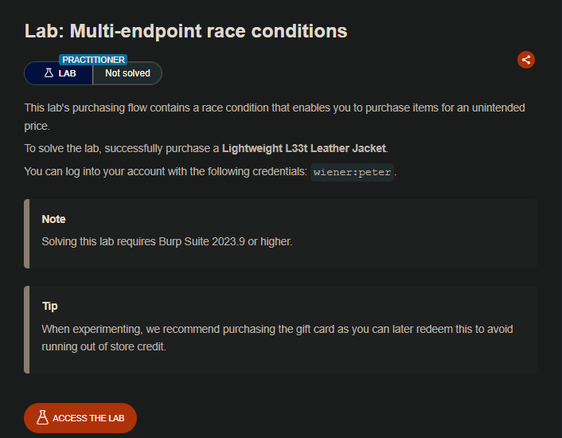
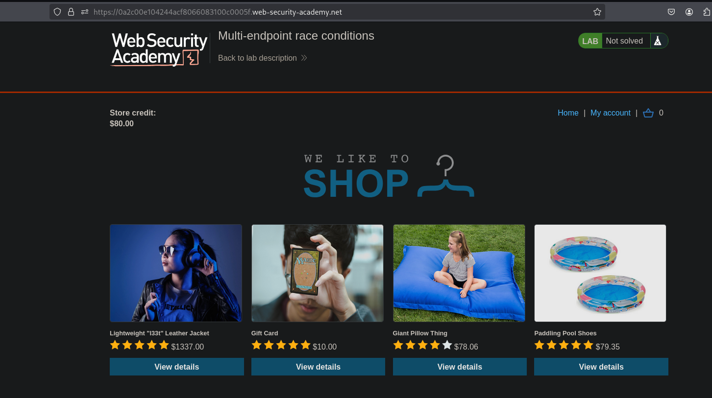
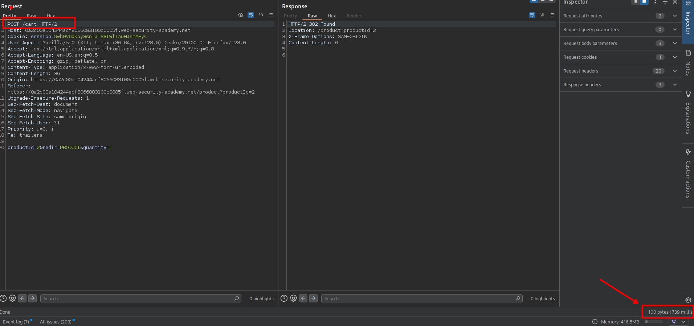
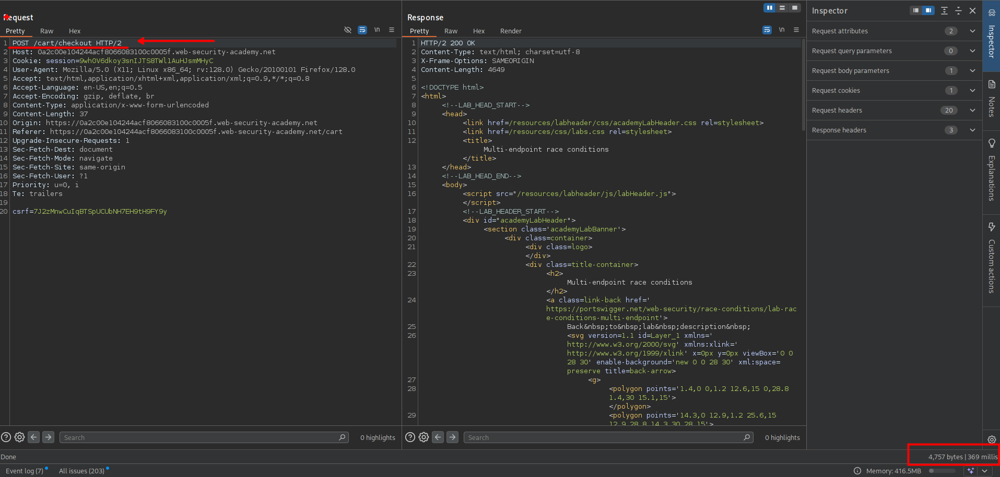
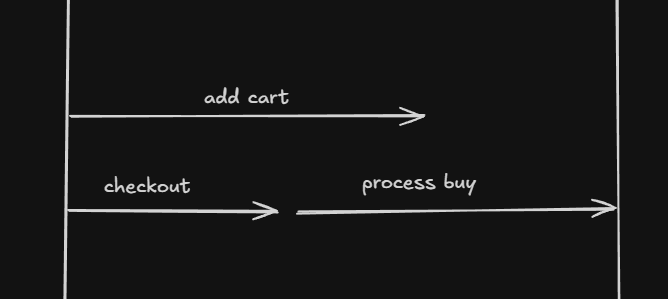
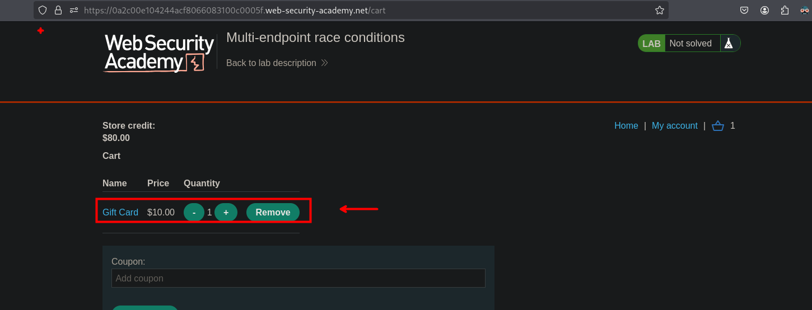
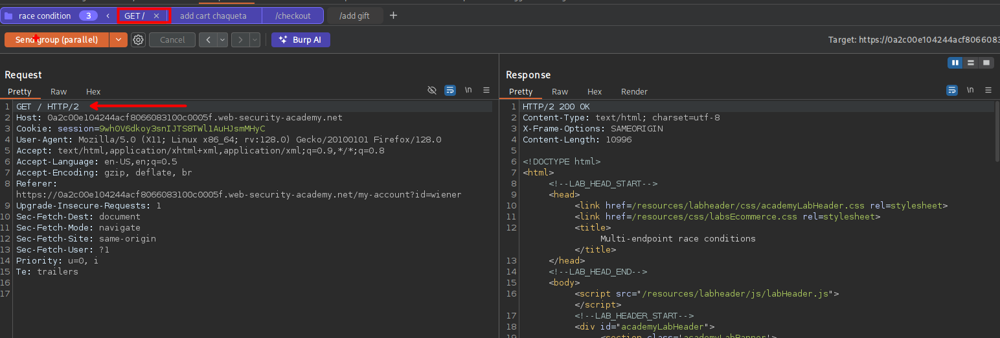
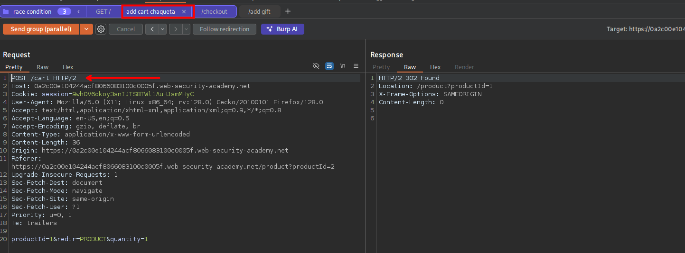
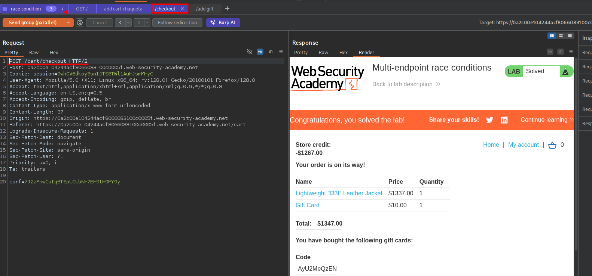

## LAB

Al interceptar las solicitudes de agregar un articulo al carrito y también la validación de crédito del usuario. al enviar en grupo y de manera `send group in sequence (single connection)` podemos ver que se tiene que al agregar una articulo demora mas tiempo en comparación de la solicitud de la validación de crédito al usuario.

En la validación de crédito se hace en menos tiempo que al agregar un articulo. Entonces, cuando se envía las solicitudes en paralelo lo que pasa primero es que se valida el crédito del usuario al ser procesada en menos tiempo, luego se agrega el articulo para luego proseguir con el proceso de compra.

Para realizar lo mencionando anteriormente, primero agregaremos un producto el cual podamos comprar con el saldo actual. 

Luego agregaremos a un grupo las siguientes solicitudes:
- La solicitud `GET /`
- Una solicitud que agregue el producto de la chaqueta a nuestro carrito.
- Solicitud para la validación del saldo

Al intentar por varias vemos vemos que efectivamente podemos comprar el articulo.