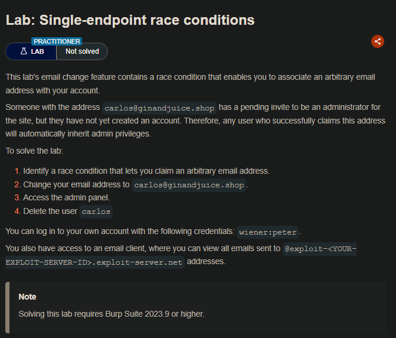

## LAB

Al ingresar con las con las credenciales proporcionadas, vemos que tenemos  un apartado para actualizar el correo del correo.

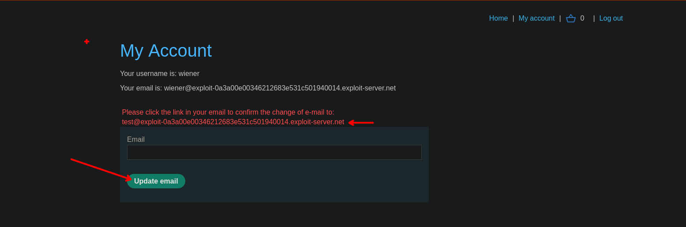

También tenemos un apartado en donde recibimos el correo.

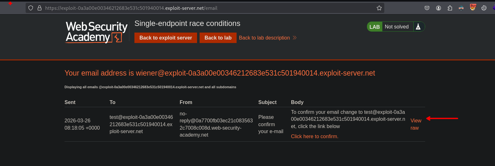

Al agregar las solicitudes, duplicar y cambiar los correos de las solicitudes.

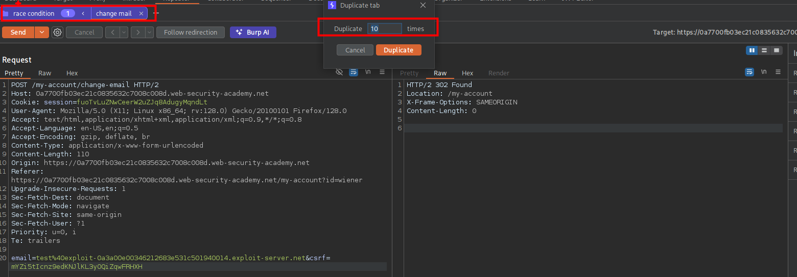

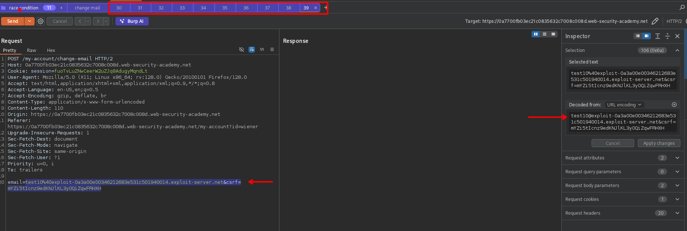

Para luego enviarlos de forma paralela (todas al mismo tiempo)

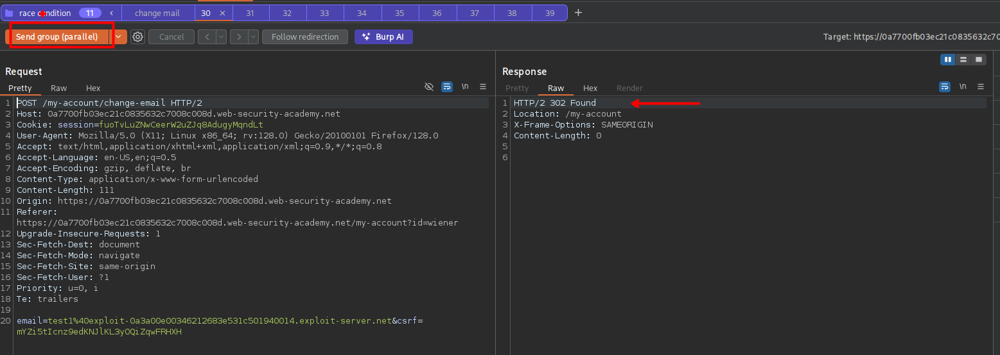

Vemos que tenemos que los correos que llegaron, tiene un contenido distinto para el destinatario. En este caso tenemos que para el correo `test1` le llego un correo de confirmación del usuario `test10` generando un desincronizado.

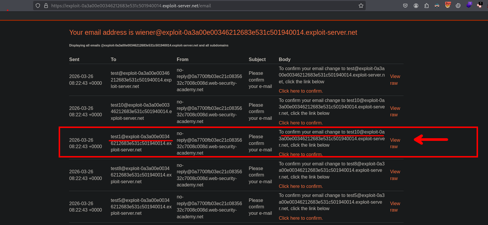

Por lo que teniendo en cuenta lo anterior, lo que podemos hacer es colocar un correo de x y el del usuario `carlos@ginandjuice.shop`.

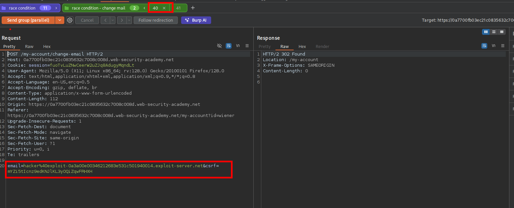

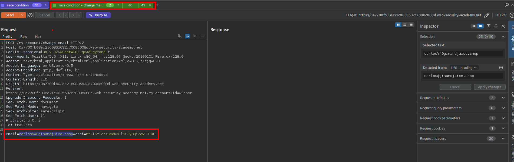

Ahora podemos enviar de manera paralelo, luego de enviar un par de veces veremos que efectivamente se cambio el correo correctamente y podemos realizar la confirmación.

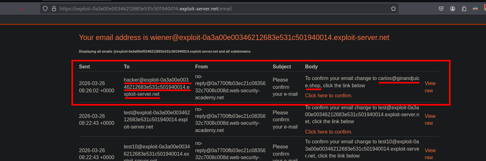

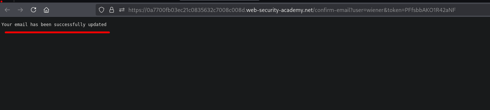

Luego vemos que podemos ver que tenemos acceso al panel de administrador.

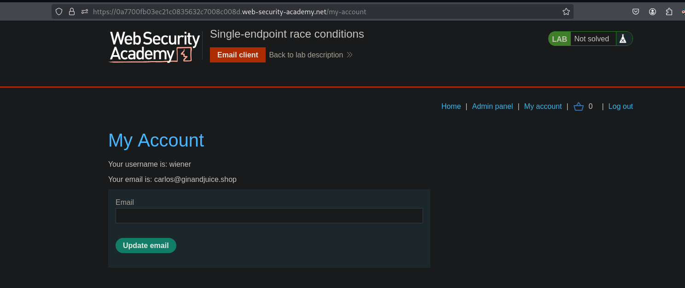

