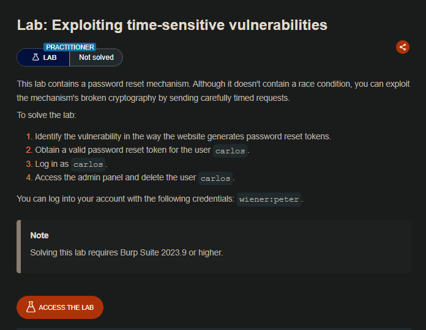

## LAB

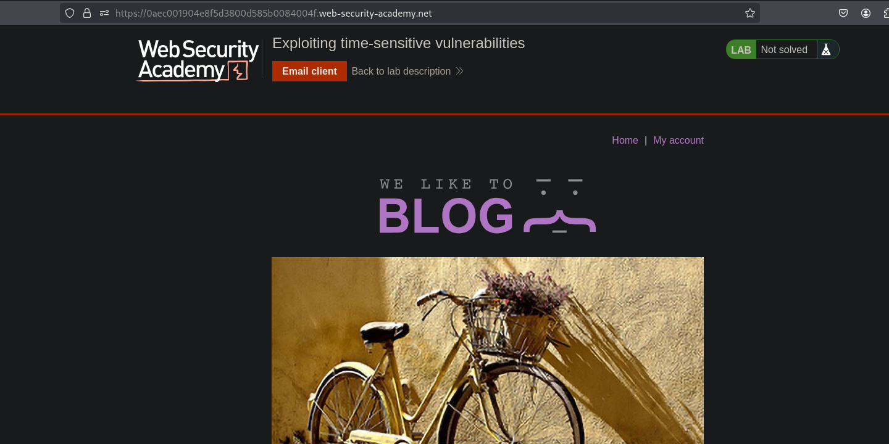

Al ir al apartado de reestablecer la contraseña vemos que tenemos un token, los cuales estan vinculados posiblemente al usuario

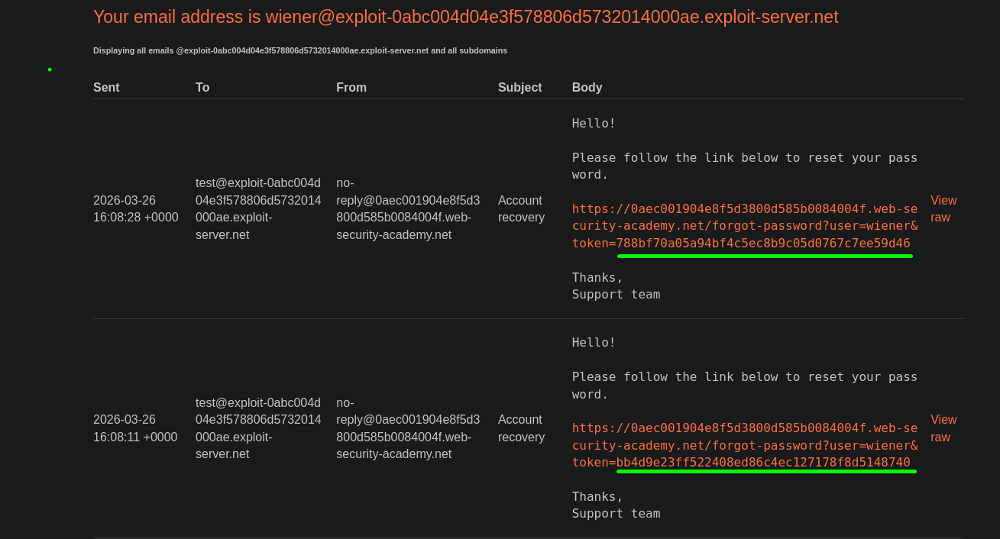

Para realizar ciertas validaciones agregamos a un grupo la solicitud y la duplicamos

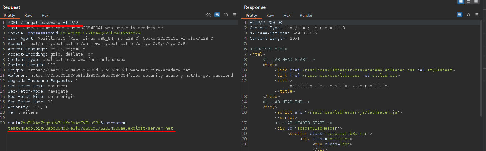

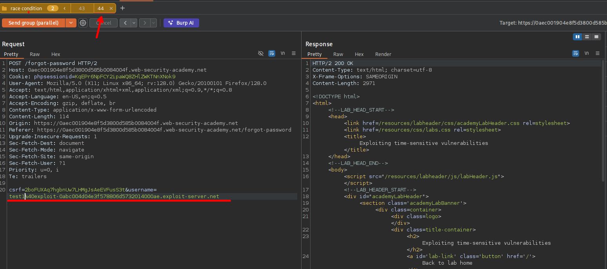

Luego enviamos ambas solicitudes de manera paralela, vemos que tenemos el token pero estos son distintos.

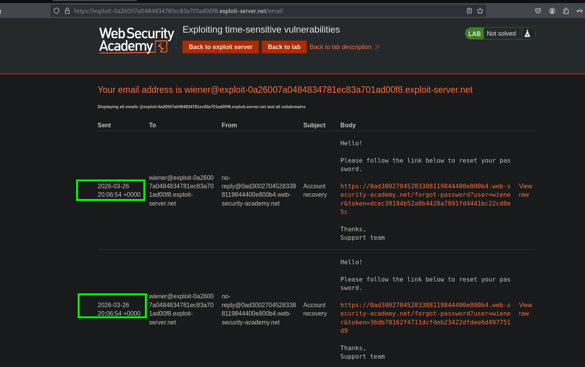

Cuando se cambia del `csrf` y `phpsessionid` de la solicitud y volvemos a enviar las dos s9olicitudes vemos que se tiene el mismo token de recuperación.

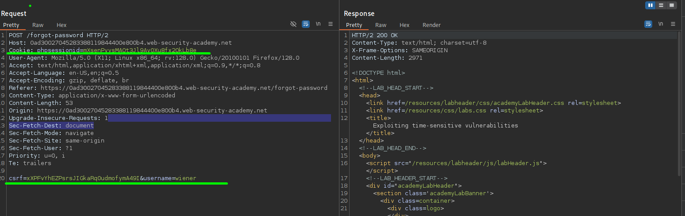

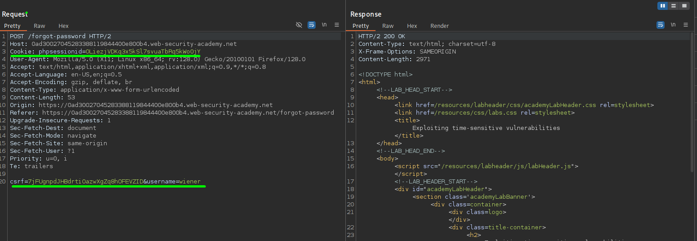

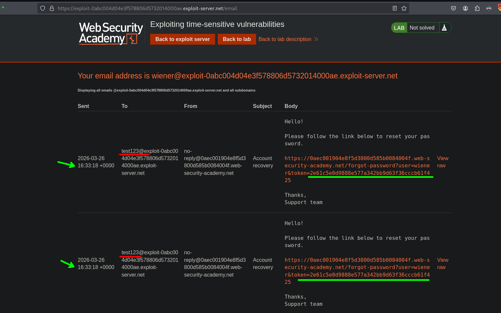

Vemos que no toma en cuenta el csrf o el phpsessionid de la solicitud, por lo que vemos que se tiene el mismo token para cambiar las credenciales. Por ello podría probar a enviar una solicitud de recuperación de cuenta para el usuario `wiener` y el usuario `carlos` al mismo tiempo, por lo que si no valida ni por usuario y solo genera por el tiempo, podemos reestablecer la  credencial del usuario `carlos` con el mismo token del usuario `wiener`

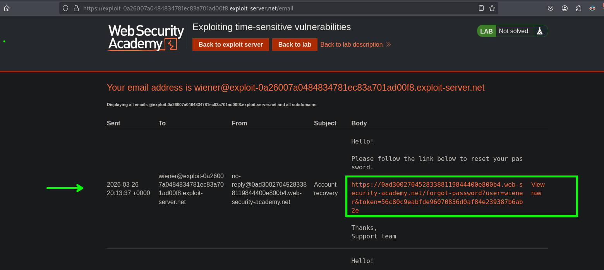

Al cambiar el nombre de usuario de `wiener` a `carlos` vemos que podemos ver la interface para cambiar la credencial y podemos cambiar la contraseña del usuario `carlos`.

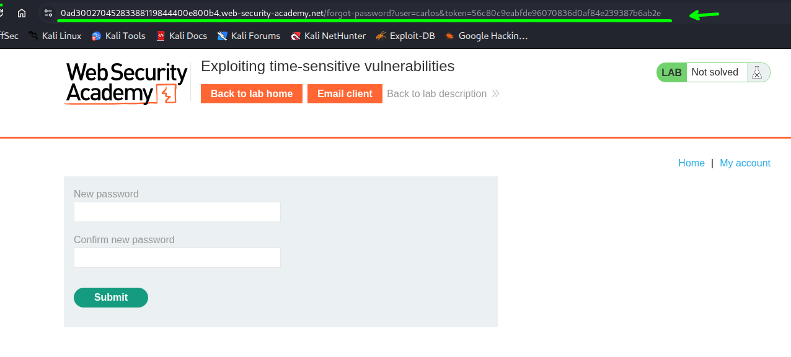

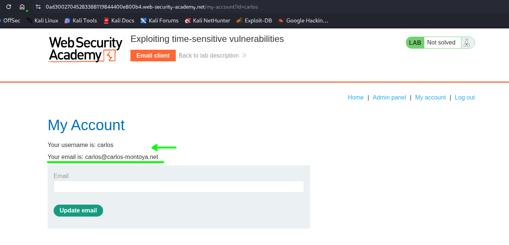

