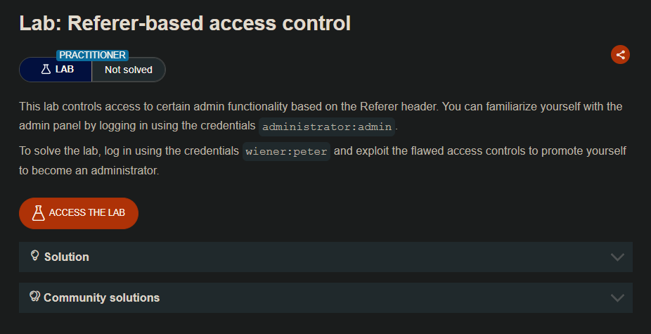
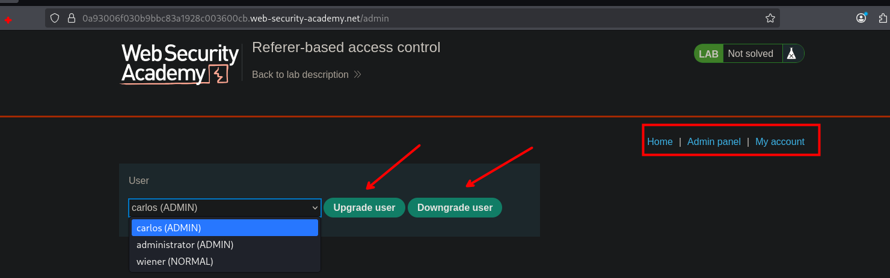
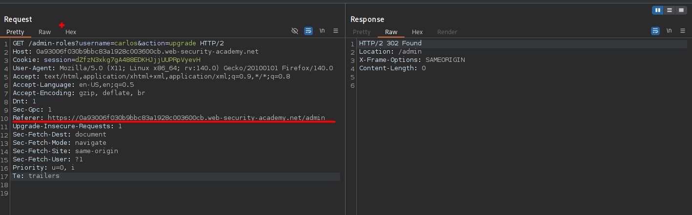
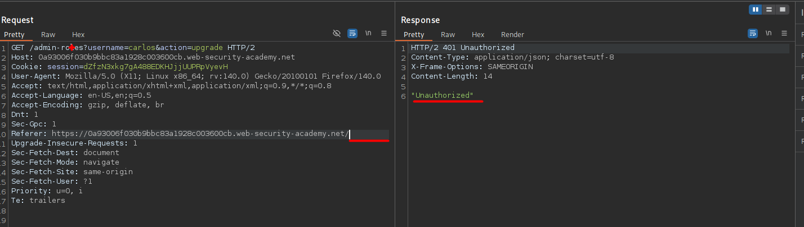
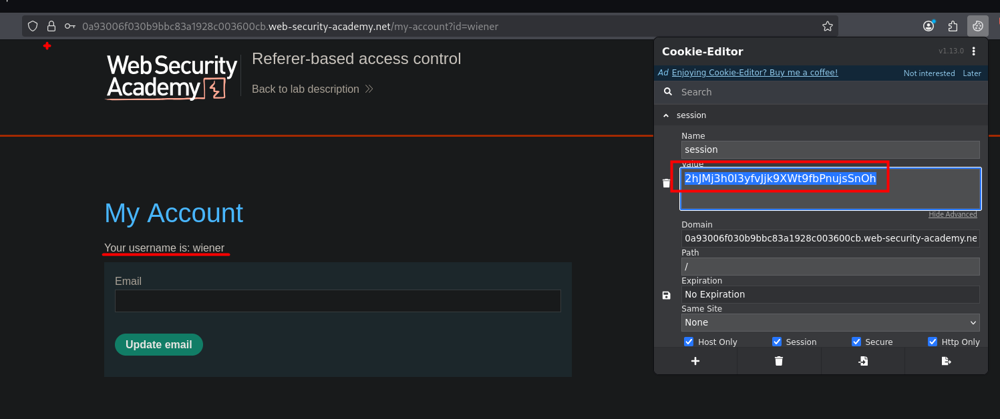
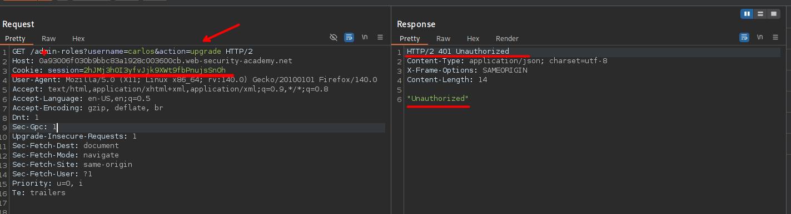
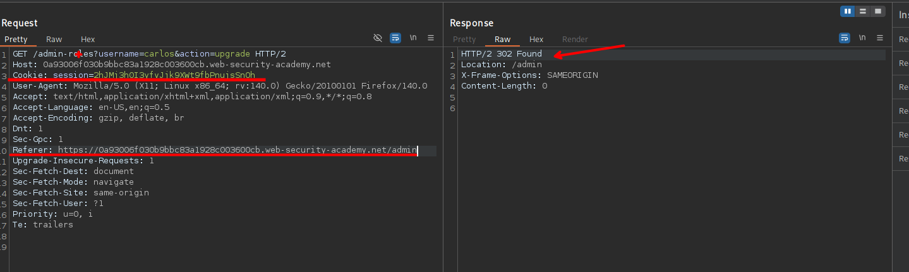
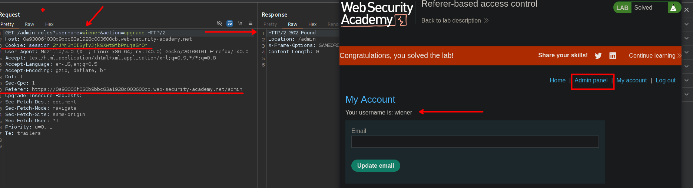

## LAB

En el panel de administrador observamos que este puede agregar o quitar privilegios a los usuarios.



Al interceptar las solicitudes observaremos que la cabecera `Referer` tiene una ruta:

```c
Referer: https://0a93006f030b9bbc83a1928c003600cb.web-security-academy.net/admin
```



Al quitar la ruta en el encabezado `referer` podemos observar que e servidor devuelve un `401 Unauthorized`



Ahora intentaremos otorgar privilegios usando la session del usuario wiener.



Al enviar con la sesión del usuario wiener, observamos que el servidor nos envía un `401 Unauthorized` 



Por lo que agregamos el encabezado `Referer`  con el valor de `https://0a93006f030b9bbc83a1928c003600cb.web-security-academy.net/admin` y observamos que la solicitud es aceptada con exito.



Ahora procedemos a elevar privilegios del usuario wiener:



