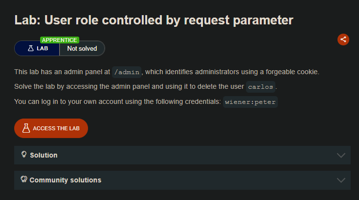
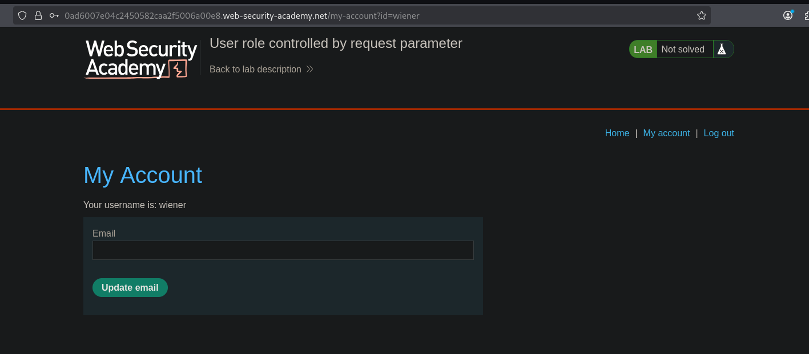
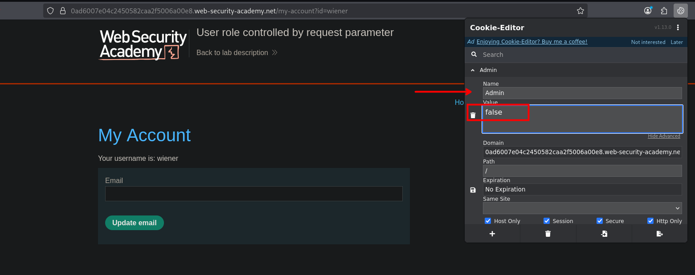
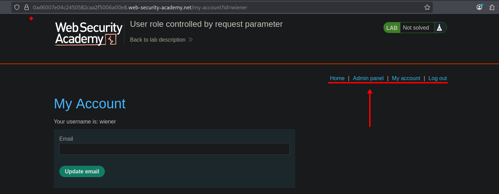
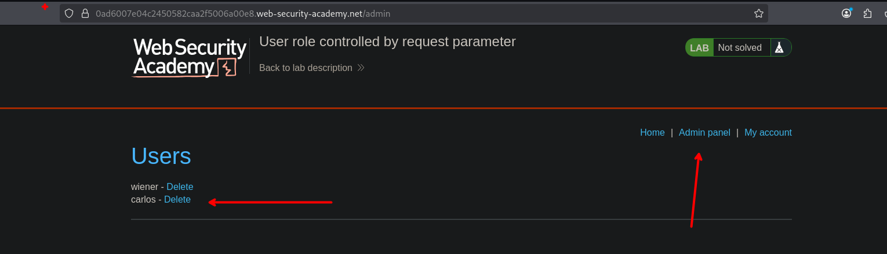

## LAB

Al laboratorio podemos ingresar con las credenciales de wiener:

```c
wiener : peter
```

Al ingresar podemos observar lo siguiente:



en las cookies, podemos observar que se tiene un `Admin` el cual tiene un valor de `false`. Por lo que se realiza el cambio de `false` a  `true`



Al cambiar el valor observamos que tenemos una pestaña de `Admin Panel`



Así que podemos acceder al admin panel y borrar al usuario carlos para completar el laboratorio.



