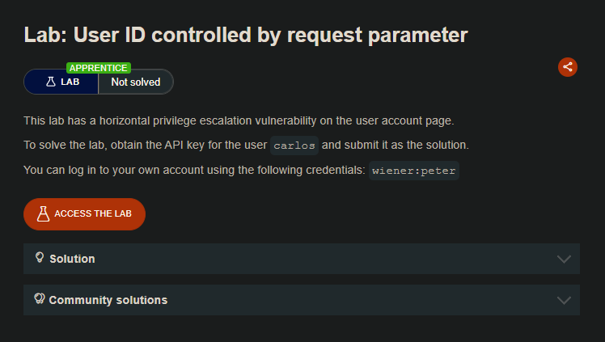
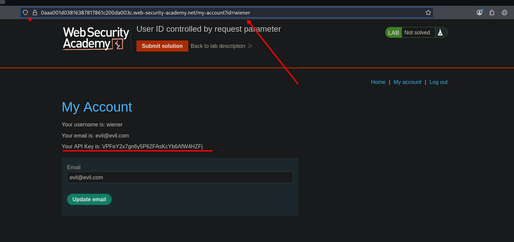
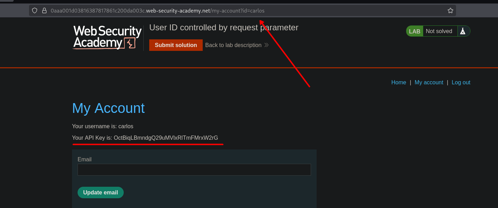

## LAB

En el sitio web observamos que en la url tenemos un parametro como `id=wiener`.



```c
my-account?id=carlos
```

Al cambiar el valor de `wiener` a `carlos` podemos observar que cambio lo que se ve del usuario wiener al de carlos. Asi de esta manera podemos obtener la key de Carlos.



