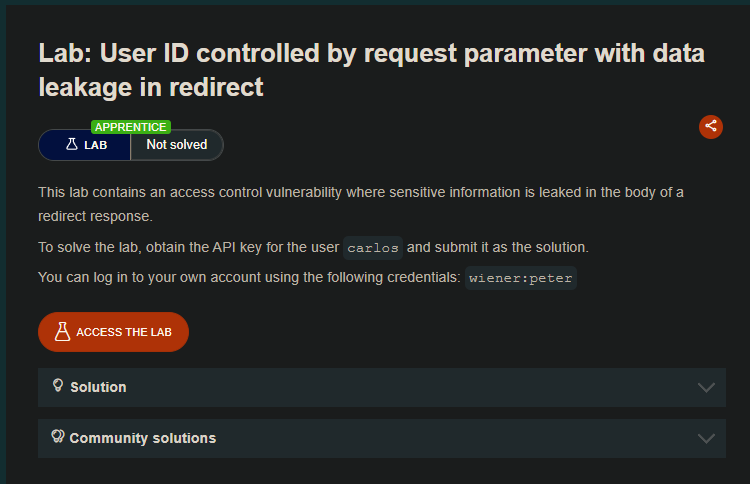
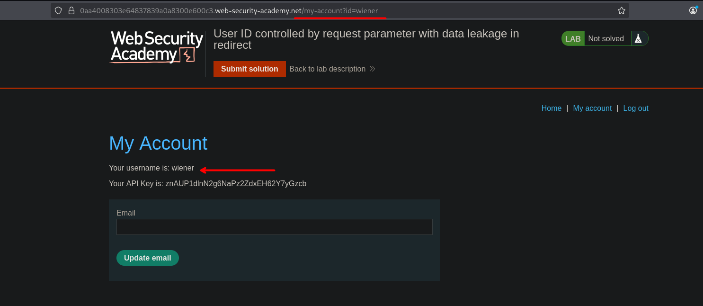
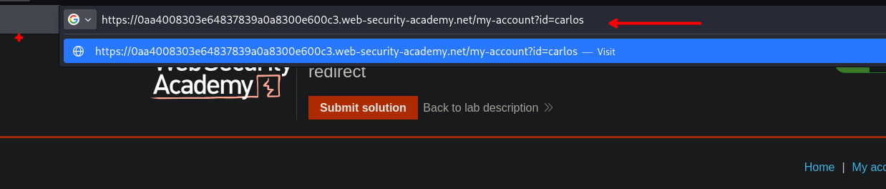
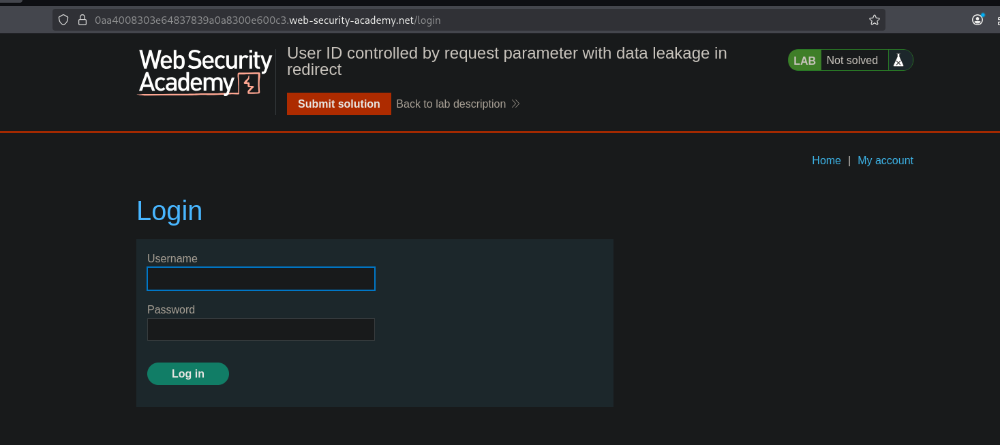
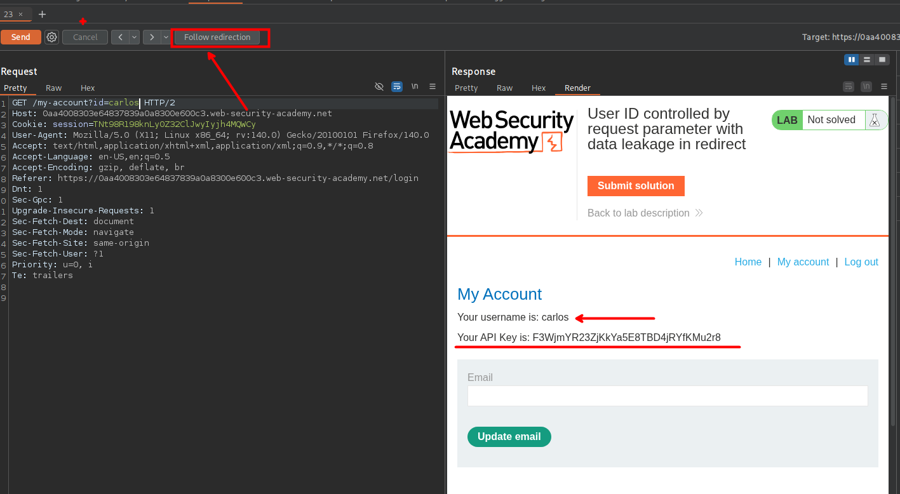

## LAB

Al iniciar sesión como el usuario `wiener` podemos observar que en la url tenemos `id=wiener`

Al cambiar de `wiener` a `carlos` este redirige al panel de inicio de sesión.

Pero al hacerlo desde el burpsuite, podemos observar que antes de enviar al inicio de sesión podemos observar el perfil del usuario Carlos, así como su key. 

