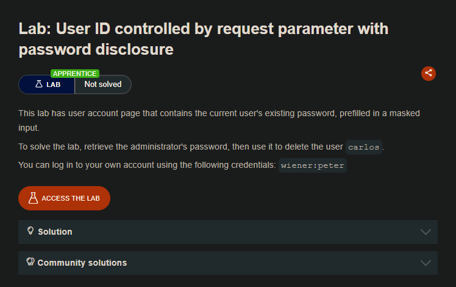
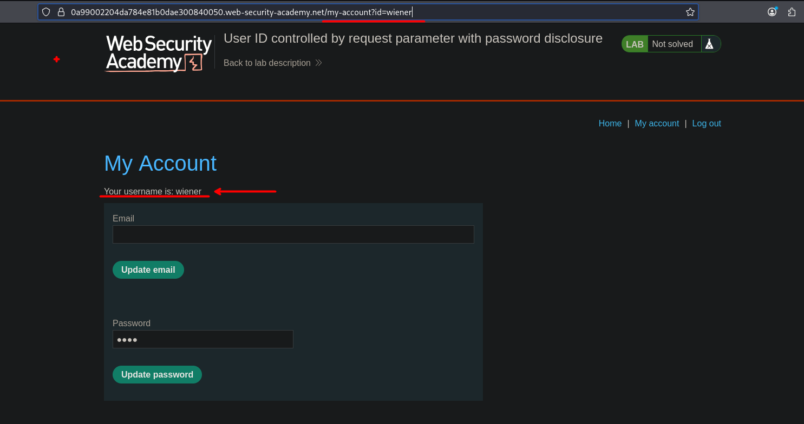
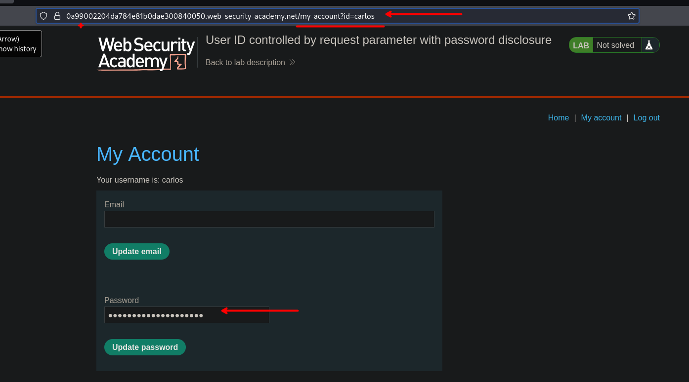
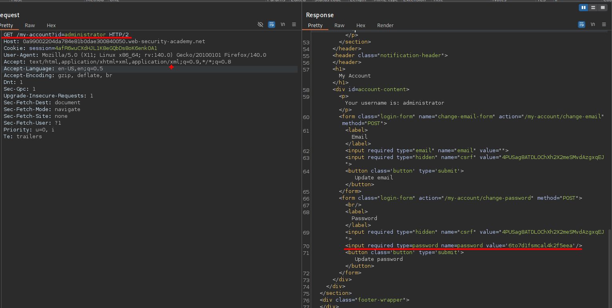
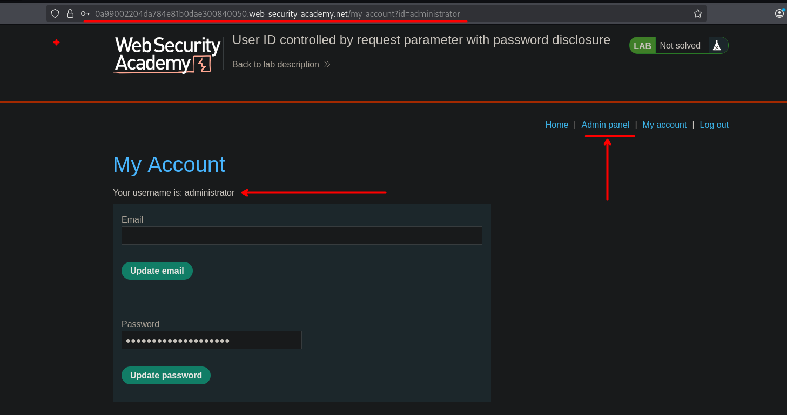

## LAB

Al iniciar sesion tendremos la opcion de cambiar nuestra contraseña, pero ademas podremos ver nuestra propia contraseña:




Por lo que al ir a la ruta:

```c
/my-account?id=carlos
```

Podemos ver la contraseña e información del usuario carlos.



De la misma manera podemos observar la contraseña del usuario administrador: `/my-account?id=administrator`



```c
                           <input required type=password name=password value='6to7d1fsmcal4k2f5eea'/>
```

Y haciendo uso de este, lograremos iniciar session y ver el `Admin Panel` del cual podremos eliminar al usuario Carlos.



