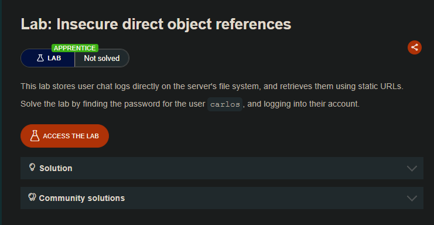
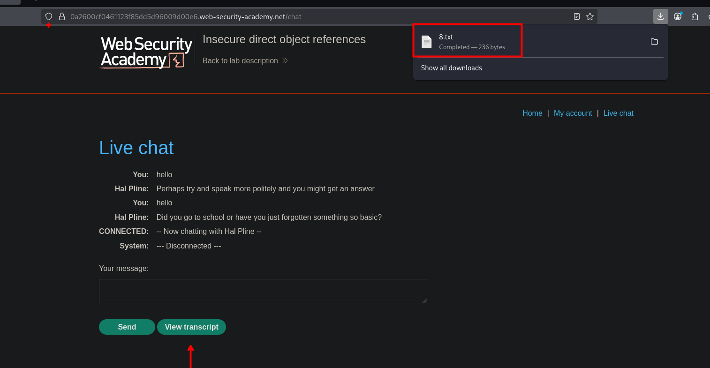
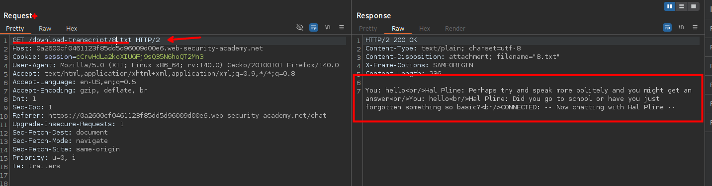
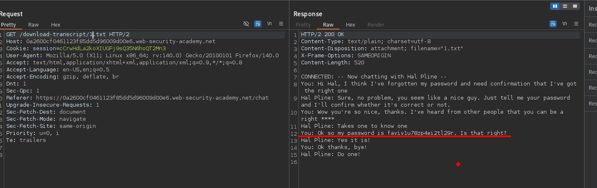
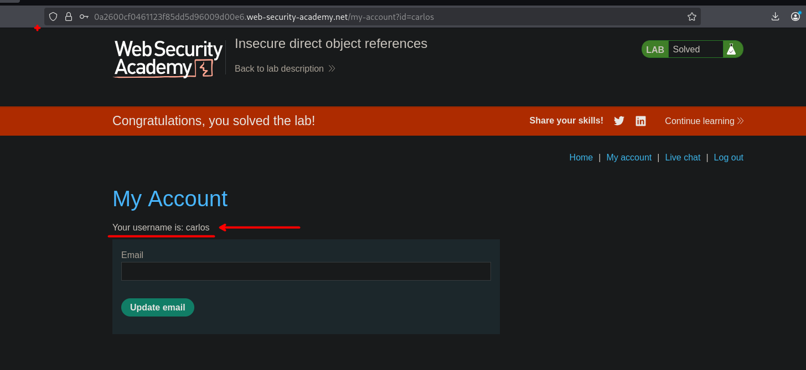

## LAB

En el sitio web encontraremos un chat, el cual podemos exportar.



Estos archivos o chats, esta guardados en las rutas `download-transcript`, el cual podemos hacer un GET par aobtenerlas.



```c
https://0a2600cf0461123f85dd5d96009d00e6.web-security-academy.net/download-transcript/1.txt
```

Al obtener el archivo `1.txt` encontraremos las credenciales para el usuario Carlos.



