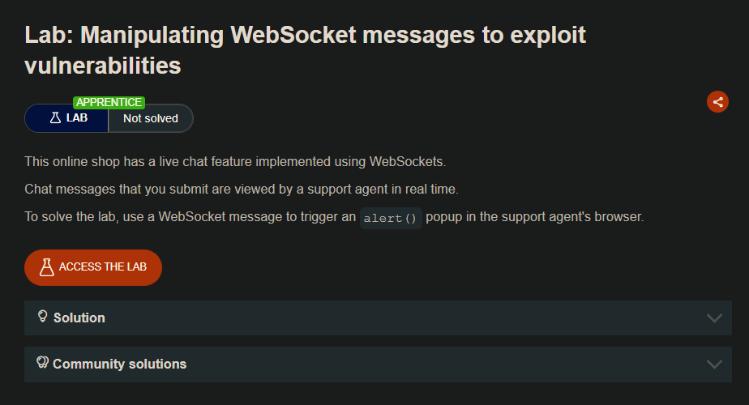
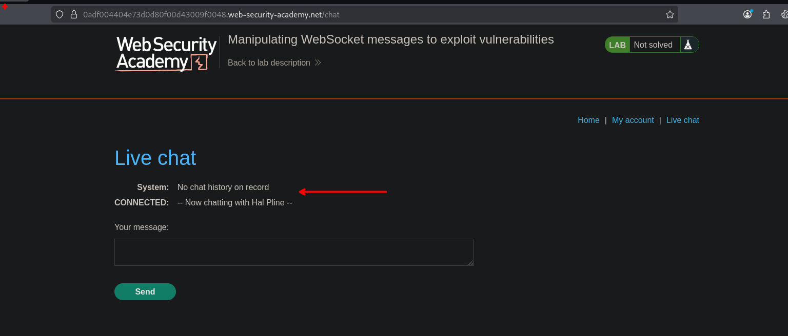
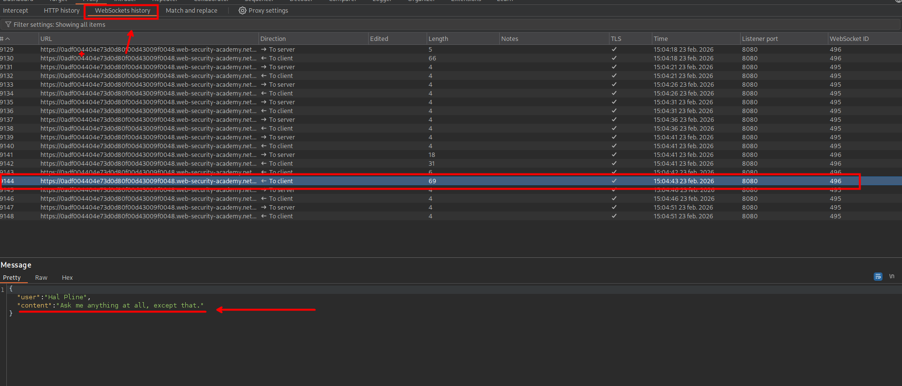
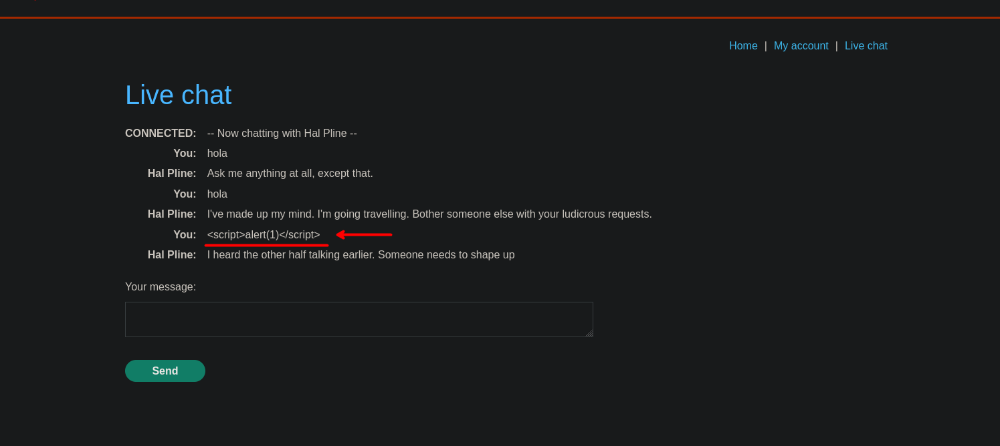
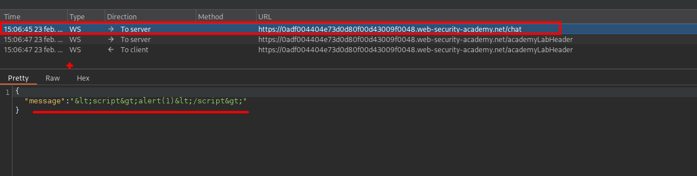
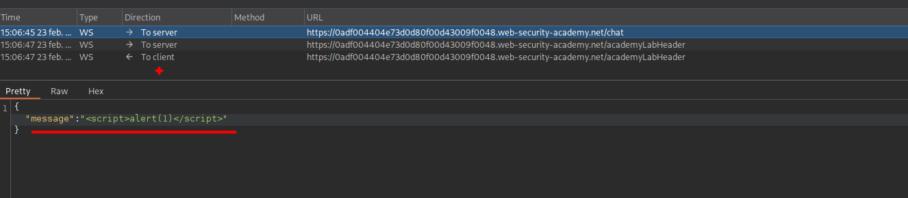
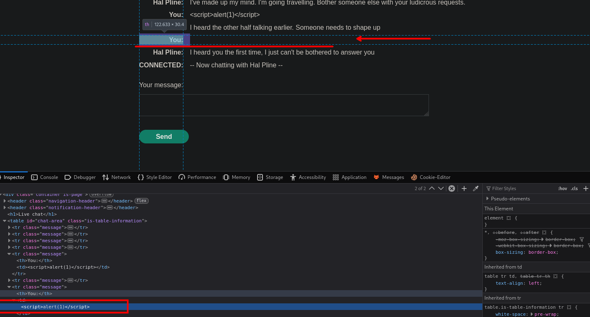
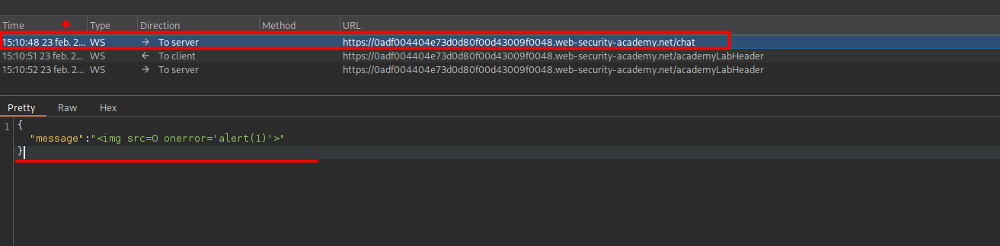
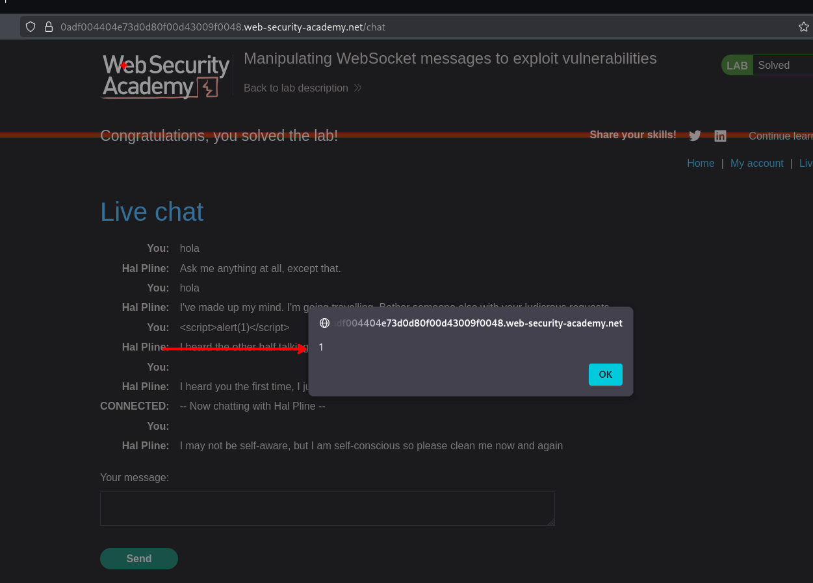

## LAB

En el sitio web encontraremos un live chat



Este live chat se conecta o el trafico que se tramita a través desde websockets, en donde veremos cada uno de los chats.



Al insertar nuestro payload maliciosa, este se refleja pero este no se interpreta.



```c
	<script>alert(1)</script>
```

Ahora, al volver a enviar nuestro payload interceptamos el envió, en este observamos que se envía en formato html encode. 



Por lo que procedemos a cambiarlos:



Ahora observamos que tampoco se logra interpretar, pero no se observa en el cuerpo. Al observar en el codigo html podemos ver que este se encuentra ahi. 



Por lo que intentamos otro payload de img

```c

```

Al interceptar y volver a enviar la solicitud con nuestro payload, podemos observar que este se logra interpretar correctamente.



```c
{"message":""}
```




