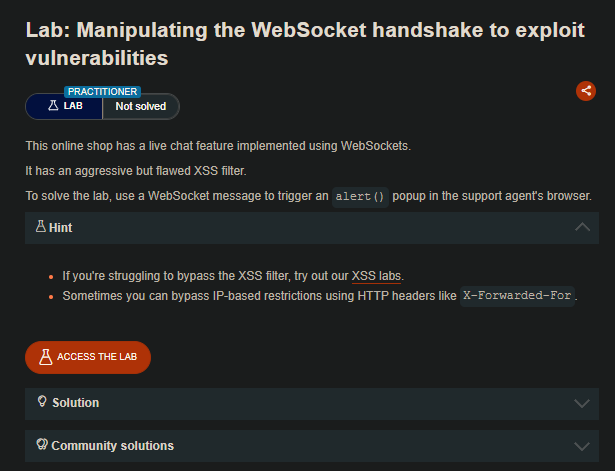

## LAB

En este laboratorio también tendremos un live chat, en el que podremos comentar. Pero al tratar de insertar un javascript malicioso. El sitio web nos bloqueara.

```c
<script>alert(1)</script>
```

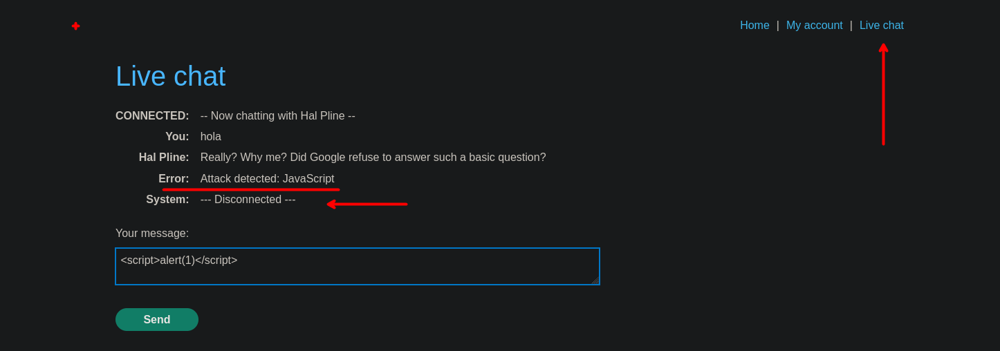

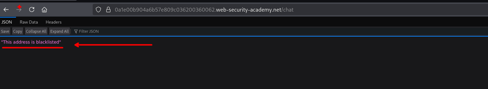

Investigando un poco encontramos que tenemos un encabezado el cual podremos para bypasear el bloqueo y asi enviar nuevamente nuestra solicitud.

```c
X-Forwarded-For: 1.2.3.4
```

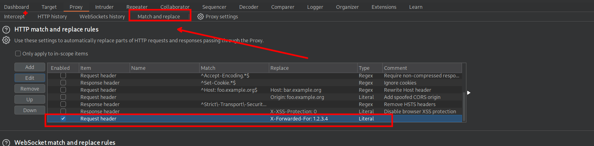

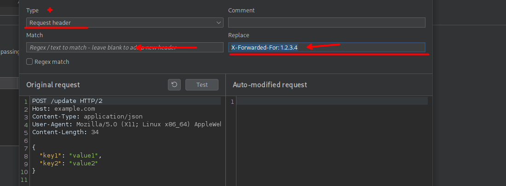

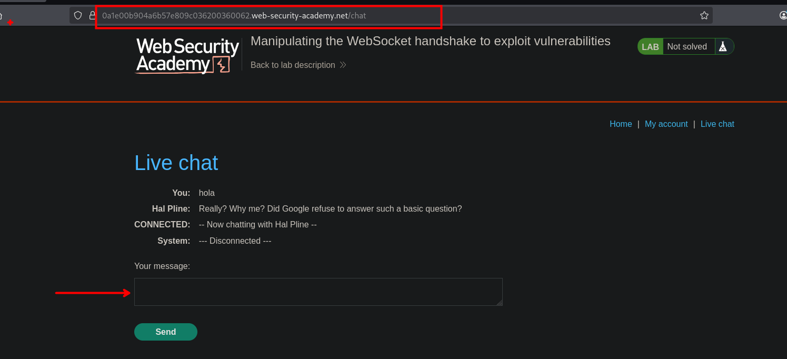

Ahora, cambiando nuestro payload trataremos de enviar:

```c
{"message":""}
```

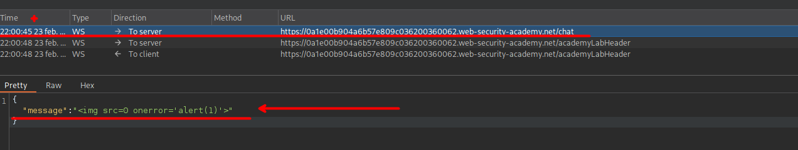

Al realizar la solicitud, podemos observar que este también es bloqueado.

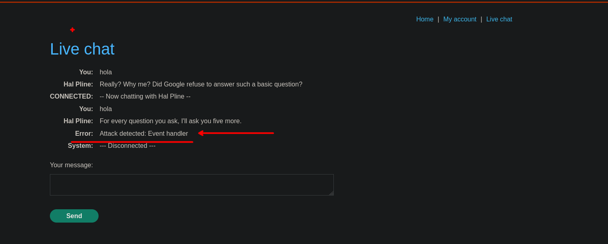

Por lo que cambiaremos el valor de la cabecera y volveremos a enviar nuestra solicitud, cambiando un poco nuestro payload. 

```c
X-Forwarded-For: 1.2.3.5
```

```c
{"message":""}
```

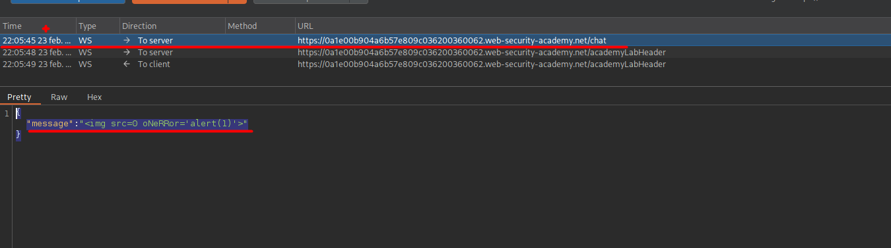

Al enviar, podemos observar que tenemos otro bloqueo, pero el mensaje es distinto. Teniendo en cuenta el mensaje, el cual se refiere al `alert(1)` y al cual esta detectando. Usando otra alternativa como:

```c
alert`1`
```

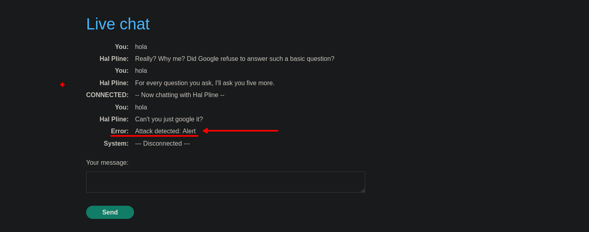

Al volver a enviar podemos observar que este si funciona.

```c
"message":""}
```

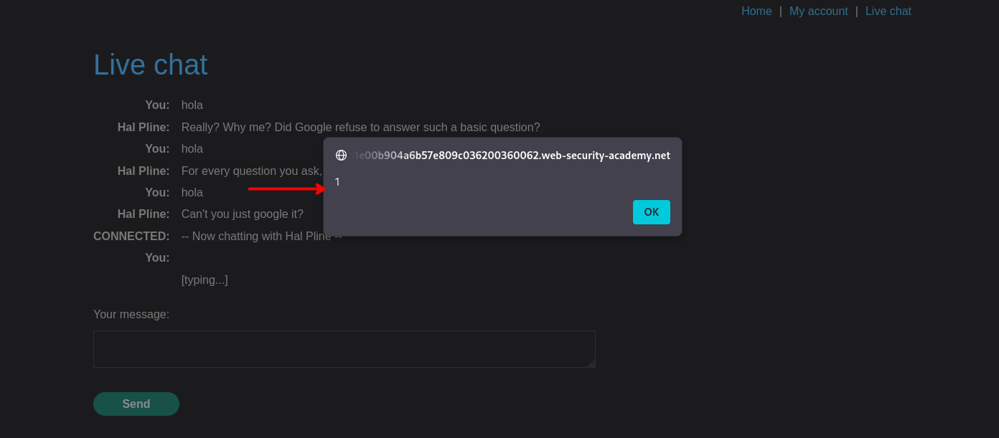

