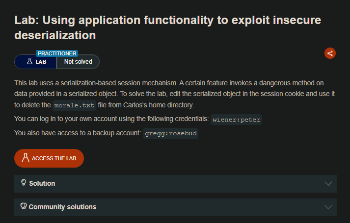
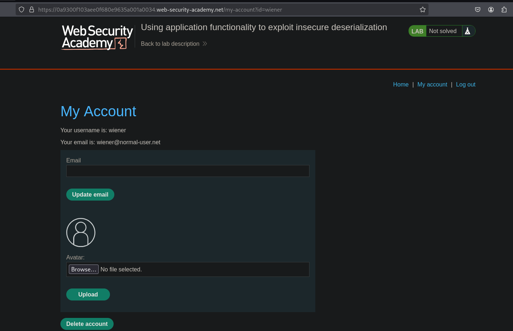
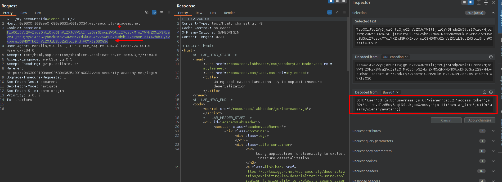
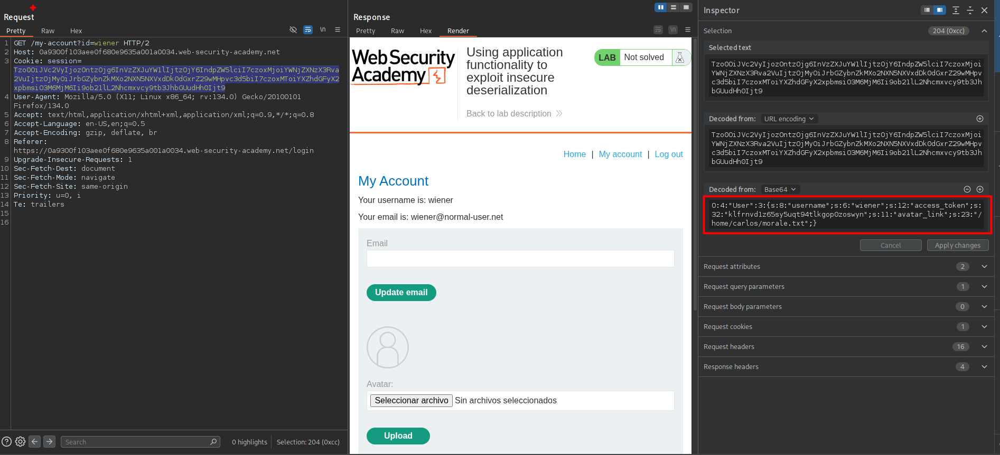
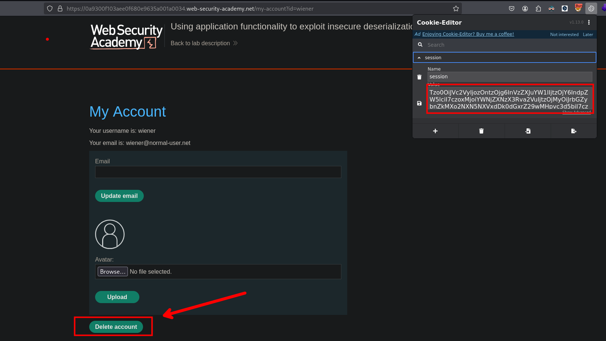
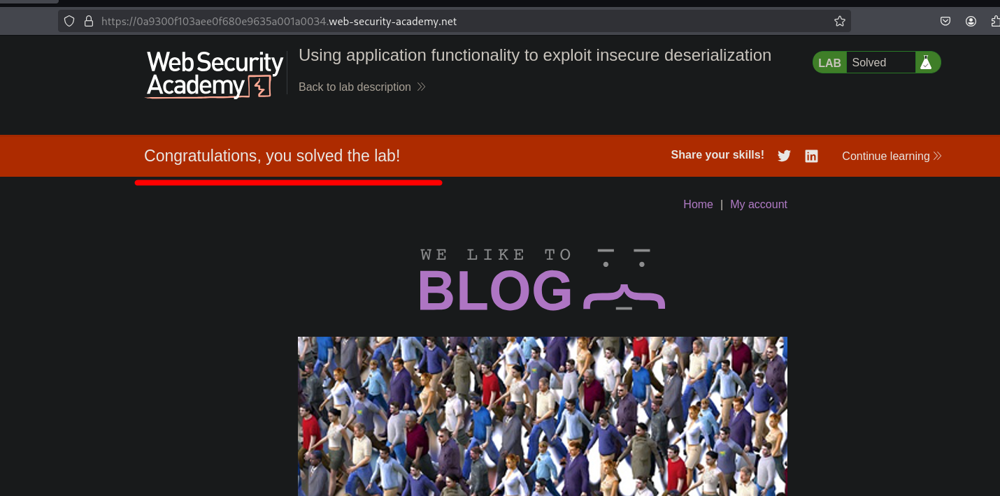

## LAB



Al inciar sesion con las credenciales de wiener y luego interceptar las solicitudes, podemos observar que en la sesion de la cookie este es posible manipularlo.



```c
O:4:"User":3:{s:8:"username";s:6:"wiener";s:12:"access_token";s:32:"klfrnvd1z65sy5uqt94tlkgop0zoswyn";s:11:"avatar_link";s:19:"users/wiener/avatar";}
```

Teniendo en cuenta que el avatar del usuario wiener esta en la ruta `users/wiener/avatar` y al eliminar al usuario wiener este es eliminado. Por lo que podemos aprovechar esto para insertar la ruta del archivo `/home/carlos/morale.txt` el cual será borrado al eliminar al cuenta del usuario wiener.

```c
O:4:"User":3:{s:8:"username";s:6:"wiener";s:12:"access_token";s:32:"klfrnvd1z65sy5uqt94tlkgop0zoswyn";s:11:"avatar_link";s:23:"/home/carlos/morale.txt";}
```



Por lo que generamos la cookie e insertamos a la session, para luego eliminar a ala cuenta.



Luego de eliminar la cuenta podemos observar que el archivo `/home/carlos/morale.txt` es eliminado.



