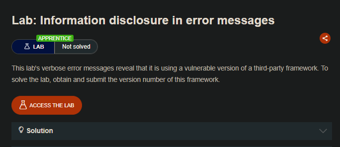
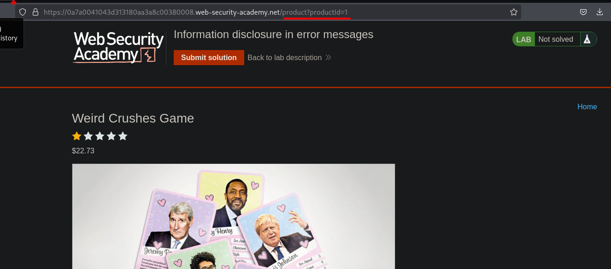
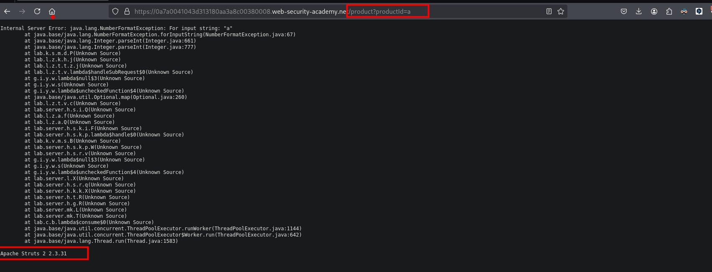
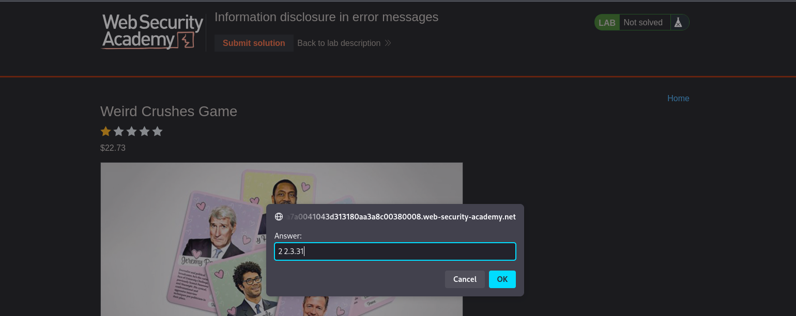

## LAB

En el sitio web podemos observar que se tiene artículos y estos son identificados por un id:



Por lo que al cambiar de un numero a una letra, este da un error y la aplicación revela estos errores:

```c
/product?productId=a
```



De esta manera obtenemos la versión del servicio de Apache.


