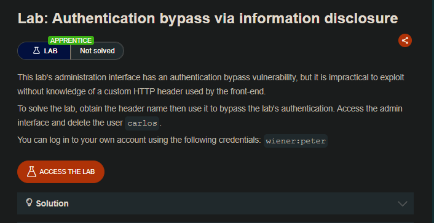
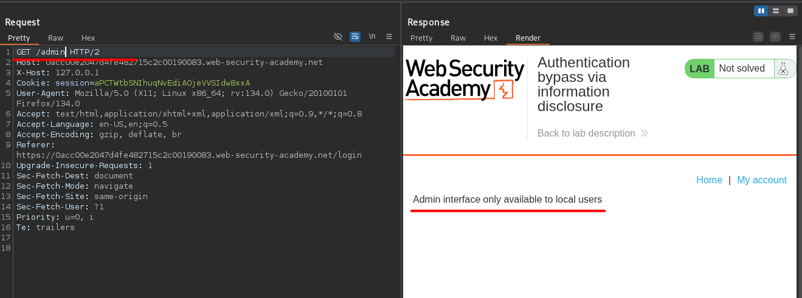
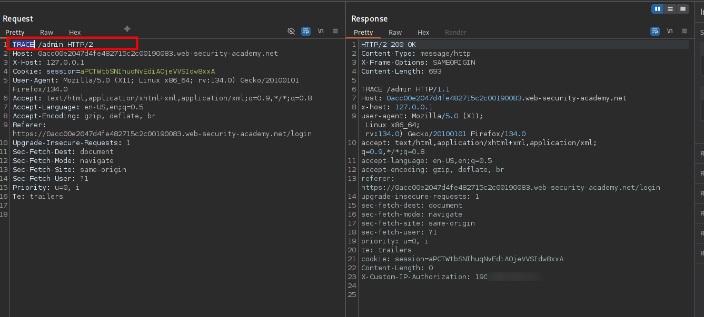
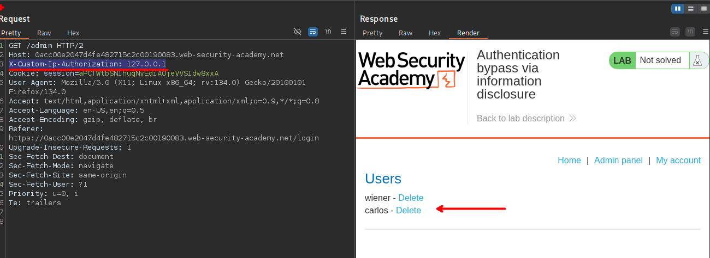
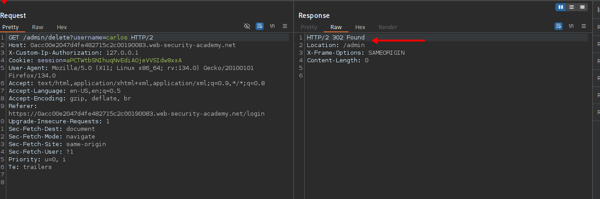
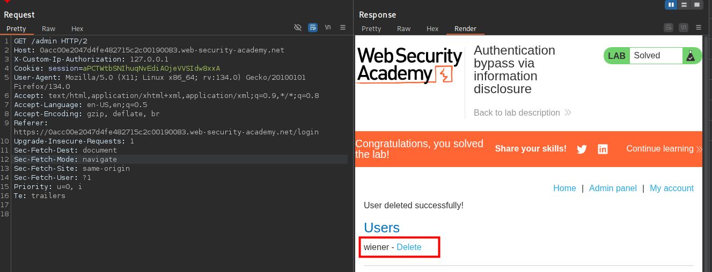

## LAB



Al querer ingresar a la ruta `/admin`, vemos que el sitio web indica que solo permite a usuarios locales. Al enumerar el sitio web encontraremos que el método TRACE esta habilitado:

```c
TRACE /admin HTTP/2
```



En la respuesta observamos que hay un encabezado `X-Custom-Ip-Authorization` el que es usado para verificar la dirección IP. Por lo que al agregar este encabezado, podemos observar el menú del administrador.



Por lo que al eliminar al usurario carlos debemos enviar la siguiente solicitud:

```c
GET /admin/delete?username=carlos HTTP/2
Host: 0acc00e2047d4fe482715c2c00190083.web-security-academy.net
X-Custom-Ip-Authorization: 127.0.0.1
```



Y de esta manera el usuario Carlos ya esta eliminado:



