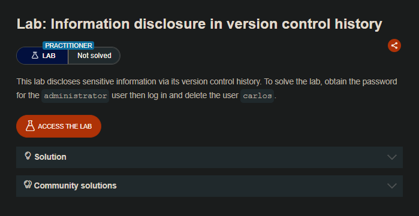
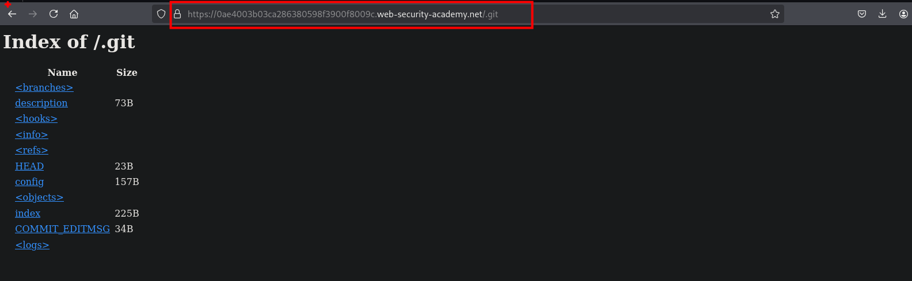
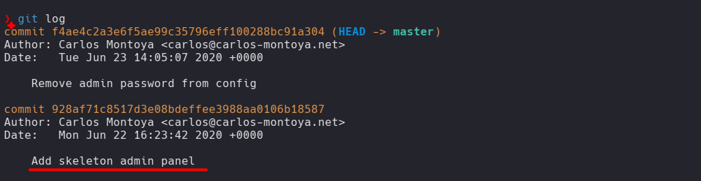
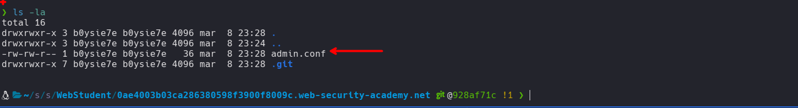
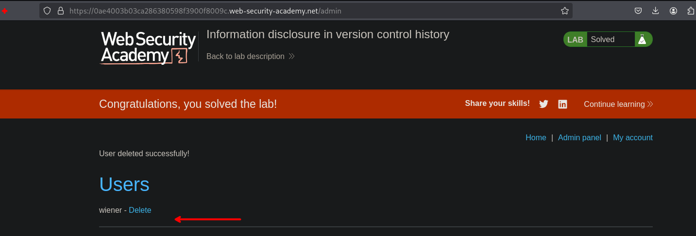

## LAB


En el sitio web encontraremos un directorio `.git` en que cual encontraremos cierto contenido.



Al descargar con wget o también podemos usar `GitTools` para ello

```c
❯ wget -r https://0ae4003b03ca286380598f3900f8009c.web-security-academy.net/.git
```

Al enumerar los commits observamos que se tiene un commit donde se elimino credenciales.



Al ir a este commit:

```c
❯ git checkout 928af71c8517d3e08bdeffee3988aa0106b18587
D       admin_panel.php
```

Observaremos un archivo el cual fue borrado y al observar el contenido este son credenciales del administrador.




