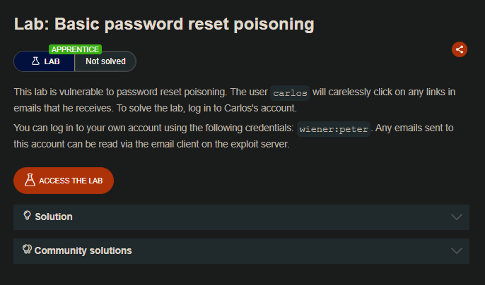
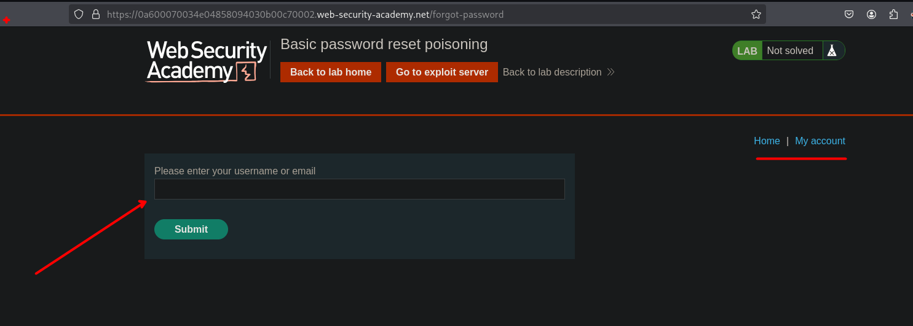
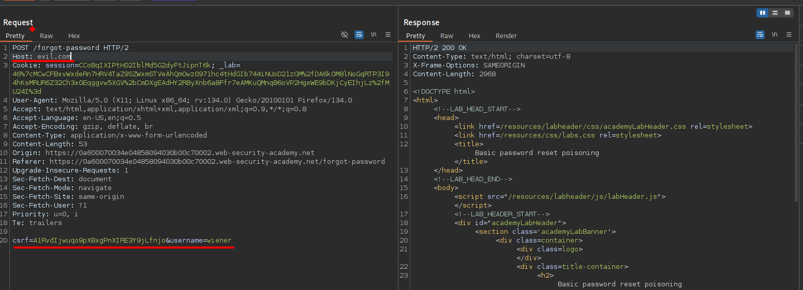
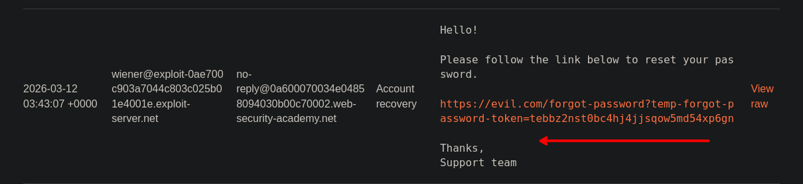
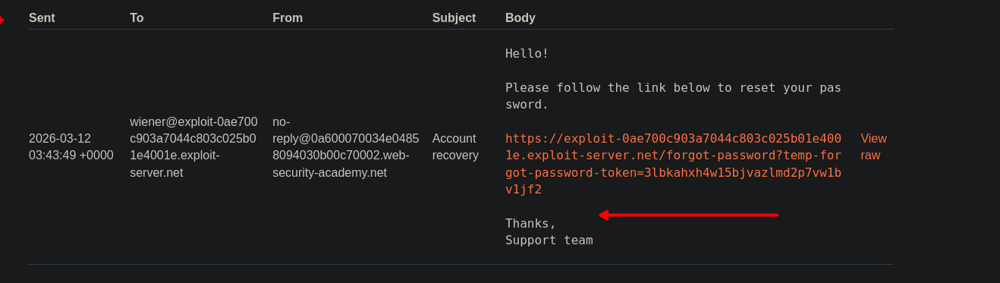
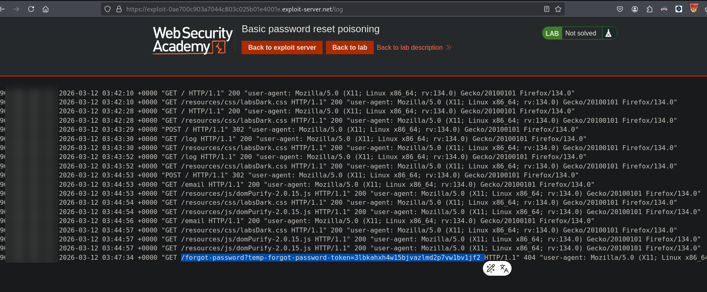
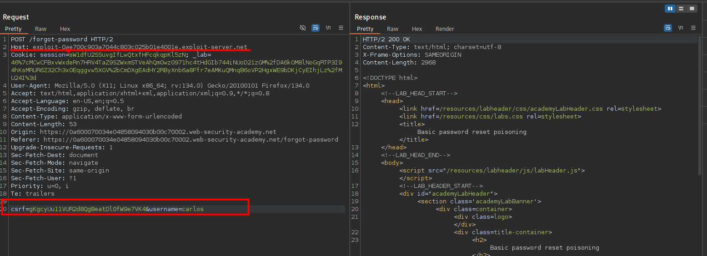
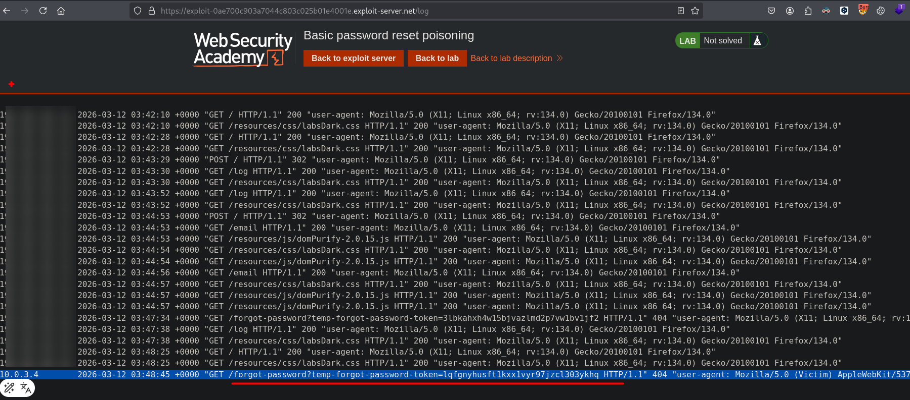
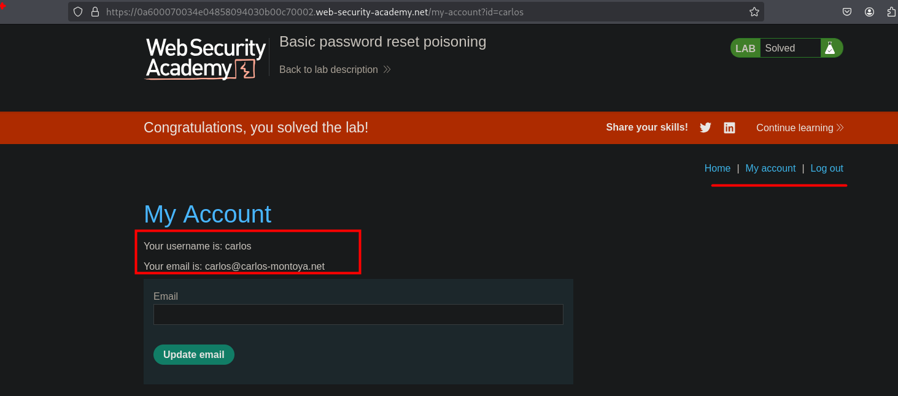

## LAB

En el sitio web observamos que se tiene una función de recuperar la contraseña.



Al enviar la solicitud, podemos observar que al cambiar el valor de la cabecera de `Host` y observar en el servidor de correos, vemos que la url de cambio de contraseña cambia al que el atacante pueda controlar.





Al enviar la url de nuestro exploit server, podemos observar que se genera una url con el token re recuperación y al ingresar a dicha url, podemos observar que en los logs vemos que el token se puede ver en los logs.  





Como se dice que el usuario Carlos hace click en la url que se le envia, podemos ingresar al usuario `carlos` y también cambiar el valor de `Host` por nuestro exploit server y luego enviar. 



Luego de enviar, podemos observar que se realice la petición a nuestro servidor 



Ahora podemos copiar el token y proceder a cambiar la contraseña del usuario carlos.

```c
/forgot-password?temp-forgot-password-token=lqfgnyhusft1kxx1vyr97jzcl303ykhq
```



