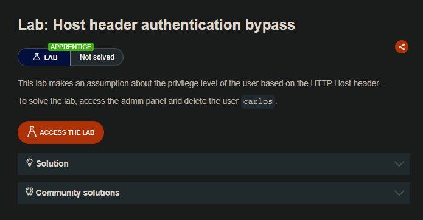
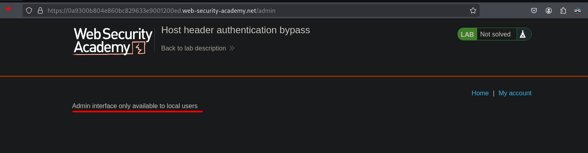
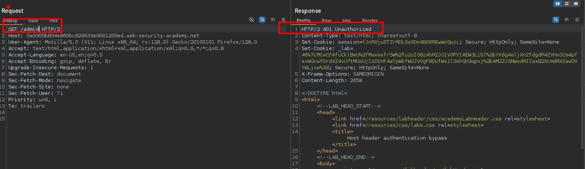
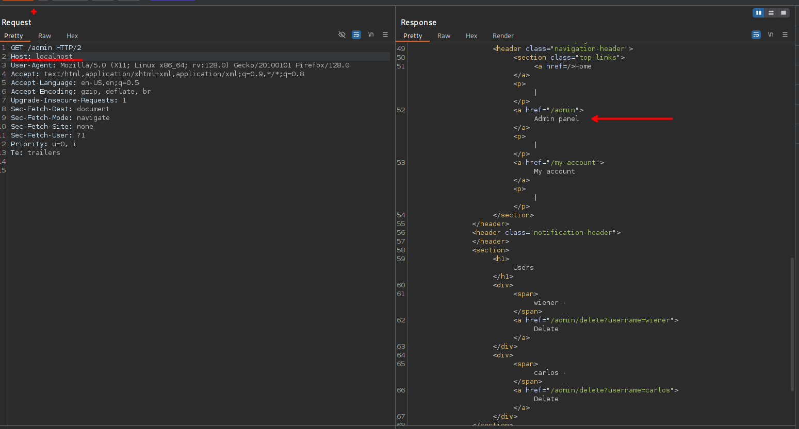
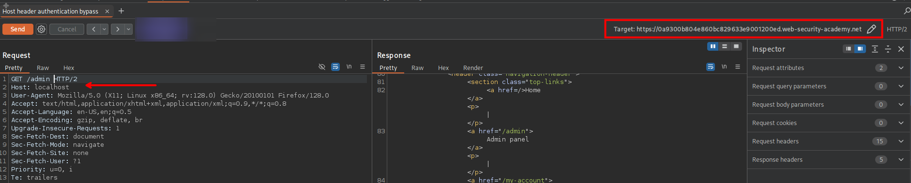
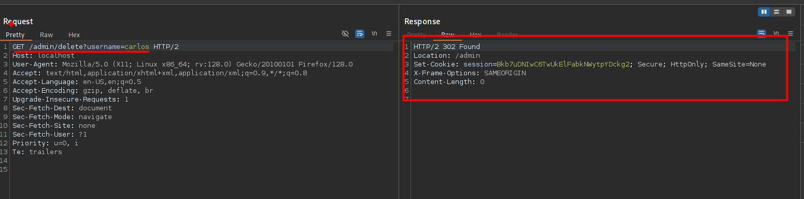
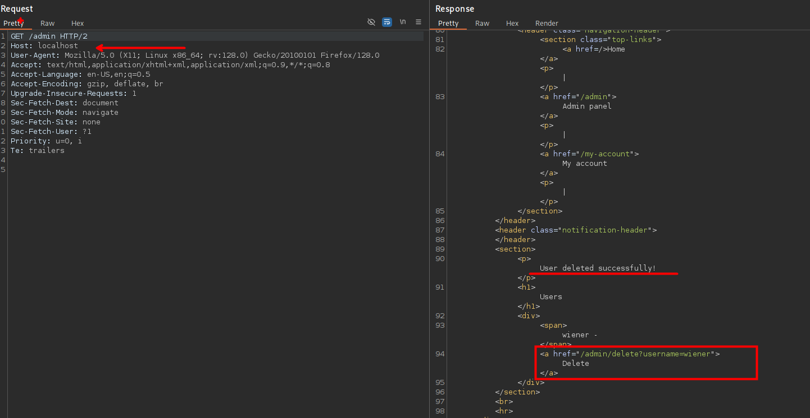

## LAB

Al ir a la ruta `/admin` podemos ver que se tiene un panel administrativo, esto también se puede ver desde el recursos `robots.txt`.



Así mismo desde la solicitud desde el `burpsuite`



Al cambiar el valor del encabezado `Host` y realizar una petición al recurso `/admin` observamos que se realiza una solicitud correcta al panel de administración.

```c
GET /admin HTTP/2
Host: localhost
```



Esto es posible debido a que se tiene definido el target:



Por lo que podemos realizar una solicitud a :

```c
GET /admin/delete?username=carlos HTTP/2
Host: localhost
```

Y podemos eliminar exitosamente al usuario `carlos`.





