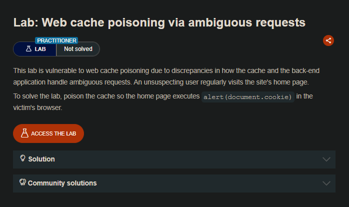
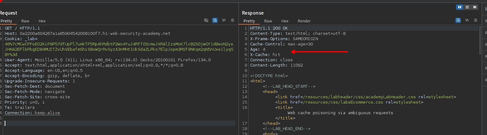
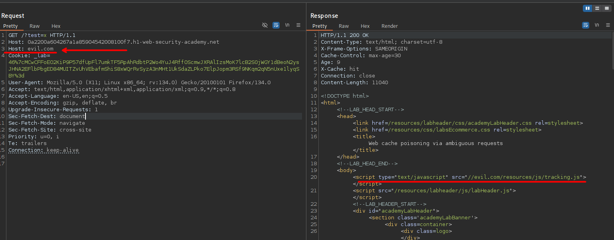
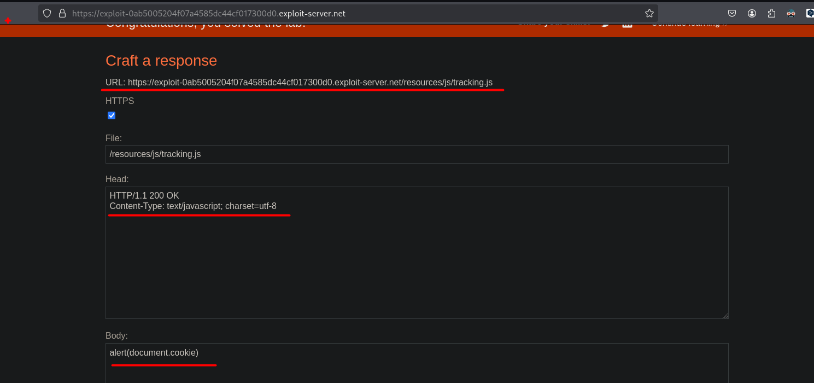
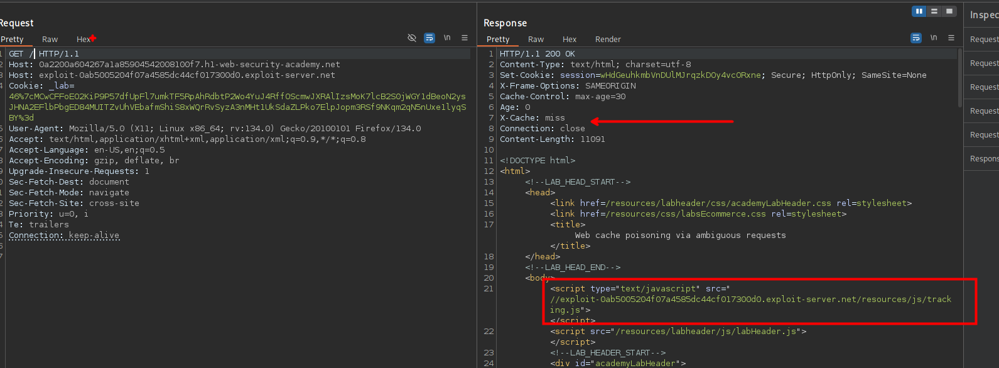
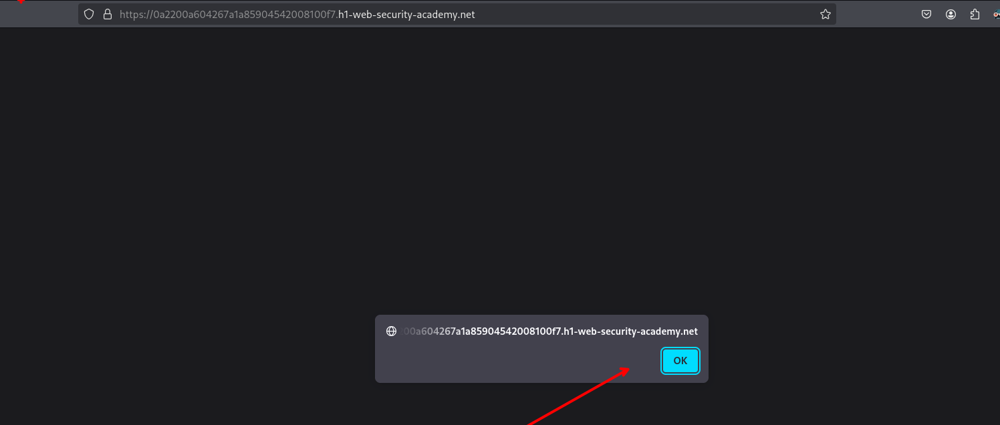

## LAB

al realizar las solicitudes, podemos observar que el servidor maneja los recursos mediante la cache.

Al agregar otro encabezado `Host` con un valor `evil.com` y es reflejado en la respuesta.

Como observamos, podemos manejar el url y en su lugar podemos usar el exploit server pra ejecutar javascript malicoso:

Luego insertamos nuestra url del exploit server y observamos que este es agregado a cache y en el la url del recursos javascript.

Luego podemos recargar y vemos que el codigo javascript es ejecutado

