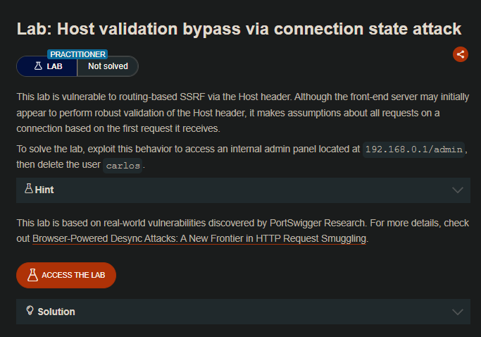
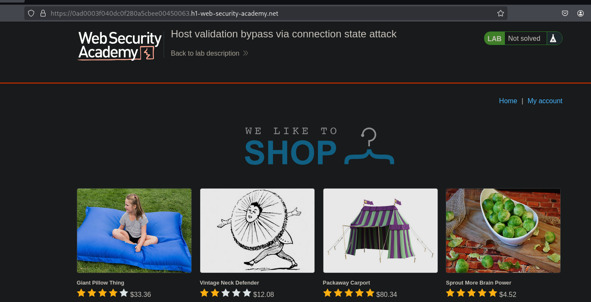
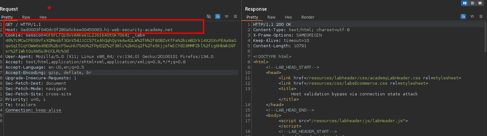
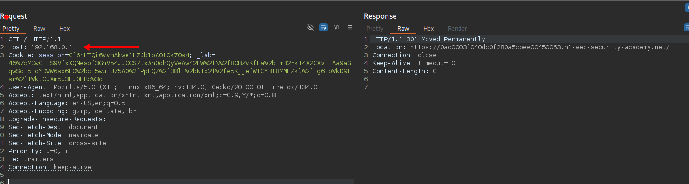
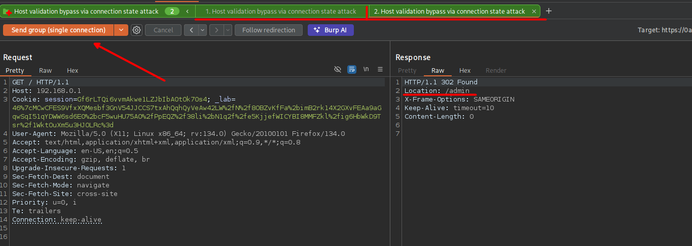
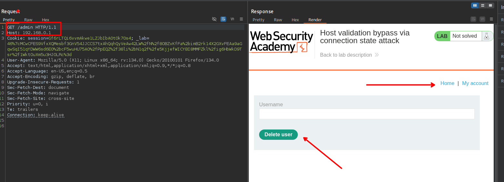
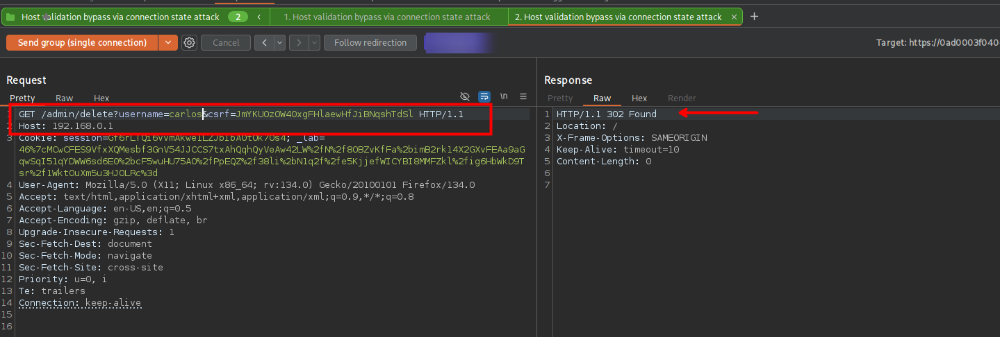

## LAB



En este caso tenemos que el enunciado nos indica que, en la primera solicitud verifica el `Host` sea igual que el target y en las siguientes asume que si lo es. 

Por lo que tendremos dos solicitudes:





Que serán enviadas secuencialmente pero bajo el mismo protocolo TCP. Para ello debemos agregar a un grupo (ambas solicitudes) luego elegir la opción de envió `Send group (single connection)`.



Al enviar las solicitudes, podemos ver que se puede acceder al panel de administración.



```c
GET /admin/delete?username=calros&csrf=JmYKUOzOW40xgFHlaewHfJiBNqshTdSl HTTP/1.1
Host: 192.168.0.1
```



