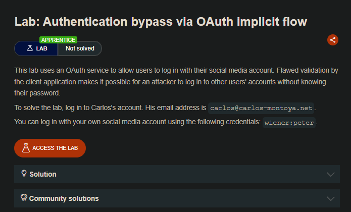
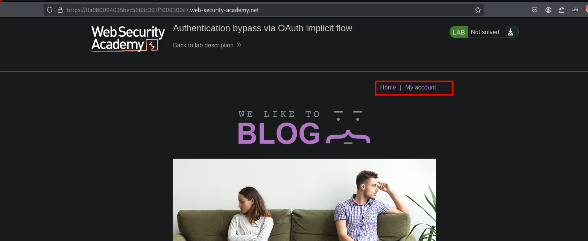
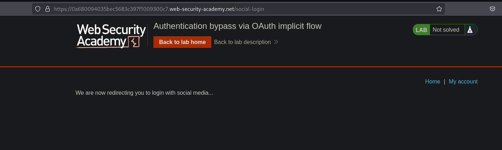
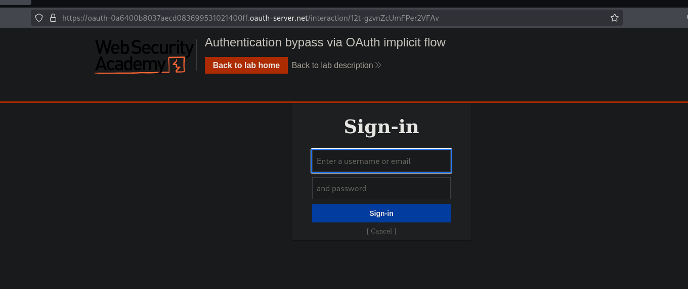
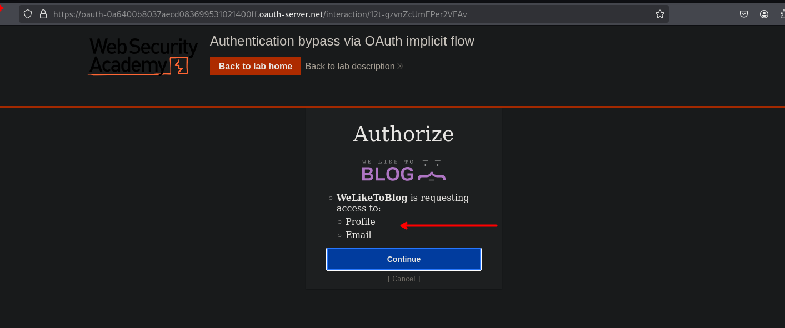
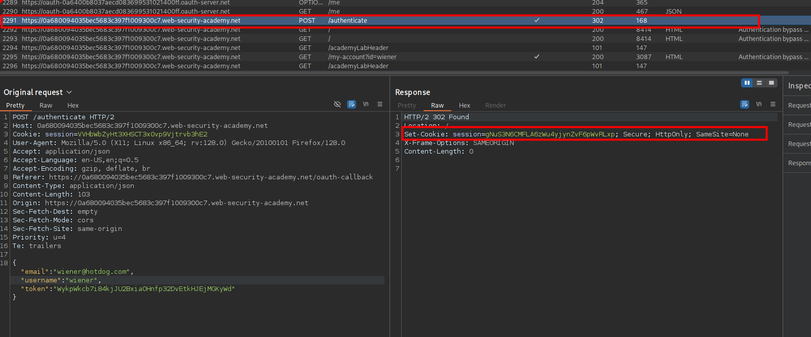
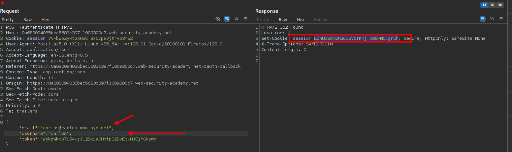
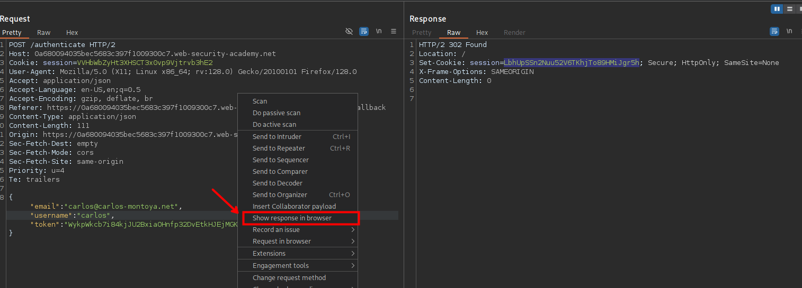
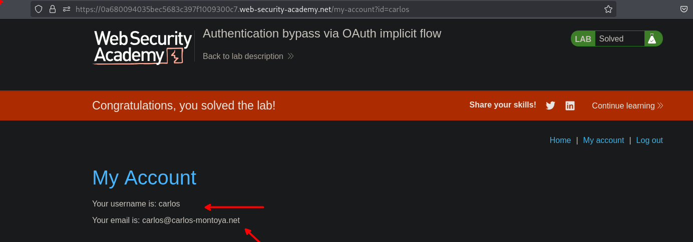

## LAB



Al iniciar sesión vemos que este nos redirige a un `social media` 



Que podemos iniciar sesión haciendo uso una red social.



Al iniciar sesión con el usuario wiener y luego nos redirige a otro apartado para continuar con le inicio de sesión. 



Luego de realizar sesión, podemos ver en las solicitudes y una en especial  `/authenticate`. En esta solicitud vemos que este realiza una solicitud para obtener la sesión (`cookie`) y en los parámetros no se envía ninguna credencial y solo se envía un correo, nombre de usuario y un token.



En el enunciado vemos que se tiene el correo del usuario carlos.

```c
carlos@carlos-montoya.net
```

Al reemplazar el correo y reusar el token vemos que se genera una sesión. 



Podemos ver o ir al navegador realizando un click derecho y eligiendo `Show request in browser`, este nos otorgara un link el cual pegaremos en el navegador. 



Luego vemos que podemos ver que tenemos la sesión de Carlos.


