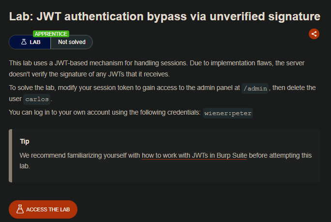
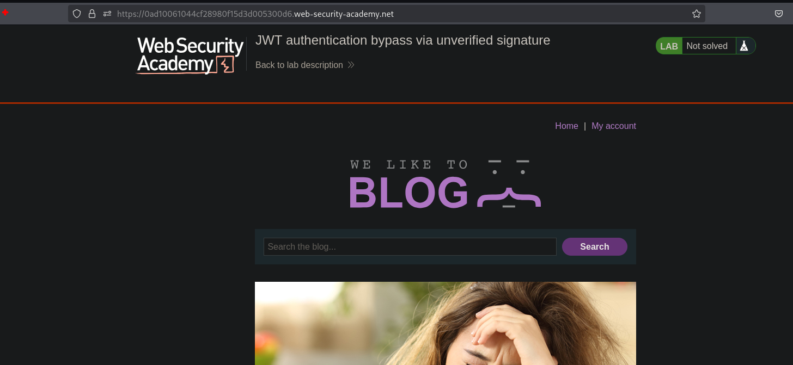
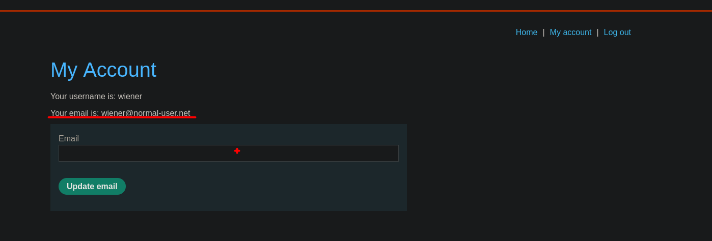
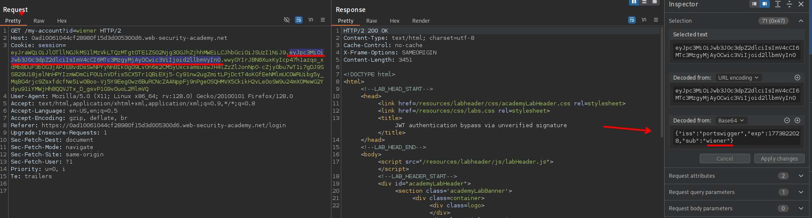
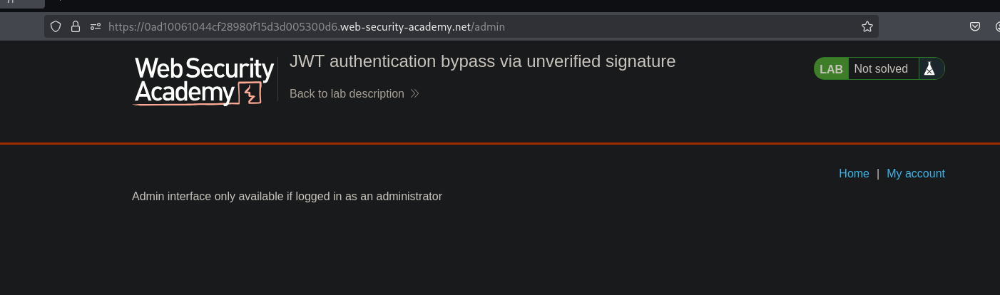
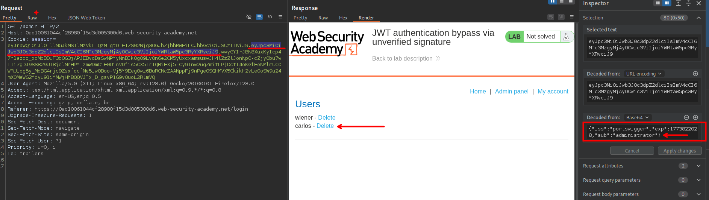

## LAB

Al ingresar al sitio web con las credenciales proporcionadas veremos que la session es manejada por jwt.

Observamos que se tiene jwt y este es formada por:

- Encabezado: Especifica el tipo de token y el algoritmo de firma (por ejemplo, HMAC SHA256 o RSA). 
- Payload: Contiene las declaraciones, como el ID de usuario, los roles de usuario y el tiempo de expiración. 
- Firma: Un hash criptográfico que garantiza que el token no ha sido manipulado.

Además vemos que tenemos una ruta `/admin`, al que solo puede acceder el usuario administrador

Al cambiar el valor del payload de `wiener` a `adminsitrator` y enviar la solicitud, se puede acceder al panel de administración.

Al ser enviada y acceder al panel de administración, vemos que no se valida adecuadamente con la firma.