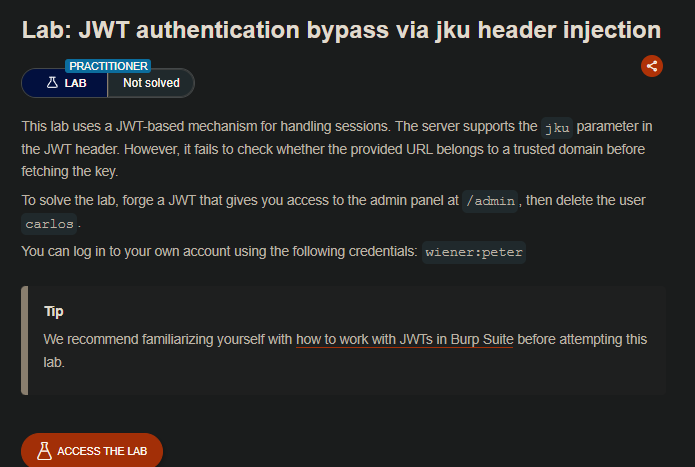
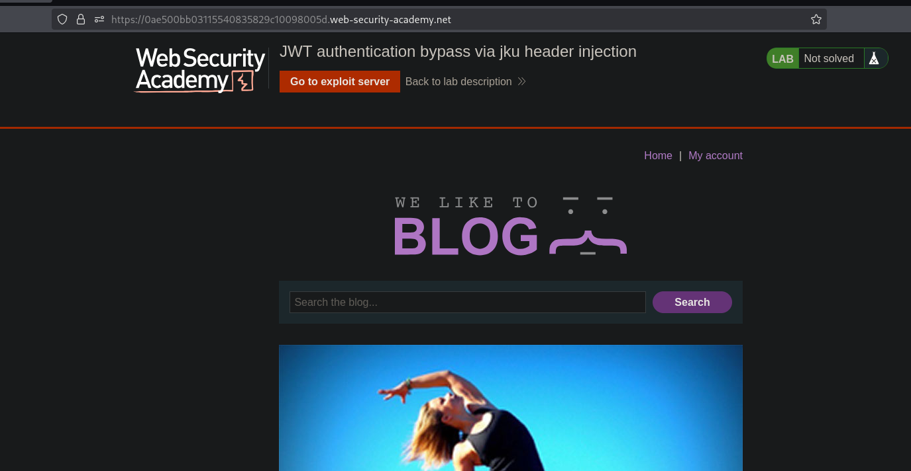
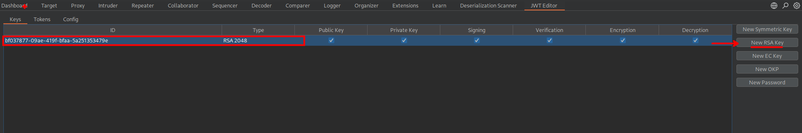
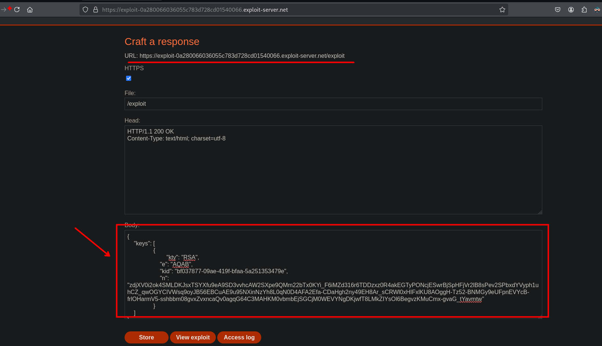
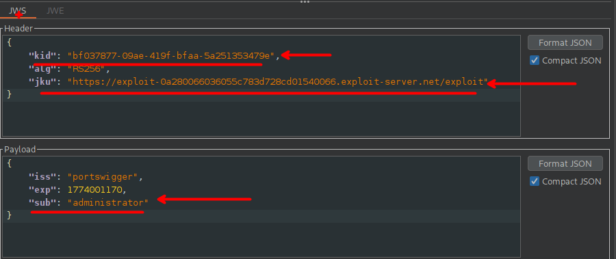
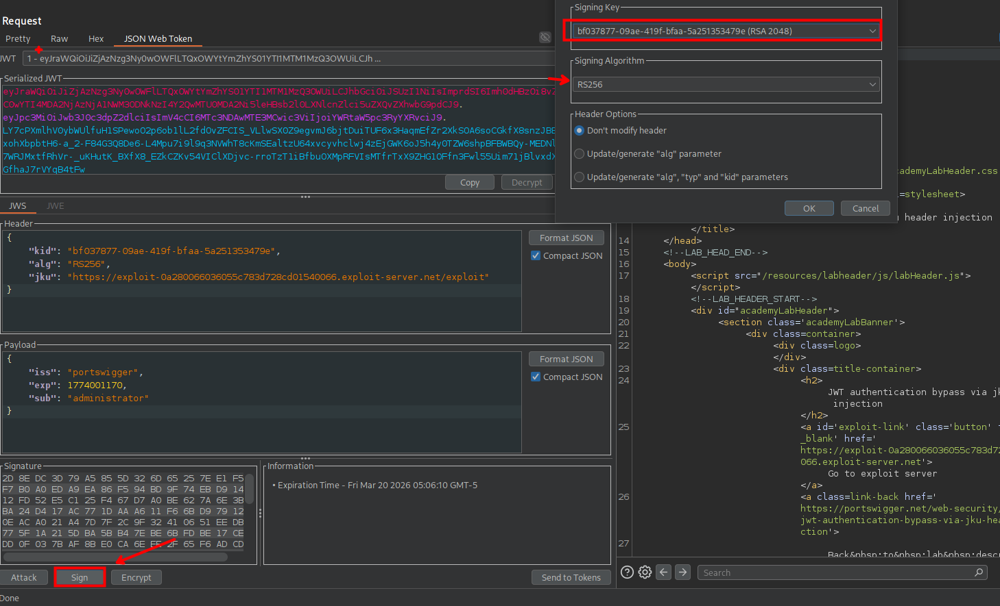
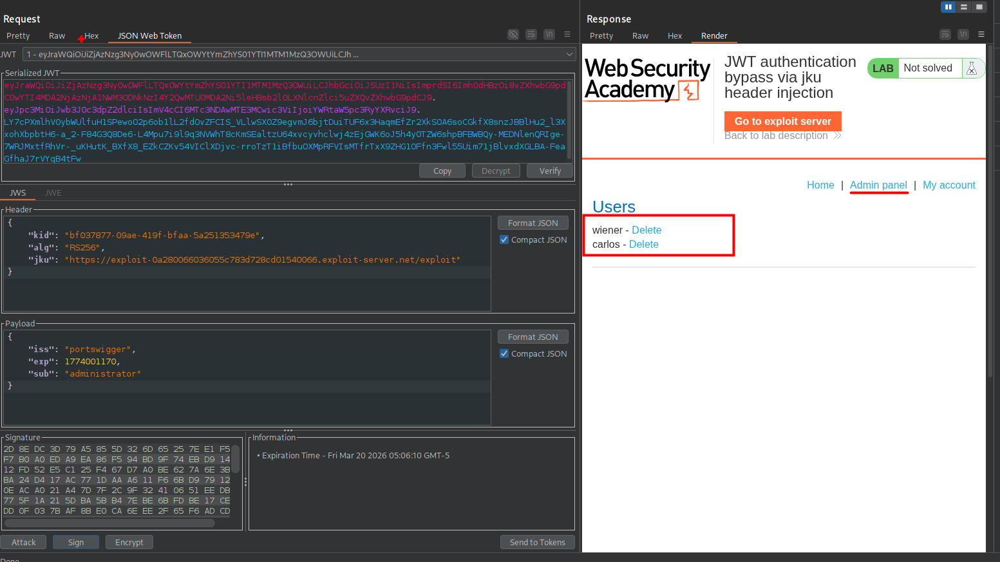

## LAB



Explotaremos una vulnerabilidad relacionada con el parámetro jku del encabezado de un JWT. Este parámetro permite al servidor obtener dinámicamente la clave pública desde una URL externa para verificar la firma del token. El fallo consiste en que el servidor no valida si esa URL pertenece a un dominio confiable.

Creamos un conjunto de claves (JWK Set) en un servidor que controlamos y colocamos nuestra clave pública en él.



Luego realizamos click derecho y elegimos la opción: `copy Public Keys as JWK`. Al realiza la acción podremos obtener la clave:

 ```c
 {
    "kty": "RSA",
    "e": "AQAB",
    "kid": "bf037877-09ae-419f-bfaa-5a251353479e",
    "n": "zdjXV0i2ok4SMLDKJsxTSYXfu9eA9SD3vvhcAW2SXpe9QMm22bTx0KYi_F6iMZd316r6TDDzxz0R4akEGTyPONcjESwrBjSpHFjVr2lB8sPev2SPbxdYVyph1uhCZ_qwOGYCIVWsq9oyJB56EBCuAE9u95NXinNzYh8L0qN0D4AFA2Efa-CDaHgh2ny49EH8Ar_sCRWl0xHIFxlKU8AOggH-Tz52-BNMGy9eUFpnEVYcB-frlOHarmV5-sshbbm08gvxZvxncaQv0agqG64C3MAHKM0vbmbEjSGCjM0WEVYNgDKjwfT8LMkZIYsOl6BegvzKMuCmx-gvaG_tYavmtw"
}
 ```

Esta clave rsa debemos de colocarlo dentro `[]`

```c
{ "keys": [ ] }
```

Nos debería de quedar de la siguiente manera:

```c
{
    "keys": [
		{
			"kty": "RSA",
		    "e": "AQAB",
		    "kid": "bf037877-09ae-419f-bfaa-5a251353479e",
		    "n":
"zdjXV0i2ok4SMLDKJsxTSYXfu9eA9SD3vvhcAW2SXpe9QMm22bTx0KYi_F6iMZd316r6TDDzxz0R4akEGTyPONcjESwrBjSpHFjVr2lB8sPev2SPbxdYVyph1uhCZ_qwOGYCIVWsq9oyJB56EBCuAE9u95NXinNzYh8L0qN0D4AFA2Efa-CDaHgh2ny49EH8Ar_sCRWl0xHIFxlKU8AOggH-Tz52-BNMGy9eUFpnEVYcB-frlOHarmV5-sshbbm08gvxZvxncaQv0agqG64C3MAHKM0vbmbEjSGCjM0WEVYNgDKjwfT8LMkZIYsOl6BegvzKMuCmx-gvaG_tYavmtw"
		}
    ]
}
```

Se debe tener en cuenta los espacios y tabulaciones, ya que si no se tiene en cuenta este no será tomada como valida.



 Luego generamos un JWT firmado con la clave privada correspondiente, indicando en el jku la ubicación de nuestra clave pública y configurando el token para suplantar al administrador.





El servidor acepta la clave, valida el token, y accedemos al panel de administración(`/admin`) desde donde eliminamos al usuario Carlos.



