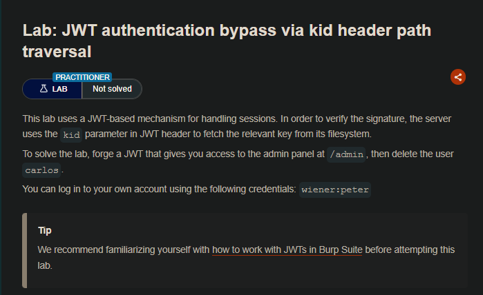
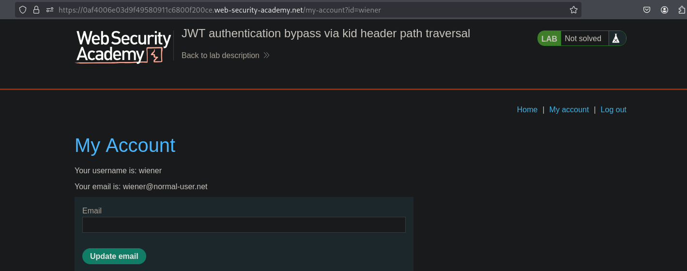
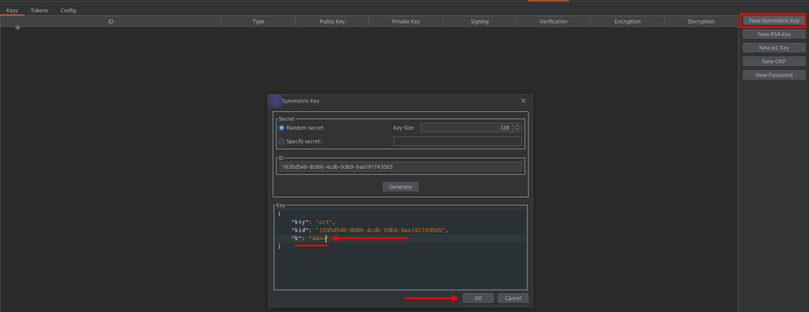
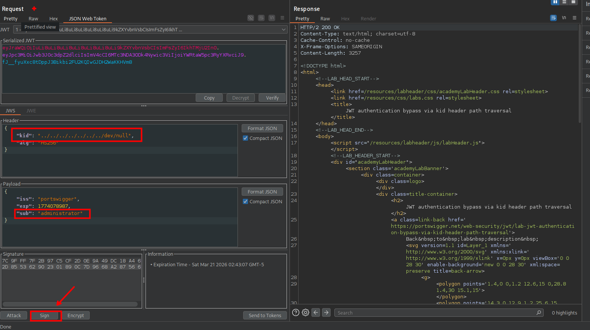
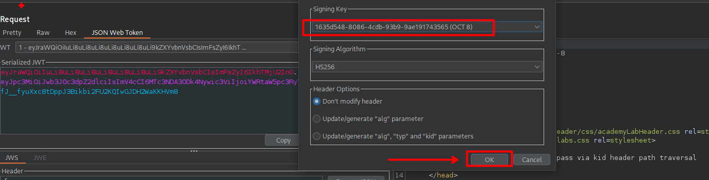
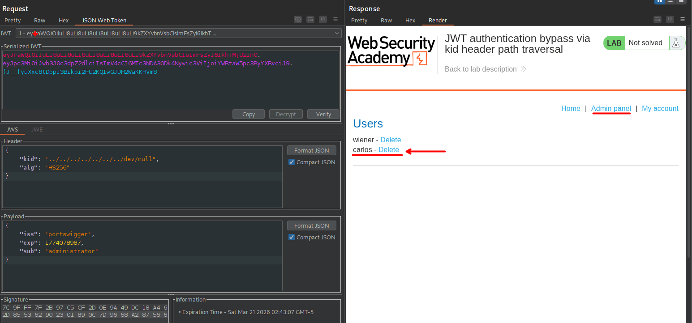

## LAB



Aquí explotaremos una implementación insegura de JWT donde el servidor utiliza el valor del parámetro kid para leer desde el sistema de archivos la clave con la que validar la firma del token. 

```c
❯ echo -en "\0" | base64 -w 0
AA==                                                                                                                                                                                            
```

Aprovechamos esto introduciendo una secuencia de path traversal en kid que apunta al archivo /dev/null, el cual tiene contenido predecible. Para ellos luego de generar un byte nulo y encodearlo en base64, para luego generar una clave simétrica con la clave.



Firmamos nuestro JWT con una clave basada en un byte nulo y modificamos el payload para suplantar al usuario administrador. El servidor usa /dev/null como clave de verificación sin realizar validaciones adecuadas.






Este laboratorio demuestra cómo una gestión insegura del parámetro kid puede comprometer completamente el control de autenticación.



