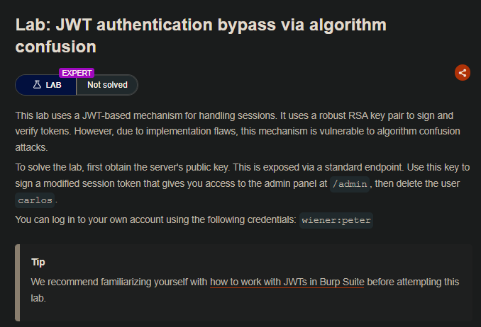
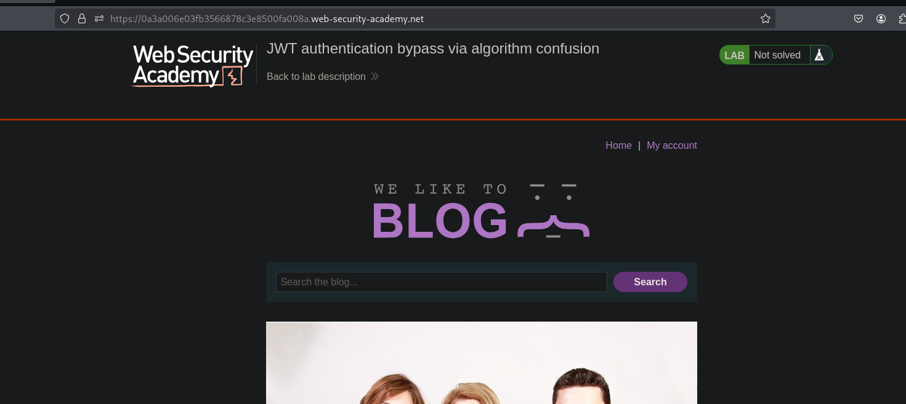
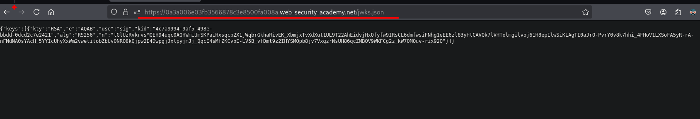
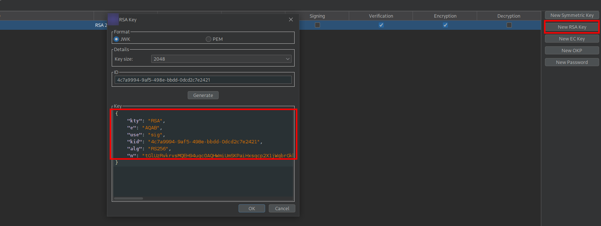
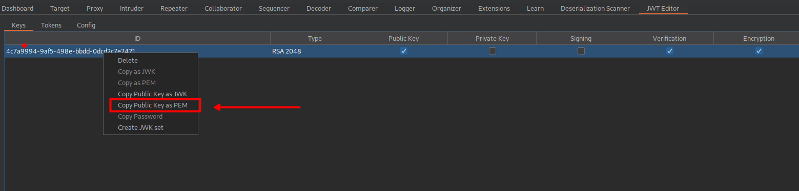
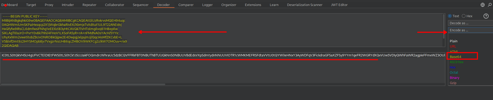
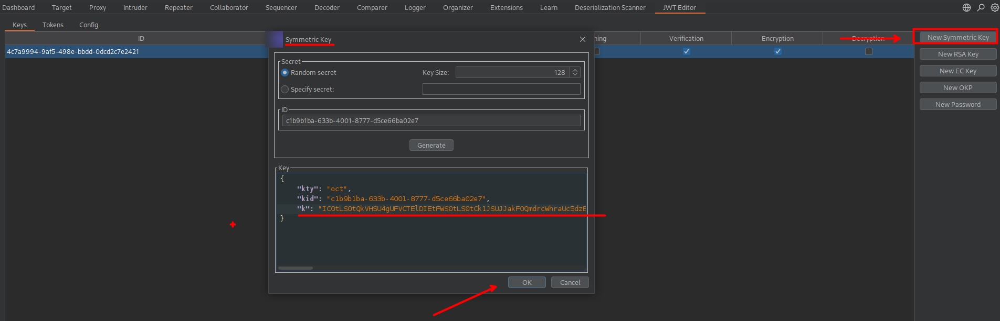
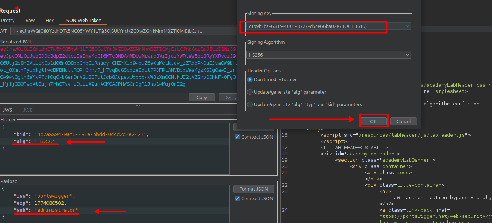
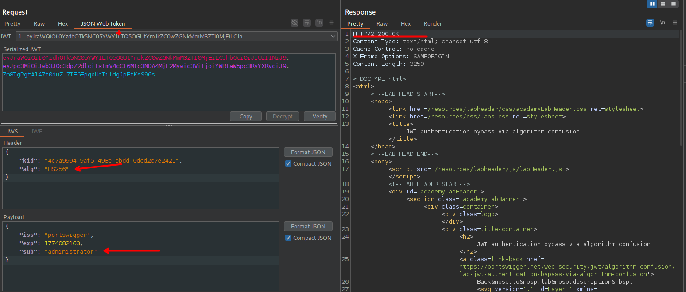
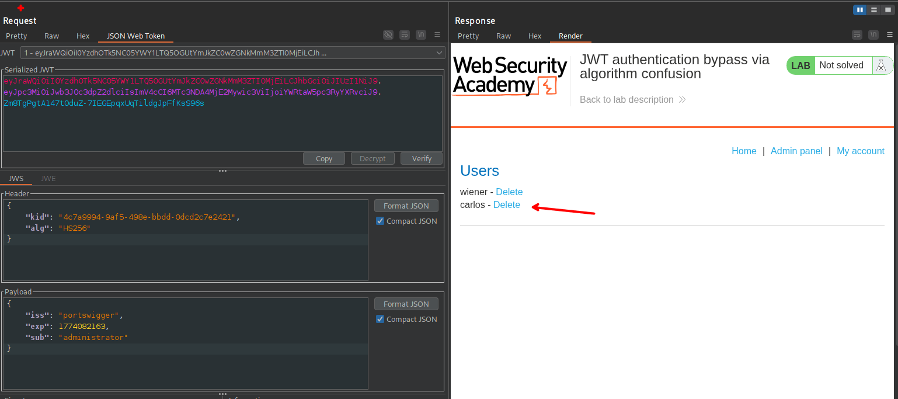

## LAB



En en el laboratorio se explotará de una implementación insegura de JWT que utiliza claves RSA para firmar y verificar tokens. Sin embargo, el servidor es vulnerable a un ataque de confusión de algoritmos: permite cambiar el algoritmo de firma a HS256, el cual utiliza una clave simétrica.

Aprovechamos que el servidor expone su clave pública en el endpoint '/jwks.json'.



```c
{
  "keys": [
    {
      "kty": "RSA",
      "e": "AQAB",
      "use": "sig",
      "kid": "4c7a9994-9af5-498e-bbdd-0dcd2c7e2421",
      "alg": "RS256",
      "n": "tGlUzRvkrvsMQEH94uqc0AQHWmiUmSKPaiHxsqcp2X1jWqbrGkhaRivEK_XbmjxTvXdXut1UL9T22AhEidvjHxQfyfw9IRsCL6dmfwsiFNhg1eEE6zl83yHtCAVQk7lVHTolmgilvoj61H8epIlwSiKLAgTI0aJrO-PvrY0v8k7hhi_4FHoV1LXSoFA5yR-rA-nFMdNA0sYAcH_5YYIcUhyXxWm2vwetitobZbUvONRO8kQjpw2E4DwpgjJxlpyjmJj_QqcI4sMfZKCvbE-LV5B_vfDmt9z2IHYSMOpb8jv7VxgzrNsUH86qcZMBOV9WKFCg2z_kW7OMOuv-rix92Q"                     
    }
  ]
}
  
```

La usamos como si fuera la clave secreta para firmar un nuevo token con HS256. Para ello primero creamos una clave `RSA` y pegamos la clave RSA que se encontró expuesata.



Luego copiamos la clave `PEM` 



```c
-----BEGIN PUBLIC KEY-----
MIIBIjANBgkqhkiG9w0BAQEFAAOCAQ8AMIIBCgKCAQEAtGlUzRvkrvsMQEH94uqc
0AQHWmiUmSKPaiHxsqcp2X1jWqbrGkhaRivEK/XbmjxTvXdXut1UL9T22AhEidvj
HxQfyfw9IRsCL6dmfwsiFNhg1eEE6zl83yHtCAVQk7lVHTolmgilvoj61H8epIlw
SiKLAgTI0aJrO+PvrY0v8k7hhi/4FHoV1LXSoFA5yR+rA+nFMdNA0sYAcH/5YYIc
UhyXxWm2vwetitobZbUvONRO8kQjpw2E4DwpgjJxlpyjmJj/QqcI4sMfZKCvbE+L
V5B/vfDmt9z2IHYSMOpb8jv7VxgzrNsUH86qcZMBOV9WKFCg2z/kW7OMOuv+rix9
2QIDAQAB
-----END PUBLIC KEY-----

```

A esta clave la pasaremos a base64 y la usaremos como clave al crear una clave asimetrica



```c
IC0tLS0tQkVHSU4gUFVCTElDIEtFWS0tLS0tCk1JSUJJakFOQmdrcWhraUc5dzBCQVFFRkFBT0NBUThBTUlJQkNnS0NBUUVBdEdsVXpSdmtydnNNUUVIOTR1cWMKMEFRSFdtaVVtU0tQYWlIeHNxY3AyWDFqV3FickdraGFSaXZFSy9YYm1qeFR2WGRYdXQxVUw5VDIyQWhFaWR2agpIeFFmeWZ3OUlSc0NMNmRtZndzaUZOaGcxZUVFNnpsODN5SHRDQVZRazdsVkhUb2xtZ2lsdm9qNjFIOGVwSWx3ClNpS0xBZ1RJMGFKck8rUHZyWTB2OGs3aGhpLzRGSG9WMUxYU29GQTV5UityQStuRk1kTkEwc1lBY0gvNVlZSWMKVWh5WHhXbTJ2d2V0aXRvYlpiVXZPTlJPOGtRanB3MkU0RHdwZ2pKeGxweWptSmovUXFjSTRzTWZaS0N2YkUrTApWNUIvdmZEbXQ5ejJJSFlTTU9wYjhqdjdWeGd6ck5zVUg4NnFjWk1CT1Y5V0tGQ2cyei9rVzdPTU91dityaXg5CjJRSURBUUFCCi0tLS0tRU5EIFBVQkxJQyBLRVktLS0tLQo=
```

Creamos una clave asimétrica y luego pegamos el `PEM` en base64 y la generamos.



Luego modificamos el payload para suplantar al usuario administrador y firmamos el JWT con la clave pública, que el servidor acepta erróneamente.



Tambien podemos usar el siguiente recursos, si en caso tengamos problemas con el burpsuite:

- https://8gwifi.org/jwkconvertfunctions.jsp



Al enviar la solicitud vemos que el token es valido para el usuario administrador.


