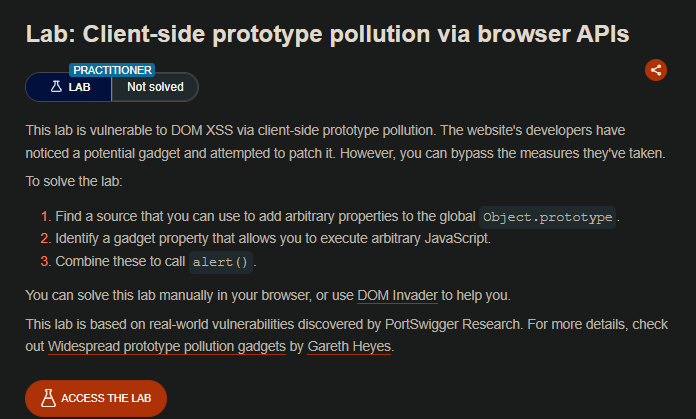
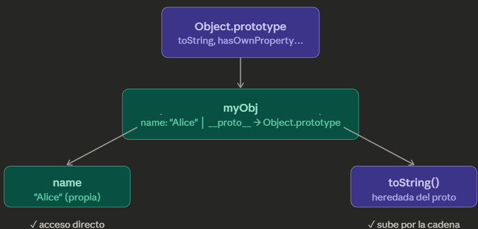
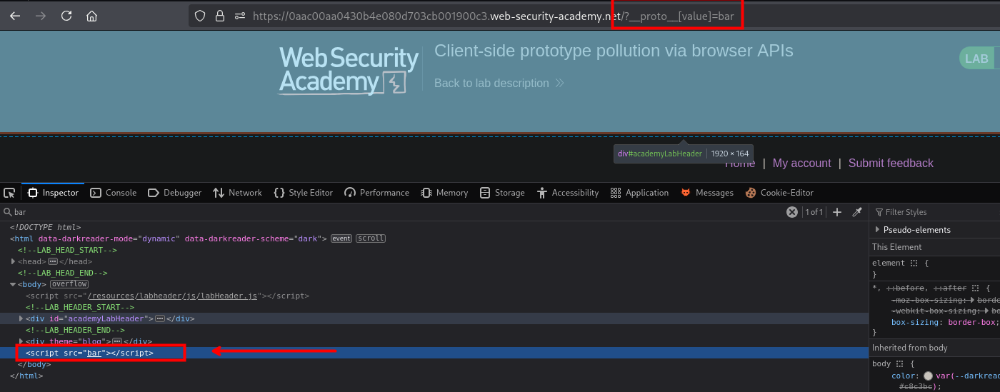
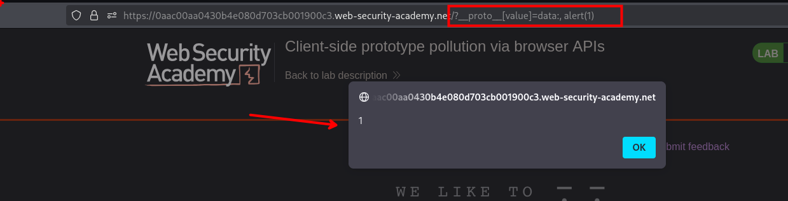

## Concepto

En JavaScript, casi todos los objetos heredan propiedades y métodos de un prototipo. El objeto "raíz" de toda esa cadena es `Object.prototype`. Si un atacante logra **modificar ese prototipo**, contamina a todos los objetos del sistema.

El concepto base con un diagrama de cómo funciona la cadena de prototipos normalmente, y luego cómo se rompe:



Cuando accedes a `myObj.name`, JS lo encuentra en el objeto mismo. Cuando accedes a `myObj.toString()`, **sube por la cadena** hasta `Object.prototype`. Eso es normal y sano.

Por ejemplo:

```js
const obj = { nombre: "Juan" }
obj.toString()  // nunca lo definiste, viene de Object.prototype
```

**El problema surge cuando alguien puede escribir en ese prototipo.**


```js
const obj = {}
obj.__proto__.admin = true

console.log({}.admin)  // true ← este objeto no tiene admin!
console.log({}.admin)  // true
console.log({}.admin)  // true — cualquier objeto, para siempre
```

`__proto__` es una propiedad especial que apunta directamente al prototipo del objeto. Cuando escribís en él, no estás modificando `obj` — estás modificando `Object.prototype` global. Y como **todos** los objetos heredan de ahí, todos quedan infectados, incluso los que se creen después.

## LAB


```js
async function logQuery(url, params) {
    try {
        await fetch(url, {method: "post", keepalive: true, body: JSON.stringify(params)});
    } catch(e) {
        console.error("Failed storing query");
    }
}

async function searchLogger() {
    let config = {params: deparam(new URL(location).searchParams.toString()), transport_url: false};
    Object.defineProperty(config, 'transport_url', {configurable: false, writable: false});
    if(config.transport_url) {
        let script = document.createElement('script');
        script.src = config.transport_url;
        document.body.appendChild(script);
    }
    if(config.params && config.params.search) {
        await logQuery('/logger', config.params);
    }
}

window.addEventListener("load", searchLogger);
```

1. Cuando la página carga, ejecuta `searchLogger()`
2. Crea un objeto `config` con dos propiedades:
    - `params`: contiene los parámetros de la URL decodificados
    - `transport_url`: inicialmente `false`
3. **Importante**: Luego hace que `transport_url` sea **no configurable y no editable** (línea con `Object.defineProperty`)
4. Si `transport_url` existe (no es false), carga un script externo
5. Si hay un parámetro "search", envía datos a `/logger`

La clave está en la líneas, porque al redefinir no le da ningún valor a `transport_url`:

```c
let config = {params: deparam(new URL(location).searchParams.toString()), transport_url: false};
    Object.defineProperty(config, 'transport_url', {configurable: false, writable: false});
```

La función `deparam()` (que no está definida en el fragmento pero es común en librerías como jQuery) convierte los parámetros de la URL en un objeto. **El problema** es que si la URL contiene `__proto__`, puede contaminar el prototipo de Object.



En el código, **en ninguna parte se lee `config.value` directamente**. ¿Cómo se ejecuta entonces?

La respuesta está en la **función `deparam()`** que convierte los parámetros de la URL en un objeto. Normalmente, `deparam()` hace algo como:

`deparam()` procesa `__proto__[value]`

Cuando `deparam()` ve `__proto__[value]`, hace esto:

```c

// En la iteración
key = "__proto__[value]"
value = "bar"
// Descompone la clave
let parts = key.split(/[\[\]]/).filter(p => p);
// parts = ["__proto__", "value"]
let current = obj; // obj es el objeto que está construyendo

for(let i = 0; i < parts.length - 1; i++) {
    // i=0: parts[0] = "__proto__"
    if(!current[parts[0]]) {
        current[parts[0]] = {};
    }
    current = current[parts[0]]; 
    // ¡Peligro! current ahora es Object.prototype
}
// parts[1] = "value"
current[parts[1]] = "bar)";
// Esto hace: Object.prototype.value = "bar"
```

En la imagen vemos que el paramatro introducido es ingresado en un tag `script` y en el valor de `src` por lo que podemos aprovechar esto, para ejecutar javascript, como por ejemplo:

```c
<!DOCTYPE html>
<html>
  <head>
    <title>Display Image</title>
  </head>
  <body>
    ' />
  </body>
</html>
```

Al usar un `src` pero de una imagen podemos usar `data:[vacío],[codigo javascript]`   

```c
src='data:, LzlqLzRBQ... <!-- Base64 data -->' />
```

El navegador no identificar la presencia de `image/jpeg` trata de interpretarlo en texto plano y ejecutará el javascript




```c
/?__proto__[value]=data:, alert(1)
```

