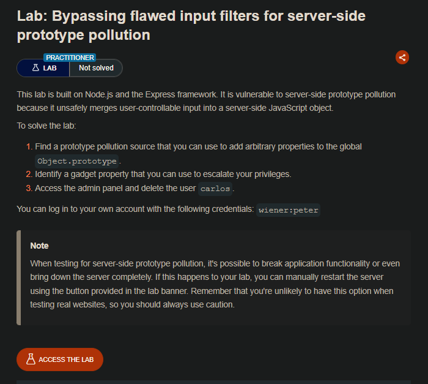
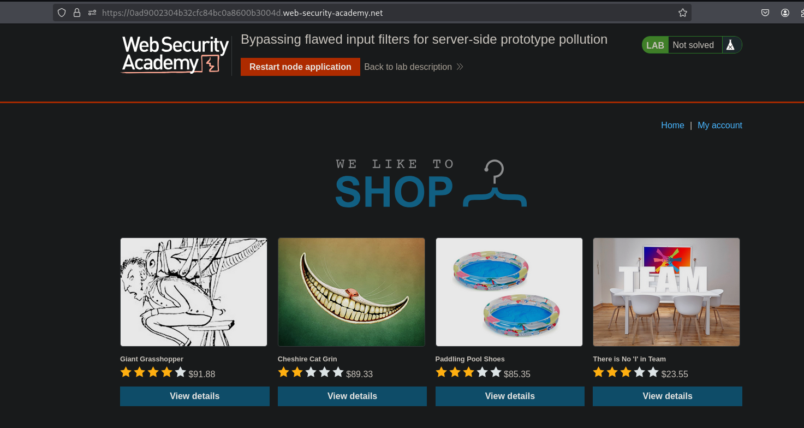
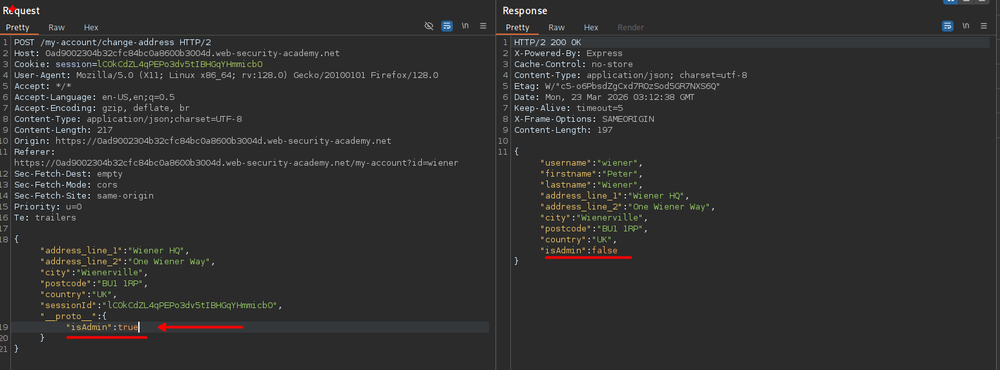
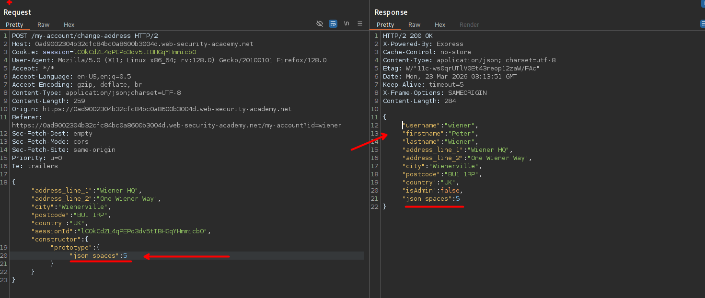
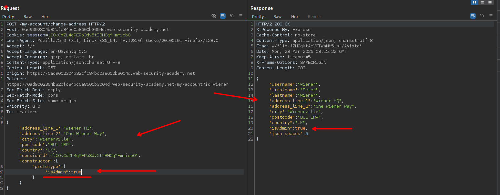
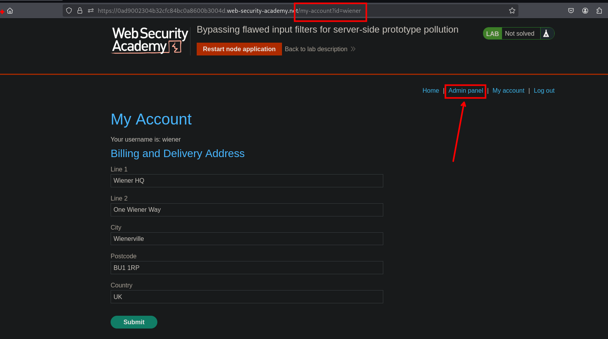

## LAB




En el sitio web tendremos un apartado donde podemos actualizar nuestros datos, en esta solicitud podemos inyectar `__proto__:{"isAdmin":true}`



Al ver la respuesta, vemos que al inyectar el payload para que tome el prototype que se ingresa, este no es valido.

Por lo que investigando encontré lo siguiente:

```c
{
    "constructor": {
        "prototype": {
            "foo": "bar",
            "json spaces": 10
        }
    }
}
```

- https://github.com/swisskyrepo/PayloadsAllTheThings/blob/master/Prototype%20Pollution/README.md#prototype-pollution-via-json-input

Al usar e enviar la solicitud de prueba en el json, vemos que este funciona efectivamente



Ahora cambiemos a `"isAdmin": true` y vemos que al enviar nuestra solicitud que efectivamente se actualiza los permisos del usuario:





