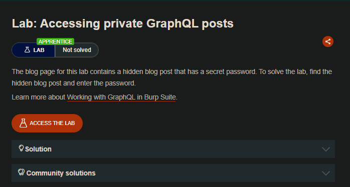
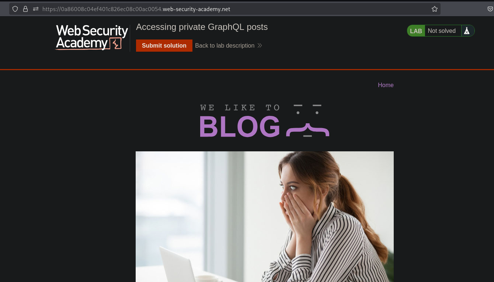
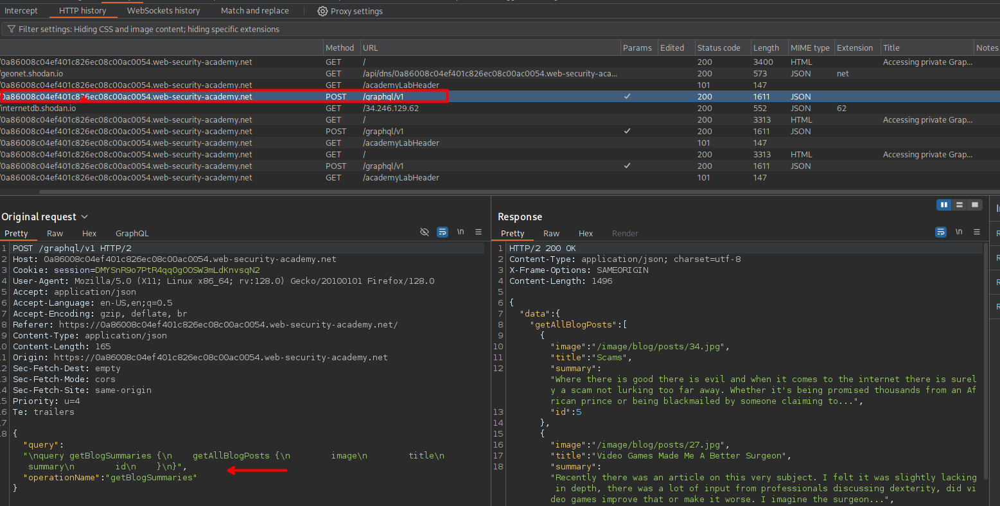
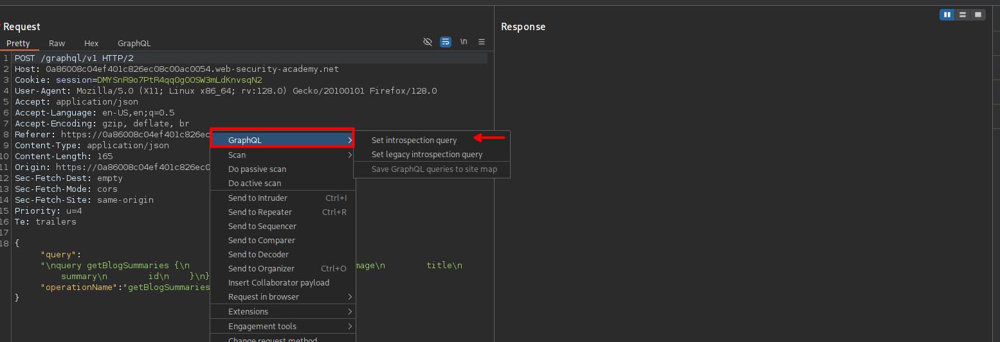
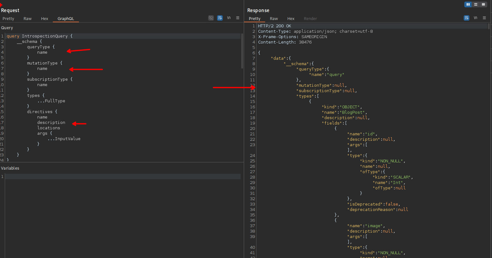
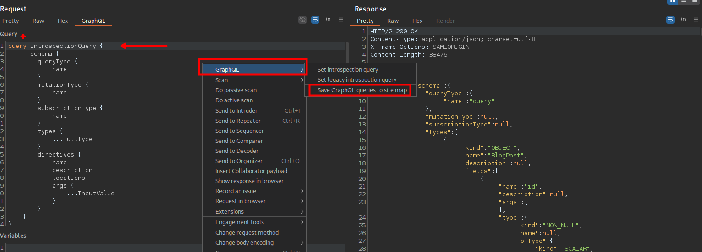
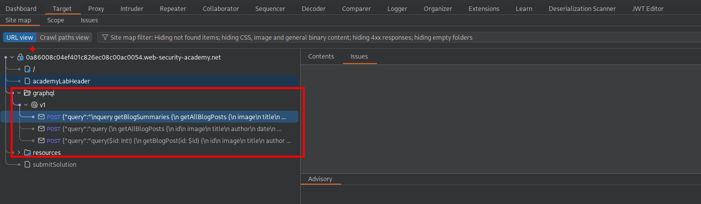
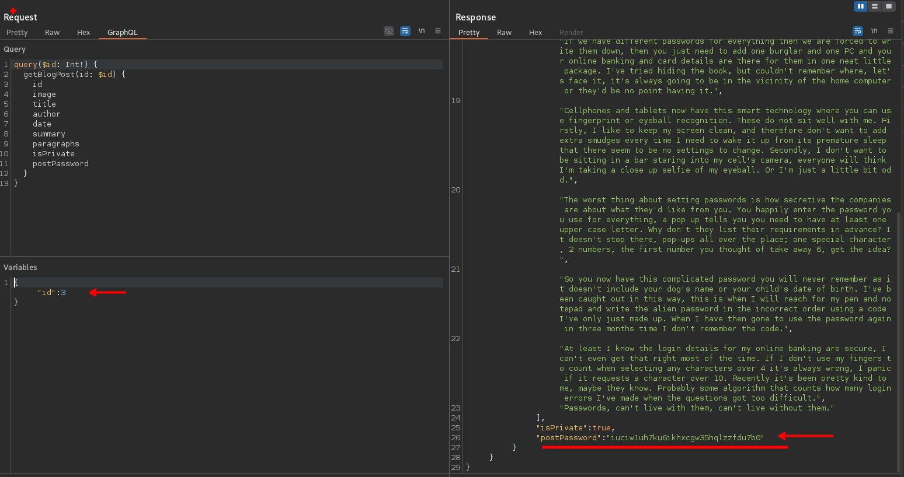

## LAB



Al interceptar las solicitudes veremos en estas un endpoint `graphQL/v1` en el que podemos hacer consultas de inspección.



Al hacer click derecho y luego seleccionar `set instrospection query`



Luego vemos que podemos ver una query y al enviar la solicitud, se tiene toda el listado de contenido.



Ahora para poder separar por consultas y querys, al seleccionar la opción de `Save GraphQL queries to site map`






Al veer la querie: getBlogPost, vemos que se tiene un parámetro de ID

```C
query($id: Int!) {
  getBlogPost(id: $id) {
    id
    image
    title
    author
    date
    summary
    paragraphs
    isPrivate
    postPassword
  }
}
```

Al ir interando veremos la contraseña.



