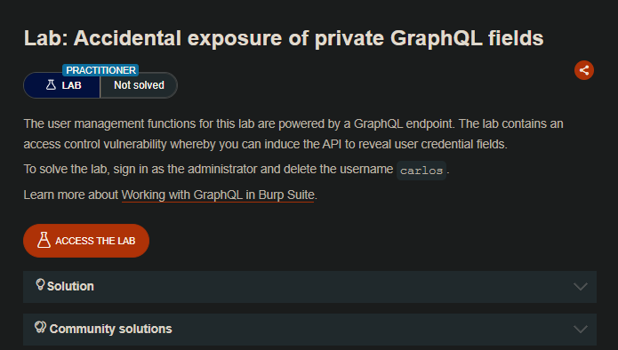
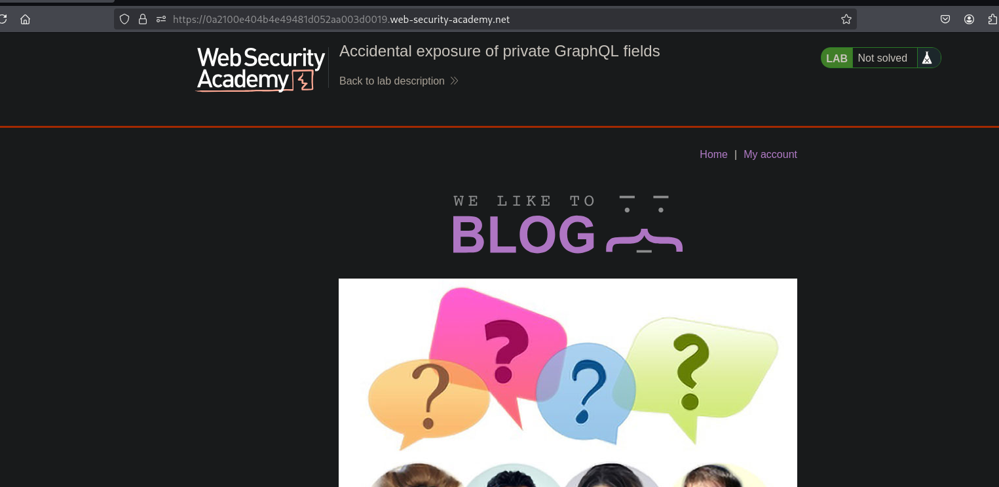
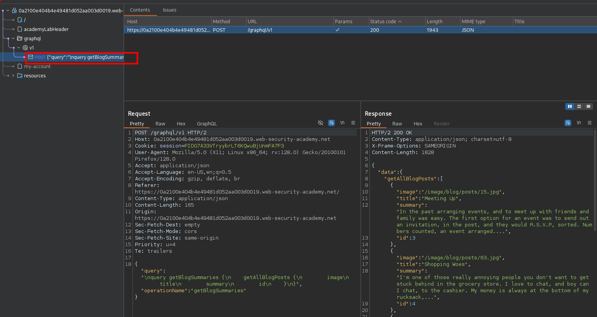
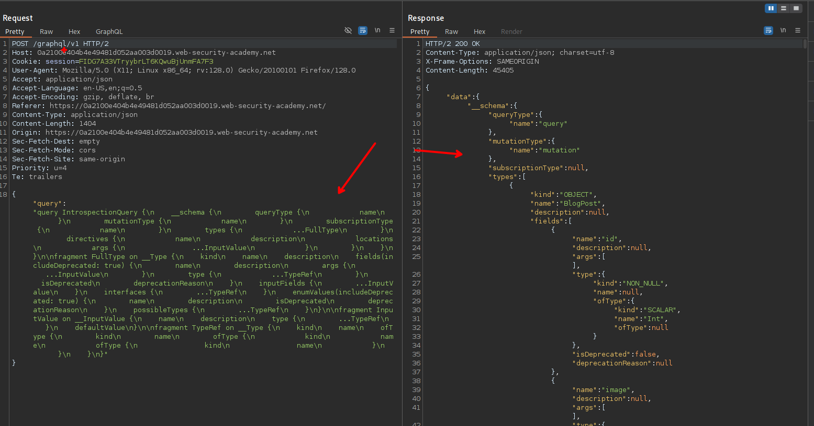
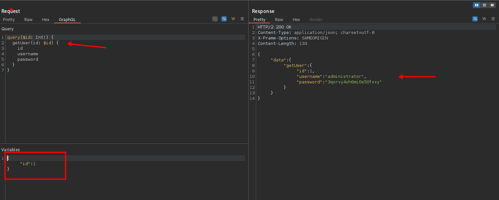
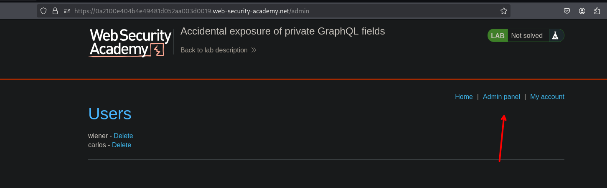

## LAB

Al interceptar las solicitudes veremos en estas un endpoint `graphQL/v1` en el que podemos hacer consultas de inspección.

Al hacer click derecho y luego seleccionar `set instrospection query`

Luego vemos que podemos ver una query y al enviar la solicitud, se tiene toda el listado de contenido. Ahora para poder separar por consultas y querys, al seleccionar la opción de `Save GraphQL queries to site map`, en este encontraremos que se hace la consulta para obtener la información de un usuario `getUser`.

Al ir interando por el id encontraremos las credenciales del usuario administrador, para luego ingresar al panel de administración.

